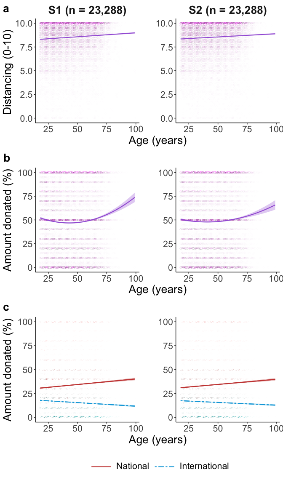
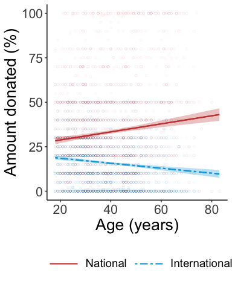

## Set up and functions

## Load and organise the data

## Means & correlations

## Mixed models

<table class="table" style="margin-left: auto; margin-right: auto;">
 <thead>
  <tr>
   <th style="text-align:left;"> Parameter </th>
   <th style="text-align:right;"> Coefficient </th>
   <th style="text-align:right;"> SE </th>
   <th style="text-align:right;"> CI_low </th>
   <th style="text-align:right;"> CI_high </th>
   <th style="text-align:right;"> t </th>
   <th style="text-align:right;"> df_error </th>
   <th style="text-align:right;"> p </th>
   <th style="text-align:right;"> d </th>
  </tr>
 </thead>
<tbody>
  <tr>
   <td style="text-align:left;"> (Intercept) </td>
   <td style="text-align:right;"> -0.1109 </td>
   <td style="text-align:right;"> 0.0355 </td>
   <td style="text-align:right;"> -0.1804 </td>
   <td style="text-align:right;"> -0.0414 </td>
   <td style="text-align:right;"> -3.128 </td>
   <td style="text-align:right;"> 72.77 </td>
   <td style="text-align:right;"> 0.0025 </td>
   <td style="text-align:right;"> -0.0412 </td>
  </tr>
  <tr>
   <td style="text-align:left;"> sexfemale </td>
   <td style="text-align:right;"> 0.2741 </td>
   <td style="text-align:right;"> 0.0128 </td>
   <td style="text-align:right;"> 0.2491 </td>
   <td style="text-align:right;"> 0.2991 </td>
   <td style="text-align:right;"> 21.494 </td>
   <td style="text-align:right;"> 23058.13 </td>
   <td style="text-align:right;"> 0.0000 </td>
   <td style="text-align:right;"> 0.2829 </td>
  </tr>
  <tr>
   <td style="text-align:left;"> risk1 </td>
   <td style="text-align:right;"> 0.0245 </td>
   <td style="text-align:right;"> 0.0134 </td>
   <td style="text-align:right;"> -0.0017 </td>
   <td style="text-align:right;"> 0.0507 </td>
   <td style="text-align:right;"> 1.831 </td>
   <td style="text-align:right;"> 53.13 </td>
   <td style="text-align:right;"> 0.0727 </td>
   <td style="text-align:right;"> 0.0241 </td>
  </tr>
  <tr>
   <td style="text-align:left;"> age </td>
   <td style="text-align:right;"> 0.1015 </td>
   <td style="text-align:right;"> 0.0161 </td>
   <td style="text-align:right;"> 0.0698 </td>
   <td style="text-align:right;"> 0.1331 </td>
   <td style="text-align:right;"> 6.288 </td>
   <td style="text-align:right;"> 56.27 </td>
   <td style="text-align:right;"> 0.0000 </td>
   <td style="text-align:right;"> 0.0828 </td>
  </tr>
</tbody>
</table>
<table class="table" style="margin-left: auto; margin-right: auto;">
 <thead>
  <tr>
   <th style="text-align:left;"> Parameter </th>
   <th style="text-align:right;"> Coefficient </th>
   <th style="text-align:right;"> SE </th>
   <th style="text-align:right;"> CI_low </th>
   <th style="text-align:right;"> CI_high </th>
   <th style="text-align:right;"> t </th>
   <th style="text-align:right;"> df_error </th>
   <th style="text-align:right;"> p </th>
   <th style="text-align:right;"> d </th>
  </tr>
 </thead>
<tbody>
  <tr>
   <td style="text-align:left;"> (Intercept) </td>
   <td style="text-align:right;"> -0.0917 </td>
   <td style="text-align:right;"> 0.0352 </td>
   <td style="text-align:right;"> -0.1606 </td>
   <td style="text-align:right;"> -0.0228 </td>
   <td style="text-align:right;"> -2.610 </td>
   <td style="text-align:right;"> 71.87 </td>
   <td style="text-align:right;"> 0.0110 </td>
   <td style="text-align:right;"> -0.0344 </td>
  </tr>
  <tr>
   <td style="text-align:left;"> sexfemale </td>
   <td style="text-align:right;"> 0.2757 </td>
   <td style="text-align:right;"> 0.0127 </td>
   <td style="text-align:right;"> 0.2507 </td>
   <td style="text-align:right;"> 0.3006 </td>
   <td style="text-align:right;"> 21.621 </td>
   <td style="text-align:right;"> 23038.14 </td>
   <td style="text-align:right;"> 0.0000 </td>
   <td style="text-align:right;"> 0.2847 </td>
  </tr>
  <tr>
   <td style="text-align:left;"> risk1 </td>
   <td style="text-align:right;"> 0.0213 </td>
   <td style="text-align:right;"> 0.0125 </td>
   <td style="text-align:right;"> -0.0033 </td>
   <td style="text-align:right;"> 0.0458 </td>
   <td style="text-align:right;"> 1.694 </td>
   <td style="text-align:right;"> 50.88 </td>
   <td style="text-align:right;"> 0.0963 </td>
   <td style="text-align:right;"> 0.0223 </td>
  </tr>
  <tr>
   <td style="text-align:left;"> age </td>
   <td style="text-align:right;"> 0.0997 </td>
   <td style="text-align:right;"> 0.0148 </td>
   <td style="text-align:right;"> 0.0707 </td>
   <td style="text-align:right;"> 0.1287 </td>
   <td style="text-align:right;"> 6.738 </td>
   <td style="text-align:right;"> 50.98 </td>
   <td style="text-align:right;"> 0.0000 </td>
   <td style="text-align:right;"> 0.0887 </td>
  </tr>
</tbody>
</table>
<table class="table" style="margin-left: auto; margin-right: auto;">
 <thead>
  <tr>
   <th style="text-align:left;"> Parameter </th>
   <th style="text-align:right;"> Coefficient </th>
   <th style="text-align:right;"> SE </th>
   <th style="text-align:right;"> CI_low </th>
   <th style="text-align:right;"> CI_high </th>
   <th style="text-align:right;"> t </th>
   <th style="text-align:right;"> df_error </th>
   <th style="text-align:right;"> p </th>
   <th style="text-align:right;"> d </th>
  </tr>
 </thead>
<tbody>
  <tr>
   <td style="text-align:left;"> (Intercept) </td>
   <td style="text-align:right;"> -0.1043 </td>
   <td style="text-align:right;"> 0.0378 </td>
   <td style="text-align:right;"> -0.1784 </td>
   <td style="text-align:right;"> -0.0301 </td>
   <td style="text-align:right;"> -2.756 </td>
   <td style="text-align:right;"> 74.88 </td>
   <td style="text-align:right;"> 0.0073 </td>
   <td style="text-align:right;"> -0.0362 </td>
  </tr>
  <tr>
   <td style="text-align:left;"> sexfemale </td>
   <td style="text-align:right;"> 0.1446 </td>
   <td style="text-align:right;"> 0.0128 </td>
   <td style="text-align:right;"> 0.1196 </td>
   <td style="text-align:right;"> 0.1696 </td>
   <td style="text-align:right;"> 11.335 </td>
   <td style="text-align:right;"> 23021.19 </td>
   <td style="text-align:right;"> 0.0000 </td>
   <td style="text-align:right;"> 0.1490 </td>
  </tr>
  <tr>
   <td style="text-align:left;"> Ladder </td>
   <td style="text-align:right;"> -0.0804 </td>
   <td style="text-align:right;"> 0.0092 </td>
   <td style="text-align:right;"> -0.0983 </td>
   <td style="text-align:right;"> -0.0624 </td>
   <td style="text-align:right;"> -8.783 </td>
   <td style="text-align:right;"> 39.46 </td>
   <td style="text-align:right;"> 0.0000 </td>
   <td style="text-align:right;"> -0.1154 </td>
  </tr>
  <tr>
   <td style="text-align:left;"> poly(age, 2, raw = TRUE)1 </td>
   <td style="text-align:right;"> 0.0420 </td>
   <td style="text-align:right;"> 0.0098 </td>
   <td style="text-align:right;"> 0.0228 </td>
   <td style="text-align:right;"> 0.0612 </td>
   <td style="text-align:right;"> 4.287 </td>
   <td style="text-align:right;"> 55.68 </td>
   <td style="text-align:right;"> 0.0001 </td>
   <td style="text-align:right;"> 0.0563 </td>
  </tr>
  <tr>
   <td style="text-align:left;"> poly(age, 2, raw = TRUE)2 </td>
   <td style="text-align:right;"> 0.0573 </td>
   <td style="text-align:right;"> 0.0067 </td>
   <td style="text-align:right;"> 0.0442 </td>
   <td style="text-align:right;"> 0.0705 </td>
   <td style="text-align:right;"> 8.559 </td>
   <td style="text-align:right;"> 6780.73 </td>
   <td style="text-align:right;"> 0.0000 </td>
   <td style="text-align:right;"> 0.1125 </td>
  </tr>
</tbody>
</table>
<table class="table" style="margin-left: auto; margin-right: auto;">
 <thead>
  <tr>
   <th style="text-align:left;"> Parameter </th>
   <th style="text-align:right;"> Coefficient </th>
   <th style="text-align:right;"> SE </th>
   <th style="text-align:right;"> CI_low </th>
   <th style="text-align:right;"> CI_high </th>
   <th style="text-align:right;"> t </th>
   <th style="text-align:right;"> df_error </th>
   <th style="text-align:right;"> p </th>
   <th style="text-align:right;"> d </th>
  </tr>
 </thead>
<tbody>
  <tr>
   <td style="text-align:left;"> (Intercept) </td>
   <td style="text-align:right;"> -0.0788 </td>
   <td style="text-align:right;"> 0.0383 </td>
   <td style="text-align:right;"> -0.1540 </td>
   <td style="text-align:right;"> -0.0037 </td>
   <td style="text-align:right;"> -2.056 </td>
   <td style="text-align:right;"> 75.88 </td>
   <td style="text-align:right;"> 0.0432 </td>
   <td style="text-align:right;"> -0.0270 </td>
  </tr>
  <tr>
   <td style="text-align:left;"> sexfemale </td>
   <td style="text-align:right;"> 0.1565 </td>
   <td style="text-align:right;"> 0.0127 </td>
   <td style="text-align:right;"> 0.1317 </td>
   <td style="text-align:right;"> 0.1813 </td>
   <td style="text-align:right;"> 12.355 </td>
   <td style="text-align:right;"> 23042.42 </td>
   <td style="text-align:right;"> 0.0000 </td>
   <td style="text-align:right;"> 0.1623 </td>
  </tr>
  <tr>
   <td style="text-align:left;"> Ladder </td>
   <td style="text-align:right;"> -0.0836 </td>
   <td style="text-align:right;"> 0.0124 </td>
   <td style="text-align:right;"> -0.1079 </td>
   <td style="text-align:right;"> -0.0594 </td>
   <td style="text-align:right;"> -6.764 </td>
   <td style="text-align:right;"> 52.41 </td>
   <td style="text-align:right;"> 0.0000 </td>
   <td style="text-align:right;"> -0.0889 </td>
  </tr>
  <tr>
   <td style="text-align:left;"> poly(age, 2, raw = TRUE)1 </td>
   <td style="text-align:right;"> 0.0477 </td>
   <td style="text-align:right;"> 0.0095 </td>
   <td style="text-align:right;"> 0.0290 </td>
   <td style="text-align:right;"> 0.0664 </td>
   <td style="text-align:right;"> 4.999 </td>
   <td style="text-align:right;"> 46.19 </td>
   <td style="text-align:right;"> 0.0000 </td>
   <td style="text-align:right;"> 0.0657 </td>
  </tr>
  <tr>
   <td style="text-align:left;"> poly(age, 2, raw = TRUE)2 </td>
   <td style="text-align:right;"> 0.0379 </td>
   <td style="text-align:right;"> 0.0066 </td>
   <td style="text-align:right;"> 0.0249 </td>
   <td style="text-align:right;"> 0.0510 </td>
   <td style="text-align:right;"> 5.707 </td>
   <td style="text-align:right;"> 6244.72 </td>
   <td style="text-align:right;"> 0.0000 </td>
   <td style="text-align:right;"> 0.0750 </td>
  </tr>
</tbody>
</table>
<table class="table" style="margin-left: auto; margin-right: auto;">
 <thead>
  <tr>
   <th style="text-align:left;"> Parameter </th>
   <th style="text-align:right;"> Coefficient </th>
   <th style="text-align:right;"> SE </th>
   <th style="text-align:right;"> CI_low </th>
   <th style="text-align:right;"> CI_high </th>
   <th style="text-align:right;"> t </th>
   <th style="text-align:right;"> df_error </th>
   <th style="text-align:right;"> p </th>
   <th style="text-align:right;"> d </th>
  </tr>
 </thead>
<tbody>
  <tr>
   <td style="text-align:left;"> (Intercept) </td>
   <td style="text-align:right;"> 0.2914 </td>
   <td style="text-align:right;"> 0.0251 </td>
   <td style="text-align:right;"> 0.2421 </td>
   <td style="text-align:right;"> 0.3406 </td>
   <td style="text-align:right;"> 11.588 </td>
   <td style="text-align:right;"> 74.38 </td>
   <td style="text-align:right;"> 0 </td>
   <td style="text-align:right;"> 0.1081 </td>
  </tr>
  <tr>
   <td style="text-align:left;"> sexfemale </td>
   <td style="text-align:right;"> 0.1020 </td>
   <td style="text-align:right;"> 0.0088 </td>
   <td style="text-align:right;"> 0.0848 </td>
   <td style="text-align:right;"> 0.1193 </td>
   <td style="text-align:right;"> 11.596 </td>
   <td style="text-align:right;"> 45359.41 </td>
   <td style="text-align:right;"> 0 </td>
   <td style="text-align:right;"> 0.1082 </td>
  </tr>
  <tr>
   <td style="text-align:left;"> Ladder </td>
   <td style="text-align:right;"> -0.0524 </td>
   <td style="text-align:right;"> 0.0062 </td>
   <td style="text-align:right;"> -0.0646 </td>
   <td style="text-align:right;"> -0.0401 </td>
   <td style="text-align:right;"> -8.383 </td>
   <td style="text-align:right;"> 48.54 </td>
   <td style="text-align:right;"> 0 </td>
   <td style="text-align:right;"> -0.0782 </td>
  </tr>
  <tr>
   <td style="text-align:left;"> age </td>
   <td style="text-align:right;"> 0.0754 </td>
   <td style="text-align:right;"> 0.0093 </td>
   <td style="text-align:right;"> 0.0571 </td>
   <td style="text-align:right;"> 0.0937 </td>
   <td style="text-align:right;"> 8.085 </td>
   <td style="text-align:right;"> 72.78 </td>
   <td style="text-align:right;"> 0 </td>
   <td style="text-align:right;"> 0.0754 </td>
  </tr>
  <tr>
   <td style="text-align:left;"> charityinternational </td>
   <td style="text-align:right;"> -0.6571 </td>
   <td style="text-align:right;"> 0.0086 </td>
   <td style="text-align:right;"> -0.6739 </td>
   <td style="text-align:right;"> -0.6403 </td>
   <td style="text-align:right;"> -76.600 </td>
   <td style="text-align:right;"> 45798.29 </td>
   <td style="text-align:right;"> 0 </td>
   <td style="text-align:right;"> -0.7147 </td>
  </tr>
  <tr>
   <td style="text-align:left;"> age:charityinternational </td>
   <td style="text-align:right;"> -0.1225 </td>
   <td style="text-align:right;"> 0.0086 </td>
   <td style="text-align:right;"> -0.1393 </td>
   <td style="text-align:right;"> -0.1057 </td>
   <td style="text-align:right;"> -14.284 </td>
   <td style="text-align:right;"> 45798.74 </td>
   <td style="text-align:right;"> 0 </td>
   <td style="text-align:right;"> -0.1333 </td>
  </tr>
</tbody>
</table>
<table class="table" style="margin-left: auto; margin-right: auto;">
 <thead>
  <tr>
   <th style="text-align:left;"> Parameter </th>
   <th style="text-align:right;"> Coefficient </th>
   <th style="text-align:right;"> SE </th>
   <th style="text-align:right;"> CI_low </th>
   <th style="text-align:right;"> CI_high </th>
   <th style="text-align:right;"> t </th>
   <th style="text-align:right;"> df_error </th>
   <th style="text-align:right;"> p </th>
   <th style="text-align:right;"> d </th>
  </tr>
 </thead>
<tbody>
  <tr>
   <td style="text-align:left;"> (Intercept) </td>
   <td style="text-align:right;"> 0.2980 </td>
   <td style="text-align:right;"> 0.0258 </td>
   <td style="text-align:right;"> 0.2475 </td>
   <td style="text-align:right;"> 0.3485 </td>
   <td style="text-align:right;"> 11.570 </td>
   <td style="text-align:right;"> 74.63 </td>
   <td style="text-align:right;"> 0 </td>
   <td style="text-align:right;"> 0.1079 </td>
  </tr>
  <tr>
   <td style="text-align:left;"> sexfemale </td>
   <td style="text-align:right;"> 0.1156 </td>
   <td style="text-align:right;"> 0.0088 </td>
   <td style="text-align:right;"> 0.0985 </td>
   <td style="text-align:right;"> 0.1328 </td>
   <td style="text-align:right;"> 13.200 </td>
   <td style="text-align:right;"> 45684.43 </td>
   <td style="text-align:right;"> 0 </td>
   <td style="text-align:right;"> 0.1231 </td>
  </tr>
  <tr>
   <td style="text-align:left;"> Ladder </td>
   <td style="text-align:right;"> -0.0519 </td>
   <td style="text-align:right;"> 0.0082 </td>
   <td style="text-align:right;"> -0.0681 </td>
   <td style="text-align:right;"> -0.0358 </td>
   <td style="text-align:right;"> -6.300 </td>
   <td style="text-align:right;"> 52.12 </td>
   <td style="text-align:right;"> 0 </td>
   <td style="text-align:right;"> -0.0588 </td>
  </tr>
  <tr>
   <td style="text-align:left;"> age </td>
   <td style="text-align:right;"> 0.0705 </td>
   <td style="text-align:right;"> 0.0092 </td>
   <td style="text-align:right;"> 0.0524 </td>
   <td style="text-align:right;"> 0.0885 </td>
   <td style="text-align:right;"> 7.647 </td>
   <td style="text-align:right;"> 67.91 </td>
   <td style="text-align:right;"> 0 </td>
   <td style="text-align:right;"> 0.0713 </td>
  </tr>
  <tr>
   <td style="text-align:left;"> charityinternational </td>
   <td style="text-align:right;"> -0.6586 </td>
   <td style="text-align:right;"> 0.0086 </td>
   <td style="text-align:right;"> -0.6754 </td>
   <td style="text-align:right;"> -0.6419 </td>
   <td style="text-align:right;"> -77.003 </td>
   <td style="text-align:right;"> 45827.23 </td>
   <td style="text-align:right;"> 0 </td>
   <td style="text-align:right;"> -0.7181 </td>
  </tr>
  <tr>
   <td style="text-align:left;"> age:charityinternational </td>
   <td style="text-align:right;"> -0.1080 </td>
   <td style="text-align:right;"> 0.0086 </td>
   <td style="text-align:right;"> -0.1248 </td>
   <td style="text-align:right;"> -0.0913 </td>
   <td style="text-align:right;"> -12.630 </td>
   <td style="text-align:right;"> 45827.79 </td>
   <td style="text-align:right;"> 0 </td>
   <td style="text-align:right;"> -0.1178 </td>
  </tr>
</tbody>
</table>
<table class="table" style="margin-left: auto; margin-right: auto;">
 <thead>
  <tr>
   <th style="text-align:left;"> Parameter </th>
   <th style="text-align:right;"> Coefficient </th>
   <th style="text-align:right;"> SE </th>
   <th style="text-align:right;"> CI_low </th>
   <th style="text-align:right;"> CI_high </th>
   <th style="text-align:right;"> t </th>
   <th style="text-align:right;"> df_error </th>
   <th style="text-align:right;"> p </th>
   <th style="text-align:right;"> d </th>
  </tr>
 </thead>
<tbody>
  <tr>
   <td style="text-align:left;"> (Intercept) </td>
   <td style="text-align:right;"> -0.0494 </td>
   <td style="text-align:right;"> 0.0361 </td>
   <td style="text-align:right;"> -0.1201 </td>
   <td style="text-align:right;"> 0.0212 </td>
   <td style="text-align:right;"> -1.371 </td>
   <td style="text-align:right;"> 69.66 </td>
   <td style="text-align:right;"> 0.1749 </td>
   <td style="text-align:right;"> -0.0181 </td>
  </tr>
  <tr>
   <td style="text-align:left;"> sexfemale </td>
   <td style="text-align:right;"> 0.1312 </td>
   <td style="text-align:right;"> 0.0129 </td>
   <td style="text-align:right;"> 0.1058 </td>
   <td style="text-align:right;"> 0.1565 </td>
   <td style="text-align:right;"> 10.149 </td>
   <td style="text-align:right;"> 22885.72 </td>
   <td style="text-align:right;"> 0.0000 </td>
   <td style="text-align:right;"> 0.1340 </td>
  </tr>
  <tr>
   <td style="text-align:left;"> Ladder </td>
   <td style="text-align:right;"> -0.0664 </td>
   <td style="text-align:right;"> 0.0093 </td>
   <td style="text-align:right;"> -0.0846 </td>
   <td style="text-align:right;"> -0.0482 </td>
   <td style="text-align:right;"> -7.144 </td>
   <td style="text-align:right;"> 42.28 </td>
   <td style="text-align:right;"> 0.0000 </td>
   <td style="text-align:right;"> -0.0943 </td>
  </tr>
  <tr>
   <td style="text-align:left;"> age </td>
   <td style="text-align:right;"> 0.0911 </td>
   <td style="text-align:right;"> 0.0118 </td>
   <td style="text-align:right;"> 0.0680 </td>
   <td style="text-align:right;"> 0.1142 </td>
   <td style="text-align:right;"> 7.718 </td>
   <td style="text-align:right;"> 47.84 </td>
   <td style="text-align:right;"> 0.0000 </td>
   <td style="text-align:right;"> 0.1019 </td>
  </tr>
</tbody>
</table>
<table class="table" style="margin-left: auto; margin-right: auto;">
 <thead>
  <tr>
   <th style="text-align:left;"> Parameter </th>
   <th style="text-align:right;"> Coefficient </th>
   <th style="text-align:right;"> SE </th>
   <th style="text-align:right;"> CI_low </th>
   <th style="text-align:right;"> CI_high </th>
   <th style="text-align:right;"> t </th>
   <th style="text-align:right;"> df_error </th>
   <th style="text-align:right;"> p </th>
   <th style="text-align:right;"> d </th>
  </tr>
 </thead>
<tbody>
  <tr>
   <td style="text-align:left;"> (Intercept) </td>
   <td style="text-align:right;"> -0.0560 </td>
   <td style="text-align:right;"> 0.0355 </td>
   <td style="text-align:right;"> -0.1256 </td>
   <td style="text-align:right;"> 0.0136 </td>
   <td style="text-align:right;"> -1.578 </td>
   <td style="text-align:right;"> 68.69 </td>
   <td style="text-align:right;"> 0.1191 </td>
   <td style="text-align:right;"> -0.0208 </td>
  </tr>
  <tr>
   <td style="text-align:left;"> sexfemale </td>
   <td style="text-align:right;"> 0.1481 </td>
   <td style="text-align:right;"> 0.0129 </td>
   <td style="text-align:right;"> 0.1228 </td>
   <td style="text-align:right;"> 0.1734 </td>
   <td style="text-align:right;"> 11.484 </td>
   <td style="text-align:right;"> 22918.95 </td>
   <td style="text-align:right;"> 0.0000 </td>
   <td style="text-align:right;"> 0.1515 </td>
  </tr>
  <tr>
   <td style="text-align:left;"> Ladder </td>
   <td style="text-align:right;"> -0.0698 </td>
   <td style="text-align:right;"> 0.0121 </td>
   <td style="text-align:right;"> -0.0936 </td>
   <td style="text-align:right;"> -0.0461 </td>
   <td style="text-align:right;"> -5.761 </td>
   <td style="text-align:right;"> 49.96 </td>
   <td style="text-align:right;"> 0.0000 </td>
   <td style="text-align:right;"> -0.0760 </td>
  </tr>
  <tr>
   <td style="text-align:left;"> age </td>
   <td style="text-align:right;"> 0.0830 </td>
   <td style="text-align:right;"> 0.0113 </td>
   <td style="text-align:right;"> 0.0608 </td>
   <td style="text-align:right;"> 0.1051 </td>
   <td style="text-align:right;"> 7.345 </td>
   <td style="text-align:right;"> 41.67 </td>
   <td style="text-align:right;"> 0.0000 </td>
   <td style="text-align:right;"> 0.0969 </td>
  </tr>
</tbody>
</table>
<table class="table" style="margin-left: auto; margin-right: auto;">
 <thead>
  <tr>
   <th style="text-align:left;"> Parameter </th>
   <th style="text-align:right;"> Coefficient </th>
   <th style="text-align:right;"> SE </th>
   <th style="text-align:right;"> CI_low </th>
   <th style="text-align:right;"> CI_high </th>
   <th style="text-align:right;"> t </th>
   <th style="text-align:right;"> df_error </th>
   <th style="text-align:right;"> p </th>
   <th style="text-align:right;"> d </th>
  </tr>
 </thead>
<tbody>
  <tr>
   <td style="text-align:left;"> (Intercept) </td>
   <td style="text-align:right;"> -0.0301 </td>
   <td style="text-align:right;"> 0.0308 </td>
   <td style="text-align:right;"> -0.0905 </td>
   <td style="text-align:right;"> 0.0304 </td>
   <td style="text-align:right;"> -0.9753 </td>
   <td style="text-align:right;"> 71.84 </td>
   <td style="text-align:right;"> 0.3327 </td>
   <td style="text-align:right;"> -0.0129 </td>
  </tr>
  <tr>
   <td style="text-align:left;"> sexfemale </td>
   <td style="text-align:right;"> 0.0799 </td>
   <td style="text-align:right;"> 0.0130 </td>
   <td style="text-align:right;"> 0.0544 </td>
   <td style="text-align:right;"> 0.1054 </td>
   <td style="text-align:right;"> 6.1374 </td>
   <td style="text-align:right;"> 22923.57 </td>
   <td style="text-align:right;"> 0.0000 </td>
   <td style="text-align:right;"> 0.0810 </td>
  </tr>
  <tr>
   <td style="text-align:left;"> Ladder </td>
   <td style="text-align:right;"> -0.0436 </td>
   <td style="text-align:right;"> 0.0086 </td>
   <td style="text-align:right;"> -0.0605 </td>
   <td style="text-align:right;"> -0.0266 </td>
   <td style="text-align:right;"> -5.0406 </td>
   <td style="text-align:right;"> 50.17 </td>
   <td style="text-align:right;"> 0.0000 </td>
   <td style="text-align:right;"> -0.0665 </td>
  </tr>
  <tr>
   <td style="text-align:left;"> age </td>
   <td style="text-align:right;"> -0.0817 </td>
   <td style="text-align:right;"> 0.0128 </td>
   <td style="text-align:right;"> -0.1069 </td>
   <td style="text-align:right;"> -0.0566 </td>
   <td style="text-align:right;"> -6.3679 </td>
   <td style="text-align:right;"> 51.98 </td>
   <td style="text-align:right;"> 0.0000 </td>
   <td style="text-align:right;"> -0.0840 </td>
  </tr>
</tbody>
</table>
<table class="table" style="margin-left: auto; margin-right: auto;">
 <thead>
  <tr>
   <th style="text-align:left;"> Parameter </th>
   <th style="text-align:right;"> Coefficient </th>
   <th style="text-align:right;"> SE </th>
   <th style="text-align:right;"> CI_low </th>
   <th style="text-align:right;"> CI_high </th>
   <th style="text-align:right;"> t </th>
   <th style="text-align:right;"> df_error </th>
   <th style="text-align:right;"> p </th>
   <th style="text-align:right;"> d </th>
  </tr>
 </thead>
<tbody>
  <tr>
   <td style="text-align:left;"> (Intercept) </td>
   <td style="text-align:right;"> -0.0084 </td>
   <td style="text-align:right;"> 0.0350 </td>
   <td style="text-align:right;"> -0.0770 </td>
   <td style="text-align:right;"> 0.0601 </td>
   <td style="text-align:right;"> -0.2413 </td>
   <td style="text-align:right;"> 61.58 </td>
   <td style="text-align:right;"> 0.8101 </td>
   <td style="text-align:right;"> -0.0032 </td>
  </tr>
  <tr>
   <td style="text-align:left;"> sexfemale </td>
   <td style="text-align:right;"> 0.0918 </td>
   <td style="text-align:right;"> 0.0129 </td>
   <td style="text-align:right;"> 0.0664 </td>
   <td style="text-align:right;"> 0.1172 </td>
   <td style="text-align:right;"> 7.0937 </td>
   <td style="text-align:right;"> 23002.40 </td>
   <td style="text-align:right;"> 0.0000 </td>
   <td style="text-align:right;"> 0.0935 </td>
  </tr>
  <tr>
   <td style="text-align:left;"> Ladder </td>
   <td style="text-align:right;"> -0.0371 </td>
   <td style="text-align:right;"> 0.0120 </td>
   <td style="text-align:right;"> -0.0605 </td>
   <td style="text-align:right;"> -0.0136 </td>
   <td style="text-align:right;"> -3.0983 </td>
   <td style="text-align:right;"> 54.98 </td>
   <td style="text-align:right;"> 0.0031 </td>
   <td style="text-align:right;"> -0.0408 </td>
  </tr>
  <tr>
   <td style="text-align:left;"> age </td>
   <td style="text-align:right;"> -0.0651 </td>
   <td style="text-align:right;"> 0.0138 </td>
   <td style="text-align:right;"> -0.0922 </td>
   <td style="text-align:right;"> -0.0380 </td>
   <td style="text-align:right;"> -4.7149 </td>
   <td style="text-align:right;"> 50.36 </td>
   <td style="text-align:right;"> 0.0000 </td>
   <td style="text-align:right;"> -0.0622 </td>
  </tr>
</tbody>
</table>

## Plots of age (raw & adjusted) with distancing & giving

## Mixed model controlling for objective wealth

<table class="table" style="margin-left: auto; margin-right: auto;">
 <thead>
  <tr>
   <th style="text-align:left;"> Parameter </th>
   <th style="text-align:right;"> Coefficient </th>
   <th style="text-align:right;"> SE </th>
   <th style="text-align:right;"> CI_low </th>
   <th style="text-align:right;"> CI_high </th>
   <th style="text-align:right;"> t </th>
   <th style="text-align:right;"> df_error </th>
   <th style="text-align:right;"> p </th>
   <th style="text-align:right;"> d </th>
  </tr>
 </thead>
<tbody>
  <tr>
   <td style="text-align:left;"> (Intercept) </td>
   <td style="text-align:right;"> 0.2829 </td>
   <td style="text-align:right;"> 0.0805 </td>
   <td style="text-align:right;"> 0.1251 </td>
   <td style="text-align:right;"> 0.4407 </td>
   <td style="text-align:right;"> 3.5144 </td>
   <td style="text-align:right;"> 4.409 </td>
   <td style="text-align:right;"> 0.0209 </td>
   <td style="text-align:right;"> 0.0972 </td>
  </tr>
  <tr>
   <td style="text-align:left;"> sexfemale </td>
   <td style="text-align:right;"> 0.1273 </td>
   <td style="text-align:right;"> 0.0255 </td>
   <td style="text-align:right;"> 0.0773 </td>
   <td style="text-align:right;"> 0.1774 </td>
   <td style="text-align:right;"> 4.9843 </td>
   <td style="text-align:right;"> 5199.669 </td>
   <td style="text-align:right;"> 0.0000 </td>
   <td style="text-align:right;"> 0.1379 </td>
  </tr>
  <tr>
   <td style="text-align:left;"> Income </td>
   <td style="text-align:right;"> 0.0192 </td>
   <td style="text-align:right;"> 0.0232 </td>
   <td style="text-align:right;"> -0.0262 </td>
   <td style="text-align:right;"> 0.0646 </td>
   <td style="text-align:right;"> 0.8292 </td>
   <td style="text-align:right;"> 4.185 </td>
   <td style="text-align:right;"> 0.4517 </td>
   <td style="text-align:right;"> 0.0229 </td>
  </tr>
  <tr>
   <td style="text-align:left;"> age </td>
   <td style="text-align:right;"> 0.1105 </td>
   <td style="text-align:right;"> 0.0356 </td>
   <td style="text-align:right;"> 0.0407 </td>
   <td style="text-align:right;"> 0.1804 </td>
   <td style="text-align:right;"> 3.1013 </td>
   <td style="text-align:right;"> 5.512 </td>
   <td style="text-align:right;"> 0.0236 </td>
   <td style="text-align:right;"> 0.0858 </td>
  </tr>
  <tr>
   <td style="text-align:left;"> charityinternational </td>
   <td style="text-align:right;"> -0.7105 </td>
   <td style="text-align:right;"> 0.0252 </td>
   <td style="text-align:right;"> -0.7599 </td>
   <td style="text-align:right;"> -0.6612 </td>
   <td style="text-align:right;"> -28.2021 </td>
   <td style="text-align:right;"> 5220.298 </td>
   <td style="text-align:right;"> 0.0000 </td>
   <td style="text-align:right;"> -0.7801 </td>
  </tr>
  <tr>
   <td style="text-align:left;"> age:charityinternational </td>
   <td style="text-align:right;"> -0.2180 </td>
   <td style="text-align:right;"> 0.0252 </td>
   <td style="text-align:right;"> -0.2674 </td>
   <td style="text-align:right;"> -0.1686 </td>
   <td style="text-align:right;"> -8.6516 </td>
   <td style="text-align:right;"> 5220.298 </td>
   <td style="text-align:right;"> 0.0000 </td>
   <td style="text-align:right;"> -0.2393 </td>
  </tr>
</tbody>
</table>

## Quantification of effects in each country & map plots

## Country-level variables in mixed models of donations - model comparison (done manually)

## Country-level variables in mixed models of donations & distancing - final models & formatting

<table class="table" style="margin-left: auto; margin-right: auto;">
 <thead>
  <tr>
   <th style="text-align:left;"> Parameter </th>
   <th style="text-align:right;"> Coefficient </th>
   <th style="text-align:right;"> SE </th>
   <th style="text-align:right;"> CI_low </th>
   <th style="text-align:right;"> CI_high </th>
   <th style="text-align:right;"> t </th>
   <th style="text-align:right;"> df_error </th>
   <th style="text-align:right;"> p </th>
   <th style="text-align:right;"> d </th>
  </tr>
 </thead>
<tbody>
  <tr>
   <td style="text-align:left;"> (Intercept) </td>
   <td style="text-align:right;"> -0.1354 </td>
   <td style="text-align:right;"> 0.0388 </td>
   <td style="text-align:right;"> -0.2113 </td>
   <td style="text-align:right;"> -0.0594 </td>
   <td style="text-align:right;"> -3.4937 </td>
   <td style="text-align:right;"> 42.47 </td>
   <td style="text-align:right;"> 0.0011 </td>
   <td style="text-align:right;"> -0.0505 </td>
  </tr>
  <tr>
   <td style="text-align:left;"> sexfemale </td>
   <td style="text-align:right;"> 0.2866 </td>
   <td style="text-align:right;"> 0.0141 </td>
   <td style="text-align:right;"> 0.2590 </td>
   <td style="text-align:right;"> 0.3142 </td>
   <td style="text-align:right;"> 20.3264 </td>
   <td style="text-align:right;"> 19168.04 </td>
   <td style="text-align:right;"> 0.0000 </td>
   <td style="text-align:right;"> 0.2935 </td>
  </tr>
  <tr>
   <td style="text-align:left;"> risk1 </td>
   <td style="text-align:right;"> 0.0294 </td>
   <td style="text-align:right;"> 0.0073 </td>
   <td style="text-align:right;"> 0.0150 </td>
   <td style="text-align:right;"> 0.0438 </td>
   <td style="text-align:right;"> 4.0087 </td>
   <td style="text-align:right;"> 19151.64 </td>
   <td style="text-align:right;"> 0.0001 </td>
   <td style="text-align:right;"> 0.0579 </td>
  </tr>
  <tr>
   <td style="text-align:left;"> age </td>
   <td style="text-align:right;"> 0.1210 </td>
   <td style="text-align:right;"> 0.0173 </td>
   <td style="text-align:right;"> 0.0872 </td>
   <td style="text-align:right;"> 0.1548 </td>
   <td style="text-align:right;"> 7.0103 </td>
   <td style="text-align:right;"> 33.24 </td>
   <td style="text-align:right;"> 0.0000 </td>
   <td style="text-align:right;"> 0.1012 </td>
  </tr>
  <tr>
   <td style="text-align:left;"> world_total_deaths </td>
   <td style="text-align:right;"> -0.0352 </td>
   <td style="text-align:right;"> 0.0175 </td>
   <td style="text-align:right;"> -0.0694 </td>
   <td style="text-align:right;"> -0.0009 </td>
   <td style="text-align:right;"> -2.0116 </td>
   <td style="text-align:right;"> 756.29 </td>
   <td style="text-align:right;"> 0.0446 </td>
   <td style="text-align:right;"> -0.0290 </td>
  </tr>
  <tr>
   <td style="text-align:left;"> world_rolling_deaths_slope </td>
   <td style="text-align:right;"> -0.0180 </td>
   <td style="text-align:right;"> 0.0120 </td>
   <td style="text-align:right;"> -0.0416 </td>
   <td style="text-align:right;"> 0.0056 </td>
   <td style="text-align:right;"> -1.4980 </td>
   <td style="text-align:right;"> 4560.54 </td>
   <td style="text-align:right;"> 0.1342 </td>
   <td style="text-align:right;"> -0.0216 </td>
  </tr>
  <tr>
   <td style="text-align:left;"> total_deaths </td>
   <td style="text-align:right;"> 0.0871 </td>
   <td style="text-align:right;"> 0.0398 </td>
   <td style="text-align:right;"> 0.0091 </td>
   <td style="text-align:right;"> 0.1652 </td>
   <td style="text-align:right;"> 2.1875 </td>
   <td style="text-align:right;"> 46.96 </td>
   <td style="text-align:right;"> 0.0337 </td>
   <td style="text-align:right;"> 0.0316 </td>
  </tr>
  <tr>
   <td style="text-align:left;"> rolling_deaths_slope </td>
   <td style="text-align:right;"> 0.0323 </td>
   <td style="text-align:right;"> 0.0261 </td>
   <td style="text-align:right;"> -0.0190 </td>
   <td style="text-align:right;"> 0.0835 </td>
   <td style="text-align:right;"> 1.2340 </td>
   <td style="text-align:right;"> 526.61 </td>
   <td style="text-align:right;"> 0.2178 </td>
   <td style="text-align:right;"> 0.0178 </td>
  </tr>
  <tr>
   <td style="text-align:left;"> x2018GNI </td>
   <td style="text-align:right;"> -0.0979 </td>
   <td style="text-align:right;"> 0.0380 </td>
   <td style="text-align:right;"> -0.1723 </td>
   <td style="text-align:right;"> -0.0234 </td>
   <td style="text-align:right;"> -2.5774 </td>
   <td style="text-align:right;"> 40.92 </td>
   <td style="text-align:right;"> 0.0137 </td>
   <td style="text-align:right;"> -0.0372 </td>
  </tr>
  <tr>
   <td style="text-align:left;"> age:world_total_deaths </td>
   <td style="text-align:right;"> 0.0034 </td>
   <td style="text-align:right;"> 0.0137 </td>
   <td style="text-align:right;"> -0.0235 </td>
   <td style="text-align:right;"> 0.0304 </td>
   <td style="text-align:right;"> 0.2486 </td>
   <td style="text-align:right;"> 184.95 </td>
   <td style="text-align:right;"> 0.8040 </td>
   <td style="text-align:right;"> 0.0036 </td>
  </tr>
  <tr>
   <td style="text-align:left;"> age:world_rolling_deaths_slope </td>
   <td style="text-align:right;"> 0.0052 </td>
   <td style="text-align:right;"> 0.0111 </td>
   <td style="text-align:right;"> -0.0165 </td>
   <td style="text-align:right;"> 0.0269 </td>
   <td style="text-align:right;"> 0.4729 </td>
   <td style="text-align:right;"> 559.95 </td>
   <td style="text-align:right;"> 0.6365 </td>
   <td style="text-align:right;"> 0.0068 </td>
  </tr>
  <tr>
   <td style="text-align:left;"> age:total_deaths </td>
   <td style="text-align:right;"> -0.0130 </td>
   <td style="text-align:right;"> 0.0195 </td>
   <td style="text-align:right;"> -0.0513 </td>
   <td style="text-align:right;"> 0.0252 </td>
   <td style="text-align:right;"> -0.6677 </td>
   <td style="text-align:right;"> 39.63 </td>
   <td style="text-align:right;"> 0.5082 </td>
   <td style="text-align:right;"> -0.0096 </td>
  </tr>
  <tr>
   <td style="text-align:left;"> age:rolling_deaths_slope </td>
   <td style="text-align:right;"> -0.0246 </td>
   <td style="text-align:right;"> 0.0176 </td>
   <td style="text-align:right;"> -0.0592 </td>
   <td style="text-align:right;"> 0.0100 </td>
   <td style="text-align:right;"> -1.3933 </td>
   <td style="text-align:right;"> 63.39 </td>
   <td style="text-align:right;"> 0.1684 </td>
   <td style="text-align:right;"> -0.0201 </td>
  </tr>
  <tr>
   <td style="text-align:left;"> age:x2018GNI </td>
   <td style="text-align:right;"> 0.0457 </td>
   <td style="text-align:right;"> 0.0177 </td>
   <td style="text-align:right;"> 0.0110 </td>
   <td style="text-align:right;"> 0.0803 </td>
   <td style="text-align:right;"> 2.5846 </td>
   <td style="text-align:right;"> 36.57 </td>
   <td style="text-align:right;"> 0.0139 </td>
   <td style="text-align:right;"> 0.0373 </td>
  </tr>
</tbody>
</table>
<table class="table" style="margin-left: auto; margin-right: auto;">
 <thead>
  <tr>
   <th style="text-align:left;"> Parameter </th>
   <th style="text-align:right;"> Coefficient </th>
   <th style="text-align:right;"> SE </th>
   <th style="text-align:right;"> CI_low </th>
   <th style="text-align:right;"> CI_high </th>
   <th style="text-align:right;"> t </th>
   <th style="text-align:right;"> df_error </th>
   <th style="text-align:right;"> p </th>
   <th style="text-align:right;"> d </th>
  </tr>
 </thead>
<tbody>
  <tr>
   <td style="text-align:left;"> (Intercept) </td>
   <td style="text-align:right;"> -0.1263 </td>
   <td style="text-align:right;"> 0.0371 </td>
   <td style="text-align:right;"> -0.1990 </td>
   <td style="text-align:right;"> -0.0537 </td>
   <td style="text-align:right;"> -3.4071 </td>
   <td style="text-align:right;"> 42.74 </td>
   <td style="text-align:right;"> 0.0014 </td>
   <td style="text-align:right;"> -0.0492 </td>
  </tr>
  <tr>
   <td style="text-align:left;"> sexfemale </td>
   <td style="text-align:right;"> 0.2864 </td>
   <td style="text-align:right;"> 0.0141 </td>
   <td style="text-align:right;"> 0.2588 </td>
   <td style="text-align:right;"> 0.3140 </td>
   <td style="text-align:right;"> 20.3411 </td>
   <td style="text-align:right;"> 19167.83 </td>
   <td style="text-align:right;"> 0.0000 </td>
   <td style="text-align:right;"> 0.2938 </td>
  </tr>
  <tr>
   <td style="text-align:left;"> risk1 </td>
   <td style="text-align:right;"> 0.0273 </td>
   <td style="text-align:right;"> 0.0074 </td>
   <td style="text-align:right;"> 0.0128 </td>
   <td style="text-align:right;"> 0.0418 </td>
   <td style="text-align:right;"> 3.6884 </td>
   <td style="text-align:right;"> 19112.64 </td>
   <td style="text-align:right;"> 0.0002 </td>
   <td style="text-align:right;"> 0.0533 </td>
  </tr>
  <tr>
   <td style="text-align:left;"> age </td>
   <td style="text-align:right;"> 0.1080 </td>
   <td style="text-align:right;"> 0.0180 </td>
   <td style="text-align:right;"> 0.0727 </td>
   <td style="text-align:right;"> 0.1432 </td>
   <td style="text-align:right;"> 5.9964 </td>
   <td style="text-align:right;"> 28.99 </td>
   <td style="text-align:right;"> 0.0000 </td>
   <td style="text-align:right;"> 0.0866 </td>
  </tr>
  <tr>
   <td style="text-align:left;"> world_total_deaths </td>
   <td style="text-align:right;"> -0.0451 </td>
   <td style="text-align:right;"> 0.0173 </td>
   <td style="text-align:right;"> -0.0789 </td>
   <td style="text-align:right;"> -0.0112 </td>
   <td style="text-align:right;"> -2.6089 </td>
   <td style="text-align:right;"> 674.84 </td>
   <td style="text-align:right;"> 0.0093 </td>
   <td style="text-align:right;"> -0.0377 </td>
  </tr>
  <tr>
   <td style="text-align:left;"> world_rolling_deaths_slope </td>
   <td style="text-align:right;"> -0.0283 </td>
   <td style="text-align:right;"> 0.0121 </td>
   <td style="text-align:right;"> -0.0520 </td>
   <td style="text-align:right;"> -0.0046 </td>
   <td style="text-align:right;"> -2.3417 </td>
   <td style="text-align:right;"> 3900.96 </td>
   <td style="text-align:right;"> 0.0192 </td>
   <td style="text-align:right;"> -0.0338 </td>
  </tr>
  <tr>
   <td style="text-align:left;"> total_deaths </td>
   <td style="text-align:right;"> 0.0939 </td>
   <td style="text-align:right;"> 0.0381 </td>
   <td style="text-align:right;"> 0.0193 </td>
   <td style="text-align:right;"> 0.1685 </td>
   <td style="text-align:right;"> 2.4662 </td>
   <td style="text-align:right;"> 47.25 </td>
   <td style="text-align:right;"> 0.0173 </td>
   <td style="text-align:right;"> 0.0356 </td>
  </tr>
  <tr>
   <td style="text-align:left;"> rolling_deaths_slope </td>
   <td style="text-align:right;"> 0.0590 </td>
   <td style="text-align:right;"> 0.0261 </td>
   <td style="text-align:right;"> 0.0079 </td>
   <td style="text-align:right;"> 0.1102 </td>
   <td style="text-align:right;"> 2.2631 </td>
   <td style="text-align:right;"> 449.79 </td>
   <td style="text-align:right;"> 0.0241 </td>
   <td style="text-align:right;"> 0.0327 </td>
  </tr>
  <tr>
   <td style="text-align:left;"> x2018GNI </td>
   <td style="text-align:right;"> -0.1086 </td>
   <td style="text-align:right;"> 0.0363 </td>
   <td style="text-align:right;"> -0.1798 </td>
   <td style="text-align:right;"> -0.0374 </td>
   <td style="text-align:right;"> -2.9896 </td>
   <td style="text-align:right;"> 41.23 </td>
   <td style="text-align:right;"> 0.0047 </td>
   <td style="text-align:right;"> -0.0432 </td>
  </tr>
  <tr>
   <td style="text-align:left;"> age:world_total_deaths </td>
   <td style="text-align:right;"> 0.0070 </td>
   <td style="text-align:right;"> 0.0139 </td>
   <td style="text-align:right;"> -0.0202 </td>
   <td style="text-align:right;"> 0.0343 </td>
   <td style="text-align:right;"> 0.5055 </td>
   <td style="text-align:right;"> 168.33 </td>
   <td style="text-align:right;"> 0.6138 </td>
   <td style="text-align:right;"> 0.0073 </td>
  </tr>
  <tr>
   <td style="text-align:left;"> age:world_rolling_deaths_slope </td>
   <td style="text-align:right;"> 0.0180 </td>
   <td style="text-align:right;"> 0.0111 </td>
   <td style="text-align:right;"> -0.0038 </td>
   <td style="text-align:right;"> 0.0399 </td>
   <td style="text-align:right;"> 1.6167 </td>
   <td style="text-align:right;"> 543.37 </td>
   <td style="text-align:right;"> 0.1065 </td>
   <td style="text-align:right;"> 0.0234 </td>
  </tr>
  <tr>
   <td style="text-align:left;"> age:total_deaths </td>
   <td style="text-align:right;"> -0.0094 </td>
   <td style="text-align:right;"> 0.0202 </td>
   <td style="text-align:right;"> -0.0491 </td>
   <td style="text-align:right;"> 0.0303 </td>
   <td style="text-align:right;"> -0.4646 </td>
   <td style="text-align:right;"> 35.42 </td>
   <td style="text-align:right;"> 0.6451 </td>
   <td style="text-align:right;"> -0.0067 </td>
  </tr>
  <tr>
   <td style="text-align:left;"> age:rolling_deaths_slope </td>
   <td style="text-align:right;"> -0.0122 </td>
   <td style="text-align:right;"> 0.0182 </td>
   <td style="text-align:right;"> -0.0478 </td>
   <td style="text-align:right;"> 0.0234 </td>
   <td style="text-align:right;"> -0.6708 </td>
   <td style="text-align:right;"> 60.23 </td>
   <td style="text-align:right;"> 0.5049 </td>
   <td style="text-align:right;"> -0.0097 </td>
  </tr>
  <tr>
   <td style="text-align:left;"> age:x2018GNI </td>
   <td style="text-align:right;"> 0.0352 </td>
   <td style="text-align:right;"> 0.0185 </td>
   <td style="text-align:right;"> -0.0010 </td>
   <td style="text-align:right;"> 0.0714 </td>
   <td style="text-align:right;"> 1.9053 </td>
   <td style="text-align:right;"> 32.35 </td>
   <td style="text-align:right;"> 0.0657 </td>
   <td style="text-align:right;"> 0.0275 </td>
  </tr>
</tbody>
</table>
<table class="table" style="margin-left: auto; margin-right: auto;">
 <thead>
  <tr>
   <th style="text-align:left;"> Parameter </th>
   <th style="text-align:right;"> Coefficient </th>
   <th style="text-align:right;"> SE </th>
   <th style="text-align:right;"> CI_low </th>
   <th style="text-align:right;"> CI_high </th>
   <th style="text-align:right;"> t </th>
   <th style="text-align:right;"> df_error </th>
   <th style="text-align:right;"> p </th>
   <th style="text-align:right;"> d </th>
  </tr>
 </thead>
<tbody>
  <tr>
   <td style="text-align:left;"> (Intercept) </td>
   <td style="text-align:right;"> 0.2739 </td>
   <td style="text-align:right;"> 0.0237 </td>
   <td style="text-align:right;"> 0.2275 </td>
   <td style="text-align:right;"> 0.3203 </td>
   <td style="text-align:right;"> 11.5653 </td>
   <td style="text-align:right;"> 45.82 </td>
   <td style="text-align:right;"> 0.0000 </td>
   <td style="text-align:right;"> 0.1178 </td>
  </tr>
  <tr>
   <td style="text-align:left;"> sexfemale </td>
   <td style="text-align:right;"> 0.1106 </td>
   <td style="text-align:right;"> 0.0096 </td>
   <td style="text-align:right;"> 0.0918 </td>
   <td style="text-align:right;"> 0.1293 </td>
   <td style="text-align:right;"> 11.5583 </td>
   <td style="text-align:right;"> 37995.17 </td>
   <td style="text-align:right;"> 0.0000 </td>
   <td style="text-align:right;"> 0.1178 </td>
  </tr>
  <tr>
   <td style="text-align:left;"> Ladder </td>
   <td style="text-align:right;"> -0.0551 </td>
   <td style="text-align:right;"> 0.0069 </td>
   <td style="text-align:right;"> -0.0685 </td>
   <td style="text-align:right;"> -0.0416 </td>
   <td style="text-align:right;"> -8.0299 </td>
   <td style="text-align:right;"> 39.34 </td>
   <td style="text-align:right;"> 0.0000 </td>
   <td style="text-align:right;"> -0.0818 </td>
  </tr>
  <tr>
   <td style="text-align:left;"> age </td>
   <td style="text-align:right;"> 0.1015 </td>
   <td style="text-align:right;"> 0.0096 </td>
   <td style="text-align:right;"> 0.0828 </td>
   <td style="text-align:right;"> 0.1202 </td>
   <td style="text-align:right;"> 10.6235 </td>
   <td style="text-align:right;"> 68.98 </td>
   <td style="text-align:right;"> 0.0000 </td>
   <td style="text-align:right;"> 0.1082 </td>
  </tr>
  <tr>
   <td style="text-align:left;"> charityinternational </td>
   <td style="text-align:right;"> -0.6650 </td>
   <td style="text-align:right;"> 0.0094 </td>
   <td style="text-align:right;"> -0.6835 </td>
   <td style="text-align:right;"> -0.6466 </td>
   <td style="text-align:right;"> -70.5876 </td>
   <td style="text-align:right;"> 38426.60 </td>
   <td style="text-align:right;"> 0.0000 </td>
   <td style="text-align:right;"> -0.7192 </td>
  </tr>
  <tr>
   <td style="text-align:left;"> world_total_deaths </td>
   <td style="text-align:right;"> -0.0326 </td>
   <td style="text-align:right;"> 0.0121 </td>
   <td style="text-align:right;"> -0.0563 </td>
   <td style="text-align:right;"> -0.0089 </td>
   <td style="text-align:right;"> -2.6983 </td>
   <td style="text-align:right;"> 738.26 </td>
   <td style="text-align:right;"> 0.0071 </td>
   <td style="text-align:right;"> -0.0275 </td>
  </tr>
  <tr>
   <td style="text-align:left;"> total_deaths </td>
   <td style="text-align:right;"> -0.0049 </td>
   <td style="text-align:right;"> 0.0242 </td>
   <td style="text-align:right;"> -0.0524 </td>
   <td style="text-align:right;"> 0.0425 </td>
   <td style="text-align:right;"> -0.2040 </td>
   <td style="text-align:right;"> 49.61 </td>
   <td style="text-align:right;"> 0.8392 </td>
   <td style="text-align:right;"> -0.0021 </td>
  </tr>
  <tr>
   <td style="text-align:left;"> rolling_deaths_slope </td>
   <td style="text-align:right;"> 0.0372 </td>
   <td style="text-align:right;"> 0.0168 </td>
   <td style="text-align:right;"> 0.0043 </td>
   <td style="text-align:right;"> 0.0702 </td>
   <td style="text-align:right;"> 2.2189 </td>
   <td style="text-align:right;"> 570.46 </td>
   <td style="text-align:right;"> 0.0269 </td>
   <td style="text-align:right;"> 0.0226 </td>
  </tr>
  <tr>
   <td style="text-align:left;"> x2018GNI </td>
   <td style="text-align:right;"> -0.1774 </td>
   <td style="text-align:right;"> 0.0232 </td>
   <td style="text-align:right;"> -0.2230 </td>
   <td style="text-align:right;"> -0.1319 </td>
   <td style="text-align:right;"> -7.6350 </td>
   <td style="text-align:right;"> 44.19 </td>
   <td style="text-align:right;"> 0.0000 </td>
   <td style="text-align:right;"> -0.0778 </td>
  </tr>
  <tr>
   <td style="text-align:left;"> age:charityinternational </td>
   <td style="text-align:right;"> -0.1713 </td>
   <td style="text-align:right;"> 0.0097 </td>
   <td style="text-align:right;"> -0.1903 </td>
   <td style="text-align:right;"> -0.1523 </td>
   <td style="text-align:right;"> -17.6785 </td>
   <td style="text-align:right;"> 38426.60 </td>
   <td style="text-align:right;"> 0.0000 </td>
   <td style="text-align:right;"> -0.1801 </td>
  </tr>
  <tr>
   <td style="text-align:left;"> age:world_total_deaths </td>
   <td style="text-align:right;"> -0.0190 </td>
   <td style="text-align:right;"> 0.0074 </td>
   <td style="text-align:right;"> -0.0336 </td>
   <td style="text-align:right;"> -0.0044 </td>
   <td style="text-align:right;"> -2.5575 </td>
   <td style="text-align:right;"> 127.88 </td>
   <td style="text-align:right;"> 0.0117 </td>
   <td style="text-align:right;"> -0.0261 </td>
  </tr>
  <tr>
   <td style="text-align:left;"> charityinternational:world_total_deaths </td>
   <td style="text-align:right;"> 0.0547 </td>
   <td style="text-align:right;"> 0.0096 </td>
   <td style="text-align:right;"> 0.0359 </td>
   <td style="text-align:right;"> 0.0735 </td>
   <td style="text-align:right;"> 5.6930 </td>
   <td style="text-align:right;"> 38426.60 </td>
   <td style="text-align:right;"> 0.0000 </td>
   <td style="text-align:right;"> 0.0580 </td>
  </tr>
  <tr>
   <td style="text-align:left;"> age:total_deaths </td>
   <td style="text-align:right;"> -0.0044 </td>
   <td style="text-align:right;"> 0.0108 </td>
   <td style="text-align:right;"> -0.0256 </td>
   <td style="text-align:right;"> 0.0168 </td>
   <td style="text-align:right;"> -0.4089 </td>
   <td style="text-align:right;"> 72.84 </td>
   <td style="text-align:right;"> 0.6838 </td>
   <td style="text-align:right;"> -0.0042 </td>
  </tr>
  <tr>
   <td style="text-align:left;"> charityinternational:total_deaths </td>
   <td style="text-align:right;"> 0.0563 </td>
   <td style="text-align:right;"> 0.0108 </td>
   <td style="text-align:right;"> 0.0351 </td>
   <td style="text-align:right;"> 0.0774 </td>
   <td style="text-align:right;"> 5.2176 </td>
   <td style="text-align:right;"> 38426.60 </td>
   <td style="text-align:right;"> 0.0000 </td>
   <td style="text-align:right;"> 0.0532 </td>
  </tr>
  <tr>
   <td style="text-align:left;"> age:rolling_deaths_slope </td>
   <td style="text-align:right;"> -0.0202 </td>
   <td style="text-align:right;"> 0.0102 </td>
   <td style="text-align:right;"> -0.0402 </td>
   <td style="text-align:right;"> -0.0001 </td>
   <td style="text-align:right;"> -1.9746 </td>
   <td style="text-align:right;"> 87.34 </td>
   <td style="text-align:right;"> 0.0515 </td>
   <td style="text-align:right;"> -0.0201 </td>
  </tr>
  <tr>
   <td style="text-align:left;"> charityinternational:rolling_deaths_slope </td>
   <td style="text-align:right;"> -0.0249 </td>
   <td style="text-align:right;"> 0.0107 </td>
   <td style="text-align:right;"> -0.0459 </td>
   <td style="text-align:right;"> -0.0039 </td>
   <td style="text-align:right;"> -2.3242 </td>
   <td style="text-align:right;"> 38426.60 </td>
   <td style="text-align:right;"> 0.0201 </td>
   <td style="text-align:right;"> -0.0237 </td>
  </tr>
  <tr>
   <td style="text-align:left;"> age:x2018GNI </td>
   <td style="text-align:right;"> 0.0213 </td>
   <td style="text-align:right;"> 0.0085 </td>
   <td style="text-align:right;"> 0.0046 </td>
   <td style="text-align:right;"> 0.0380 </td>
   <td style="text-align:right;"> 2.4980 </td>
   <td style="text-align:right;"> 42.14 </td>
   <td style="text-align:right;"> 0.0165 </td>
   <td style="text-align:right;"> 0.0255 </td>
  </tr>
  <tr>
   <td style="text-align:left;"> charityinternational:x2018GNI </td>
   <td style="text-align:right;"> 0.1435 </td>
   <td style="text-align:right;"> 0.0104 </td>
   <td style="text-align:right;"> 0.1232 </td>
   <td style="text-align:right;"> 0.1638 </td>
   <td style="text-align:right;"> 13.8381 </td>
   <td style="text-align:right;"> 38426.60 </td>
   <td style="text-align:right;"> 0.0000 </td>
   <td style="text-align:right;"> 0.1410 </td>
  </tr>
  <tr>
   <td style="text-align:left;"> age:charityinternational:total_deaths </td>
   <td style="text-align:right;"> 0.0272 </td>
   <td style="text-align:right;"> 0.0108 </td>
   <td style="text-align:right;"> 0.0061 </td>
   <td style="text-align:right;"> 0.0482 </td>
   <td style="text-align:right;"> 2.5238 </td>
   <td style="text-align:right;"> 38426.60 </td>
   <td style="text-align:right;"> 0.0116 </td>
   <td style="text-align:right;"> 0.0257 </td>
  </tr>
  <tr>
   <td style="text-align:left;"> age:charityinternational:rolling_deaths_slope </td>
   <td style="text-align:right;"> 0.0502 </td>
   <td style="text-align:right;"> 0.0106 </td>
   <td style="text-align:right;"> 0.0295 </td>
   <td style="text-align:right;"> 0.0710 </td>
   <td style="text-align:right;"> 4.7441 </td>
   <td style="text-align:right;"> 38426.60 </td>
   <td style="text-align:right;"> 0.0000 </td>
   <td style="text-align:right;"> 0.0483 </td>
  </tr>
</tbody>
</table>
<table class="table" style="margin-left: auto; margin-right: auto;">
 <thead>
  <tr>
   <th style="text-align:left;"> Parameter </th>
   <th style="text-align:right;"> Coefficient </th>
   <th style="text-align:right;"> SE </th>
   <th style="text-align:right;"> CI_low </th>
   <th style="text-align:right;"> CI_high </th>
   <th style="text-align:right;"> t </th>
   <th style="text-align:right;"> df_error </th>
   <th style="text-align:right;"> p </th>
   <th style="text-align:right;"> d </th>
  </tr>
 </thead>
<tbody>
  <tr>
   <td style="text-align:left;"> (Intercept) </td>
   <td style="text-align:right;"> 0.2694 </td>
   <td style="text-align:right;"> 0.0265 </td>
   <td style="text-align:right;"> 0.2176 </td>
   <td style="text-align:right;"> 0.3213 </td>
   <td style="text-align:right;"> 10.1827 </td>
   <td style="text-align:right;"> 44.55 </td>
   <td style="text-align:right;"> 0.0000 </td>
   <td style="text-align:right;"> 0.1037 </td>
  </tr>
  <tr>
   <td style="text-align:left;"> sexfemale </td>
   <td style="text-align:right;"> 0.1244 </td>
   <td style="text-align:right;"> 0.0095 </td>
   <td style="text-align:right;"> 0.1057 </td>
   <td style="text-align:right;"> 0.1430 </td>
   <td style="text-align:right;"> 13.0392 </td>
   <td style="text-align:right;"> 38231.10 </td>
   <td style="text-align:right;"> 0.0000 </td>
   <td style="text-align:right;"> 0.1328 </td>
  </tr>
  <tr>
   <td style="text-align:left;"> Ladder </td>
   <td style="text-align:right;"> -0.0542 </td>
   <td style="text-align:right;"> 0.0085 </td>
   <td style="text-align:right;"> -0.0710 </td>
   <td style="text-align:right;"> -0.0375 </td>
   <td style="text-align:right;"> -6.3537 </td>
   <td style="text-align:right;"> 39.38 </td>
   <td style="text-align:right;"> 0.0000 </td>
   <td style="text-align:right;"> -0.0647 </td>
  </tr>
  <tr>
   <td style="text-align:left;"> age </td>
   <td style="text-align:right;"> 0.0874 </td>
   <td style="text-align:right;"> 0.0094 </td>
   <td style="text-align:right;"> 0.0690 </td>
   <td style="text-align:right;"> 0.1059 </td>
   <td style="text-align:right;"> 9.2917 </td>
   <td style="text-align:right;"> 59.45 </td>
   <td style="text-align:right;"> 0.0000 </td>
   <td style="text-align:right;"> 0.0946 </td>
  </tr>
  <tr>
   <td style="text-align:left;"> charityinternational </td>
   <td style="text-align:right;"> -0.6634 </td>
   <td style="text-align:right;"> 0.0094 </td>
   <td style="text-align:right;"> -0.6818 </td>
   <td style="text-align:right;"> -0.6450 </td>
   <td style="text-align:right;"> -70.6874 </td>
   <td style="text-align:right;"> 38435.12 </td>
   <td style="text-align:right;"> 0.0000 </td>
   <td style="text-align:right;"> -0.7200 </td>
  </tr>
  <tr>
   <td style="text-align:left;"> world_total_deaths </td>
   <td style="text-align:right;"> -0.0449 </td>
   <td style="text-align:right;"> 0.0123 </td>
   <td style="text-align:right;"> -0.0691 </td>
   <td style="text-align:right;"> -0.0208 </td>
   <td style="text-align:right;"> -3.6433 </td>
   <td style="text-align:right;"> 957.46 </td>
   <td style="text-align:right;"> 0.0003 </td>
   <td style="text-align:right;"> -0.0371 </td>
  </tr>
  <tr>
   <td style="text-align:left;"> total_deaths </td>
   <td style="text-align:right;"> 0.0069 </td>
   <td style="text-align:right;"> 0.0269 </td>
   <td style="text-align:right;"> -0.0457 </td>
   <td style="text-align:right;"> 0.0596 </td>
   <td style="text-align:right;"> 0.2577 </td>
   <td style="text-align:right;"> 48.71 </td>
   <td style="text-align:right;"> 0.7978 </td>
   <td style="text-align:right;"> 0.0026 </td>
  </tr>
  <tr>
   <td style="text-align:left;"> rolling_deaths_slope </td>
   <td style="text-align:right;"> 0.0414 </td>
   <td style="text-align:right;"> 0.0173 </td>
   <td style="text-align:right;"> 0.0074 </td>
   <td style="text-align:right;"> 0.0754 </td>
   <td style="text-align:right;"> 2.3879 </td>
   <td style="text-align:right;"> 809.75 </td>
   <td style="text-align:right;"> 0.0172 </td>
   <td style="text-align:right;"> 0.0243 </td>
  </tr>
  <tr>
   <td style="text-align:left;"> x2018GNI </td>
   <td style="text-align:right;"> -0.1704 </td>
   <td style="text-align:right;"> 0.0260 </td>
   <td style="text-align:right;"> -0.2215 </td>
   <td style="text-align:right;"> -0.1194 </td>
   <td style="text-align:right;"> -6.5450 </td>
   <td style="text-align:right;"> 43.61 </td>
   <td style="text-align:right;"> 0.0000 </td>
   <td style="text-align:right;"> -0.0667 </td>
  </tr>
  <tr>
   <td style="text-align:left;"> age:charityinternational </td>
   <td style="text-align:right;"> -0.1451 </td>
   <td style="text-align:right;"> 0.0096 </td>
   <td style="text-align:right;"> -0.1639 </td>
   <td style="text-align:right;"> -0.1262 </td>
   <td style="text-align:right;"> -15.0584 </td>
   <td style="text-align:right;"> 38435.12 </td>
   <td style="text-align:right;"> 0.0000 </td>
   <td style="text-align:right;"> -0.1534 </td>
  </tr>
  <tr>
   <td style="text-align:left;"> age:world_total_deaths </td>
   <td style="text-align:right;"> -0.0142 </td>
   <td style="text-align:right;"> 0.0074 </td>
   <td style="text-align:right;"> -0.0286 </td>
   <td style="text-align:right;"> 0.0002 </td>
   <td style="text-align:right;"> -1.9299 </td>
   <td style="text-align:right;"> 111.36 </td>
   <td style="text-align:right;"> 0.0562 </td>
   <td style="text-align:right;"> -0.0197 </td>
  </tr>
  <tr>
   <td style="text-align:left;"> charityinternational:world_total_deaths </td>
   <td style="text-align:right;"> 0.0567 </td>
   <td style="text-align:right;"> 0.0096 </td>
   <td style="text-align:right;"> 0.0378 </td>
   <td style="text-align:right;"> 0.0755 </td>
   <td style="text-align:right;"> 5.8903 </td>
   <td style="text-align:right;"> 38435.12 </td>
   <td style="text-align:right;"> 0.0000 </td>
   <td style="text-align:right;"> 0.0600 </td>
  </tr>
  <tr>
   <td style="text-align:left;"> age:total_deaths </td>
   <td style="text-align:right;"> -0.0132 </td>
   <td style="text-align:right;"> 0.0107 </td>
   <td style="text-align:right;"> -0.0342 </td>
   <td style="text-align:right;"> 0.0078 </td>
   <td style="text-align:right;"> -1.2341 </td>
   <td style="text-align:right;"> 64.61 </td>
   <td style="text-align:right;"> 0.2216 </td>
   <td style="text-align:right;"> -0.0126 </td>
  </tr>
  <tr>
   <td style="text-align:left;"> charityinternational:total_deaths </td>
   <td style="text-align:right;"> 0.0431 </td>
   <td style="text-align:right;"> 0.0108 </td>
   <td style="text-align:right;"> 0.0220 </td>
   <td style="text-align:right;"> 0.0643 </td>
   <td style="text-align:right;"> 3.9943 </td>
   <td style="text-align:right;"> 38435.12 </td>
   <td style="text-align:right;"> 0.0001 </td>
   <td style="text-align:right;"> 0.0407 </td>
  </tr>
  <tr>
   <td style="text-align:left;"> age:rolling_deaths_slope </td>
   <td style="text-align:right;"> -0.0254 </td>
   <td style="text-align:right;"> 0.0101 </td>
   <td style="text-align:right;"> -0.0451 </td>
   <td style="text-align:right;"> -0.0057 </td>
   <td style="text-align:right;"> -2.5259 </td>
   <td style="text-align:right;"> 75.29 </td>
   <td style="text-align:right;"> 0.0136 </td>
   <td style="text-align:right;"> -0.0257 </td>
  </tr>
  <tr>
   <td style="text-align:left;"> charityinternational:rolling_deaths_slope </td>
   <td style="text-align:right;"> -0.0257 </td>
   <td style="text-align:right;"> 0.0107 </td>
   <td style="text-align:right;"> -0.0468 </td>
   <td style="text-align:right;"> -0.0047 </td>
   <td style="text-align:right;"> -2.3935 </td>
   <td style="text-align:right;"> 38435.12 </td>
   <td style="text-align:right;"> 0.0167 </td>
   <td style="text-align:right;"> -0.0244 </td>
  </tr>
  <tr>
   <td style="text-align:left;"> age:x2018GNI </td>
   <td style="text-align:right;"> 0.0195 </td>
   <td style="text-align:right;"> 0.0085 </td>
   <td style="text-align:right;"> 0.0029 </td>
   <td style="text-align:right;"> 0.0361 </td>
   <td style="text-align:right;"> 2.3068 </td>
   <td style="text-align:right;"> 36.73 </td>
   <td style="text-align:right;"> 0.0268 </td>
   <td style="text-align:right;"> 0.0235 </td>
  </tr>
  <tr>
   <td style="text-align:left;"> charityinternational:x2018GNI </td>
   <td style="text-align:right;"> 0.1338 </td>
   <td style="text-align:right;"> 0.0104 </td>
   <td style="text-align:right;"> 0.1134 </td>
   <td style="text-align:right;"> 0.1541 </td>
   <td style="text-align:right;"> 12.8806 </td>
   <td style="text-align:right;"> 38435.12 </td>
   <td style="text-align:right;"> 0.0000 </td>
   <td style="text-align:right;"> 0.1312 </td>
  </tr>
  <tr>
   <td style="text-align:left;"> age:charityinternational:total_deaths </td>
   <td style="text-align:right;"> 0.0366 </td>
   <td style="text-align:right;"> 0.0108 </td>
   <td style="text-align:right;"> 0.0156 </td>
   <td style="text-align:right;"> 0.0577 </td>
   <td style="text-align:right;"> 3.4045 </td>
   <td style="text-align:right;"> 38435.12 </td>
   <td style="text-align:right;"> 0.0007 </td>
   <td style="text-align:right;"> 0.0347 </td>
  </tr>
  <tr>
   <td style="text-align:left;"> age:charityinternational:rolling_deaths_slope </td>
   <td style="text-align:right;"> 0.0572 </td>
   <td style="text-align:right;"> 0.0105 </td>
   <td style="text-align:right;"> 0.0365 </td>
   <td style="text-align:right;"> 0.0778 </td>
   <td style="text-align:right;"> 5.4178 </td>
   <td style="text-align:right;"> 38435.12 </td>
   <td style="text-align:right;"> 0.0000 </td>
   <td style="text-align:right;"> 0.0552 </td>
  </tr>
</tbody>
</table>

## Quantifying changes in distancing & donations with betas and standard deviations

## Factor analysis

## Plots of factor scores

## Correlations with factor scores

## Mediation analysis

# Supplementary analyses & figures

## Mixed models excluding participants in pilot

<table class="table" style="margin-left: auto; margin-right: auto;">
 <thead>
  <tr>
   <th style="text-align:left;"> Parameter </th>
   <th style="text-align:right;"> Coefficient </th>
   <th style="text-align:right;"> SE </th>
   <th style="text-align:right;"> CI_low </th>
   <th style="text-align:right;"> CI_high </th>
   <th style="text-align:right;"> t </th>
   <th style="text-align:right;"> df_error </th>
   <th style="text-align:right;"> p </th>
   <th style="text-align:right;"> d </th>
  </tr>
 </thead>
<tbody>
  <tr>
   <td style="text-align:left;"> (Intercept) </td>
   <td style="text-align:right;"> -0.1058 </td>
   <td style="text-align:right;"> 0.0364 </td>
   <td style="text-align:right;"> -0.1771 </td>
   <td style="text-align:right;"> -0.0345 </td>
   <td style="text-align:right;"> -2.908 </td>
   <td style="text-align:right;"> 72.39 </td>
   <td style="text-align:right;"> 0.0048 </td>
   <td style="text-align:right;"> -0.0403 </td>
  </tr>
  <tr>
   <td style="text-align:left;"> sexfemale </td>
   <td style="text-align:right;"> 0.2693 </td>
   <td style="text-align:right;"> 0.0134 </td>
   <td style="text-align:right;"> 0.2430 </td>
   <td style="text-align:right;"> 0.2956 </td>
   <td style="text-align:right;"> 20.065 </td>
   <td style="text-align:right;"> 20776.84 </td>
   <td style="text-align:right;"> 0.0000 </td>
   <td style="text-align:right;"> 0.2782 </td>
  </tr>
  <tr>
   <td style="text-align:left;"> risk1 </td>
   <td style="text-align:right;"> 0.0239 </td>
   <td style="text-align:right;"> 0.0141 </td>
   <td style="text-align:right;"> -0.0038 </td>
   <td style="text-align:right;"> 0.0515 </td>
   <td style="text-align:right;"> 1.693 </td>
   <td style="text-align:right;"> 52.75 </td>
   <td style="text-align:right;"> 0.0963 </td>
   <td style="text-align:right;"> 0.0235 </td>
  </tr>
  <tr>
   <td style="text-align:left;"> age </td>
   <td style="text-align:right;"> 0.1037 </td>
   <td style="text-align:right;"> 0.0165 </td>
   <td style="text-align:right;"> 0.0712 </td>
   <td style="text-align:right;"> 0.1361 </td>
   <td style="text-align:right;"> 6.264 </td>
   <td style="text-align:right;"> 54.24 </td>
   <td style="text-align:right;"> 0.0000 </td>
   <td style="text-align:right;"> 0.0869 </td>
  </tr>
</tbody>
</table>
<table class="table" style="margin-left: auto; margin-right: auto;">
 <thead>
  <tr>
   <th style="text-align:left;"> Parameter </th>
   <th style="text-align:right;"> Coefficient </th>
   <th style="text-align:right;"> SE </th>
   <th style="text-align:right;"> CI_low </th>
   <th style="text-align:right;"> CI_high </th>
   <th style="text-align:right;"> t </th>
   <th style="text-align:right;"> df_error </th>
   <th style="text-align:right;"> p </th>
   <th style="text-align:right;"> d </th>
  </tr>
 </thead>
<tbody>
  <tr>
   <td style="text-align:left;"> (Intercept) </td>
   <td style="text-align:right;"> -0.0857 </td>
   <td style="text-align:right;"> 0.0359 </td>
   <td style="text-align:right;"> -0.1561 </td>
   <td style="text-align:right;"> -0.0153 </td>
   <td style="text-align:right;"> -2.387 </td>
   <td style="text-align:right;"> 71.64 </td>
   <td style="text-align:right;"> 0.0196 </td>
   <td style="text-align:right;"> -0.0331 </td>
  </tr>
  <tr>
   <td style="text-align:left;"> sexfemale </td>
   <td style="text-align:right;"> 0.2715 </td>
   <td style="text-align:right;"> 0.0134 </td>
   <td style="text-align:right;"> 0.2451 </td>
   <td style="text-align:right;"> 0.2978 </td>
   <td style="text-align:right;"> 20.213 </td>
   <td style="text-align:right;"> 20770.87 </td>
   <td style="text-align:right;"> 0.0000 </td>
   <td style="text-align:right;"> 0.2804 </td>
  </tr>
  <tr>
   <td style="text-align:left;"> risk1 </td>
   <td style="text-align:right;"> 0.0252 </td>
   <td style="text-align:right;"> 0.0120 </td>
   <td style="text-align:right;"> 0.0018 </td>
   <td style="text-align:right;"> 0.0487 </td>
   <td style="text-align:right;"> 2.107 </td>
   <td style="text-align:right;"> 48.80 </td>
   <td style="text-align:right;"> 0.0403 </td>
   <td style="text-align:right;"> 0.0292 </td>
  </tr>
  <tr>
   <td style="text-align:left;"> age </td>
   <td style="text-align:right;"> 0.0993 </td>
   <td style="text-align:right;"> 0.0145 </td>
   <td style="text-align:right;"> 0.0709 </td>
   <td style="text-align:right;"> 0.1277 </td>
   <td style="text-align:right;"> 6.850 </td>
   <td style="text-align:right;"> 49.86 </td>
   <td style="text-align:right;"> 0.0000 </td>
   <td style="text-align:right;"> 0.0950 </td>
  </tr>
</tbody>
</table>
<table class="table" style="margin-left: auto; margin-right: auto;">
 <thead>
  <tr>
   <th style="text-align:left;"> Parameter </th>
   <th style="text-align:right;"> Coefficient </th>
   <th style="text-align:right;"> SE </th>
   <th style="text-align:right;"> CI_low </th>
   <th style="text-align:right;"> CI_high </th>
   <th style="text-align:right;"> t </th>
   <th style="text-align:right;"> df_error </th>
   <th style="text-align:right;"> p </th>
   <th style="text-align:right;"> d </th>
  </tr>
 </thead>
<tbody>
  <tr>
   <td style="text-align:left;"> (Intercept) </td>
   <td style="text-align:right;"> -0.1000 </td>
   <td style="text-align:right;"> 0.0382 </td>
   <td style="text-align:right;"> -0.1749 </td>
   <td style="text-align:right;"> -0.0252 </td>
   <td style="text-align:right;"> -2.620 </td>
   <td style="text-align:right;"> 76.03 </td>
   <td style="text-align:right;"> 0.0106 </td>
   <td style="text-align:right;"> -0.0363 </td>
  </tr>
  <tr>
   <td style="text-align:left;"> sexfemale </td>
   <td style="text-align:right;"> 0.1402 </td>
   <td style="text-align:right;"> 0.0134 </td>
   <td style="text-align:right;"> 0.1139 </td>
   <td style="text-align:right;"> 0.1665 </td>
   <td style="text-align:right;"> 10.445 </td>
   <td style="text-align:right;"> 20749.65 </td>
   <td style="text-align:right;"> 0.0000 </td>
   <td style="text-align:right;"> 0.1446 </td>
  </tr>
  <tr>
   <td style="text-align:left;"> Ladder </td>
   <td style="text-align:right;"> -0.0826 </td>
   <td style="text-align:right;"> 0.0096 </td>
   <td style="text-align:right;"> -0.1014 </td>
   <td style="text-align:right;"> -0.0638 </td>
   <td style="text-align:right;"> -8.624 </td>
   <td style="text-align:right;"> 37.83 </td>
   <td style="text-align:right;"> 0.0000 </td>
   <td style="text-align:right;"> -0.1194 </td>
  </tr>
  <tr>
   <td style="text-align:left;"> poly(age, 2, raw = TRUE)1 </td>
   <td style="text-align:right;"> 0.0397 </td>
   <td style="text-align:right;"> 0.0101 </td>
   <td style="text-align:right;"> 0.0200 </td>
   <td style="text-align:right;"> 0.0594 </td>
   <td style="text-align:right;"> 3.949 </td>
   <td style="text-align:right;"> 58.52 </td>
   <td style="text-align:right;"> 0.0002 </td>
   <td style="text-align:right;"> 0.0546 </td>
  </tr>
  <tr>
   <td style="text-align:left;"> poly(age, 2, raw = TRUE)2 </td>
   <td style="text-align:right;"> 0.0570 </td>
   <td style="text-align:right;"> 0.0070 </td>
   <td style="text-align:right;"> 0.0432 </td>
   <td style="text-align:right;"> 0.0708 </td>
   <td style="text-align:right;"> 8.100 </td>
   <td style="text-align:right;"> 6399.49 </td>
   <td style="text-align:right;"> 0.0000 </td>
   <td style="text-align:right;"> 0.1121 </td>
  </tr>
</tbody>
</table>
<table class="table" style="margin-left: auto; margin-right: auto;">
 <thead>
  <tr>
   <th style="text-align:left;"> Parameter </th>
   <th style="text-align:right;"> Coefficient </th>
   <th style="text-align:right;"> SE </th>
   <th style="text-align:right;"> CI_low </th>
   <th style="text-align:right;"> CI_high </th>
   <th style="text-align:right;"> t </th>
   <th style="text-align:right;"> df_error </th>
   <th style="text-align:right;"> p </th>
   <th style="text-align:right;"> d </th>
  </tr>
 </thead>
<tbody>
  <tr>
   <td style="text-align:left;"> (Intercept) </td>
   <td style="text-align:right;"> -0.0845 </td>
   <td style="text-align:right;"> 0.0393 </td>
   <td style="text-align:right;"> -0.1615 </td>
   <td style="text-align:right;"> -0.0075 </td>
   <td style="text-align:right;"> -2.151 </td>
   <td style="text-align:right;"> 75.36 </td>
   <td style="text-align:right;"> 0.0346 </td>
   <td style="text-align:right;"> -0.0298 </td>
  </tr>
  <tr>
   <td style="text-align:left;"> sexfemale </td>
   <td style="text-align:right;"> 0.1544 </td>
   <td style="text-align:right;"> 0.0133 </td>
   <td style="text-align:right;"> 0.1283 </td>
   <td style="text-align:right;"> 0.1805 </td>
   <td style="text-align:right;"> 11.602 </td>
   <td style="text-align:right;"> 20756.26 </td>
   <td style="text-align:right;"> 0.0000 </td>
   <td style="text-align:right;"> 0.1606 </td>
  </tr>
  <tr>
   <td style="text-align:left;"> Ladder </td>
   <td style="text-align:right;"> -0.0841 </td>
   <td style="text-align:right;"> 0.0125 </td>
   <td style="text-align:right;"> -0.1086 </td>
   <td style="text-align:right;"> -0.0596 </td>
   <td style="text-align:right;"> -6.732 </td>
   <td style="text-align:right;"> 50.62 </td>
   <td style="text-align:right;"> 0.0000 </td>
   <td style="text-align:right;"> -0.0932 </td>
  </tr>
  <tr>
   <td style="text-align:left;"> poly(age, 2, raw = TRUE)1 </td>
   <td style="text-align:right;"> 0.0449 </td>
   <td style="text-align:right;"> 0.0099 </td>
   <td style="text-align:right;"> 0.0256 </td>
   <td style="text-align:right;"> 0.0642 </td>
   <td style="text-align:right;"> 4.550 </td>
   <td style="text-align:right;"> 44.83 </td>
   <td style="text-align:right;"> 0.0000 </td>
   <td style="text-align:right;"> 0.0630 </td>
  </tr>
  <tr>
   <td style="text-align:left;"> poly(age, 2, raw = TRUE)2 </td>
   <td style="text-align:right;"> 0.0410 </td>
   <td style="text-align:right;"> 0.0070 </td>
   <td style="text-align:right;"> 0.0273 </td>
   <td style="text-align:right;"> 0.0547 </td>
   <td style="text-align:right;"> 5.868 </td>
   <td style="text-align:right;"> 5488.07 </td>
   <td style="text-align:right;"> 0.0000 </td>
   <td style="text-align:right;"> 0.0812 </td>
  </tr>
</tbody>
</table>
<table class="table" style="margin-left: auto; margin-right: auto;">
 <thead>
  <tr>
   <th style="text-align:left;"> Parameter </th>
   <th style="text-align:right;"> Coefficient </th>
   <th style="text-align:right;"> SE </th>
   <th style="text-align:right;"> CI_low </th>
   <th style="text-align:right;"> CI_high </th>
   <th style="text-align:right;"> t </th>
   <th style="text-align:right;"> df_error </th>
   <th style="text-align:right;"> p </th>
   <th style="text-align:right;"> d </th>
  </tr>
 </thead>
<tbody>
  <tr>
   <td style="text-align:left;"> (Intercept) </td>
   <td style="text-align:right;"> 0.2939 </td>
   <td style="text-align:right;"> 0.0252 </td>
   <td style="text-align:right;"> 0.2446 </td>
   <td style="text-align:right;"> 0.3433 </td>
   <td style="text-align:right;"> 11.679 </td>
   <td style="text-align:right;"> 75.88 </td>
   <td style="text-align:right;"> 0 </td>
   <td style="text-align:right;"> 0.1148 </td>
  </tr>
  <tr>
   <td style="text-align:left;"> sexfemale </td>
   <td style="text-align:right;"> 0.0989 </td>
   <td style="text-align:right;"> 0.0093 </td>
   <td style="text-align:right;"> 0.0807 </td>
   <td style="text-align:right;"> 0.1170 </td>
   <td style="text-align:right;"> 10.666 </td>
   <td style="text-align:right;"> 40741.74 </td>
   <td style="text-align:right;"> 0 </td>
   <td style="text-align:right;"> 0.1049 </td>
  </tr>
  <tr>
   <td style="text-align:left;"> Ladder </td>
   <td style="text-align:right;"> -0.0543 </td>
   <td style="text-align:right;"> 0.0064 </td>
   <td style="text-align:right;"> -0.0669 </td>
   <td style="text-align:right;"> -0.0416 </td>
   <td style="text-align:right;"> -8.420 </td>
   <td style="text-align:right;"> 47.10 </td>
   <td style="text-align:right;"> 0 </td>
   <td style="text-align:right;"> -0.0828 </td>
  </tr>
  <tr>
   <td style="text-align:left;"> age </td>
   <td style="text-align:right;"> 0.0749 </td>
   <td style="text-align:right;"> 0.0095 </td>
   <td style="text-align:right;"> 0.0564 </td>
   <td style="text-align:right;"> 0.0935 </td>
   <td style="text-align:right;"> 7.917 </td>
   <td style="text-align:right;"> 76.77 </td>
   <td style="text-align:right;"> 0 </td>
   <td style="text-align:right;"> 0.0778 </td>
  </tr>
  <tr>
   <td style="text-align:left;"> charityinternational </td>
   <td style="text-align:right;"> -0.6571 </td>
   <td style="text-align:right;"> 0.0090 </td>
   <td style="text-align:right;"> -0.6748 </td>
   <td style="text-align:right;"> -0.6394 </td>
   <td style="text-align:right;"> -72.718 </td>
   <td style="text-align:right;"> 41243.08 </td>
   <td style="text-align:right;"> 0 </td>
   <td style="text-align:right;"> -0.7149 </td>
  </tr>
  <tr>
   <td style="text-align:left;"> age:charityinternational </td>
   <td style="text-align:right;"> -0.1236 </td>
   <td style="text-align:right;"> 0.0090 </td>
   <td style="text-align:right;"> -0.1413 </td>
   <td style="text-align:right;"> -0.1059 </td>
   <td style="text-align:right;"> -13.678 </td>
   <td style="text-align:right;"> 41243.59 </td>
   <td style="text-align:right;"> 0 </td>
   <td style="text-align:right;"> -0.1345 </td>
  </tr>
</tbody>
</table>
<table class="table" style="margin-left: auto; margin-right: auto;">
 <thead>
  <tr>
   <th style="text-align:left;"> Parameter </th>
   <th style="text-align:right;"> Coefficient </th>
   <th style="text-align:right;"> SE </th>
   <th style="text-align:right;"> CI_low </th>
   <th style="text-align:right;"> CI_high </th>
   <th style="text-align:right;"> t </th>
   <th style="text-align:right;"> df_error </th>
   <th style="text-align:right;"> p </th>
   <th style="text-align:right;"> d </th>
  </tr>
 </thead>
<tbody>
  <tr>
   <td style="text-align:left;"> (Intercept) </td>
   <td style="text-align:right;"> 0.2936 </td>
   <td style="text-align:right;"> 0.0263 </td>
   <td style="text-align:right;"> 0.2420 </td>
   <td style="text-align:right;"> 0.3452 </td>
   <td style="text-align:right;"> 11.153 </td>
   <td style="text-align:right;"> 74.15 </td>
   <td style="text-align:right;"> 0 </td>
   <td style="text-align:right;"> 0.1096 </td>
  </tr>
  <tr>
   <td style="text-align:left;"> sexfemale </td>
   <td style="text-align:right;"> 0.1145 </td>
   <td style="text-align:right;"> 0.0092 </td>
   <td style="text-align:right;"> 0.0965 </td>
   <td style="text-align:right;"> 0.1326 </td>
   <td style="text-align:right;"> 12.412 </td>
   <td style="text-align:right;"> 41095.13 </td>
   <td style="text-align:right;"> 0 </td>
   <td style="text-align:right;"> 0.1220 </td>
  </tr>
  <tr>
   <td style="text-align:left;"> Ladder </td>
   <td style="text-align:right;"> -0.0528 </td>
   <td style="text-align:right;"> 0.0083 </td>
   <td style="text-align:right;"> -0.0690 </td>
   <td style="text-align:right;"> -0.0365 </td>
   <td style="text-align:right;"> -6.353 </td>
   <td style="text-align:right;"> 49.66 </td>
   <td style="text-align:right;"> 0 </td>
   <td style="text-align:right;"> -0.0624 </td>
  </tr>
  <tr>
   <td style="text-align:left;"> age </td>
   <td style="text-align:right;"> 0.0679 </td>
   <td style="text-align:right;"> 0.0096 </td>
   <td style="text-align:right;"> 0.0492 </td>
   <td style="text-align:right;"> 0.0867 </td>
   <td style="text-align:right;"> 7.101 </td>
   <td style="text-align:right;"> 66.89 </td>
   <td style="text-align:right;"> 0 </td>
   <td style="text-align:right;"> 0.0698 </td>
  </tr>
  <tr>
   <td style="text-align:left;"> charityinternational </td>
   <td style="text-align:right;"> -0.6544 </td>
   <td style="text-align:right;"> 0.0090 </td>
   <td style="text-align:right;"> -0.6720 </td>
   <td style="text-align:right;"> -0.6367 </td>
   <td style="text-align:right;"> -72.595 </td>
   <td style="text-align:right;"> 41258.32 </td>
   <td style="text-align:right;"> 0 </td>
   <td style="text-align:right;"> -0.7134 </td>
  </tr>
  <tr>
   <td style="text-align:left;"> age:charityinternational </td>
   <td style="text-align:right;"> -0.1059 </td>
   <td style="text-align:right;"> 0.0090 </td>
   <td style="text-align:right;"> -0.1236 </td>
   <td style="text-align:right;"> -0.0883 </td>
   <td style="text-align:right;"> -11.751 </td>
   <td style="text-align:right;"> 41258.94 </td>
   <td style="text-align:right;"> 0 </td>
   <td style="text-align:right;"> -0.1155 </td>
  </tr>
</tbody>
</table>

## Mixed models using adjusted age as the predictor

<table class="table" style="margin-left: auto; margin-right: auto;">
 <thead>
  <tr>
   <th style="text-align:left;"> Parameter </th>
   <th style="text-align:right;"> Coefficient </th>
   <th style="text-align:right;"> SE </th>
   <th style="text-align:right;"> CI_low </th>
   <th style="text-align:right;"> CI_high </th>
   <th style="text-align:right;"> t </th>
   <th style="text-align:right;"> df_error </th>
   <th style="text-align:right;"> p </th>
   <th style="text-align:right;"> d </th>
  </tr>
 </thead>
<tbody>
  <tr>
   <td style="text-align:left;"> (Intercept) </td>
   <td style="text-align:right;"> -0.1147 </td>
   <td style="text-align:right;"> 0.0351 </td>
   <td style="text-align:right;"> -0.1835 </td>
   <td style="text-align:right;"> -0.0459 </td>
   <td style="text-align:right;"> -3.267 </td>
   <td style="text-align:right;"> 72.68 </td>
   <td style="text-align:right;"> 0.0017 </td>
   <td style="text-align:right;"> -0.0430 </td>
  </tr>
  <tr>
   <td style="text-align:left;"> sexfemale </td>
   <td style="text-align:right;"> 0.2743 </td>
   <td style="text-align:right;"> 0.0128 </td>
   <td style="text-align:right;"> 0.2493 </td>
   <td style="text-align:right;"> 0.2993 </td>
   <td style="text-align:right;"> 21.506 </td>
   <td style="text-align:right;"> 23057.37 </td>
   <td style="text-align:right;"> 0.0000 </td>
   <td style="text-align:right;"> 0.2831 </td>
  </tr>
  <tr>
   <td style="text-align:left;"> risk1 </td>
   <td style="text-align:right;"> 0.0245 </td>
   <td style="text-align:right;"> 0.0134 </td>
   <td style="text-align:right;"> -0.0017 </td>
   <td style="text-align:right;"> 0.0508 </td>
   <td style="text-align:right;"> 1.834 </td>
   <td style="text-align:right;"> 53.18 </td>
   <td style="text-align:right;"> 0.0723 </td>
   <td style="text-align:right;"> 0.0241 </td>
  </tr>
  <tr>
   <td style="text-align:left;"> Adjusted_age </td>
   <td style="text-align:right;"> 0.0980 </td>
   <td style="text-align:right;"> 0.0157 </td>
   <td style="text-align:right;"> 0.0671 </td>
   <td style="text-align:right;"> 0.1288 </td>
   <td style="text-align:right;"> 6.225 </td>
   <td style="text-align:right;"> 57.38 </td>
   <td style="text-align:right;"> 0.0000 </td>
   <td style="text-align:right;"> 0.0819 </td>
  </tr>
</tbody>
</table>
<table class="table" style="margin-left: auto; margin-right: auto;">
 <thead>
  <tr>
   <th style="text-align:left;"> Parameter </th>
   <th style="text-align:right;"> Coefficient </th>
   <th style="text-align:right;"> SE </th>
   <th style="text-align:right;"> CI_low </th>
   <th style="text-align:right;"> CI_high </th>
   <th style="text-align:right;"> t </th>
   <th style="text-align:right;"> df_error </th>
   <th style="text-align:right;"> p </th>
   <th style="text-align:right;"> d </th>
  </tr>
 </thead>
<tbody>
  <tr>
   <td style="text-align:left;"> (Intercept) </td>
   <td style="text-align:right;"> -0.0961 </td>
   <td style="text-align:right;"> 0.0345 </td>
   <td style="text-align:right;"> -0.1637 </td>
   <td style="text-align:right;"> -0.0285 </td>
   <td style="text-align:right;"> -2.786 </td>
   <td style="text-align:right;"> 71.83 </td>
   <td style="text-align:right;"> 0.0068 </td>
   <td style="text-align:right;"> -0.0367 </td>
  </tr>
  <tr>
   <td style="text-align:left;"> sexfemale </td>
   <td style="text-align:right;"> 0.2758 </td>
   <td style="text-align:right;"> 0.0128 </td>
   <td style="text-align:right;"> 0.2508 </td>
   <td style="text-align:right;"> 0.3008 </td>
   <td style="text-align:right;"> 21.630 </td>
   <td style="text-align:right;"> 23037.49 </td>
   <td style="text-align:right;"> 0.0000 </td>
   <td style="text-align:right;"> 0.2848 </td>
  </tr>
  <tr>
   <td style="text-align:left;"> risk1 </td>
   <td style="text-align:right;"> 0.0215 </td>
   <td style="text-align:right;"> 0.0125 </td>
   <td style="text-align:right;"> -0.0031 </td>
   <td style="text-align:right;"> 0.0460 </td>
   <td style="text-align:right;"> 1.713 </td>
   <td style="text-align:right;"> 51.05 </td>
   <td style="text-align:right;"> 0.0928 </td>
   <td style="text-align:right;"> 0.0226 </td>
  </tr>
  <tr>
   <td style="text-align:left;"> Adjusted_age </td>
   <td style="text-align:right;"> 0.0972 </td>
   <td style="text-align:right;"> 0.0144 </td>
   <td style="text-align:right;"> 0.0689 </td>
   <td style="text-align:right;"> 0.1255 </td>
   <td style="text-align:right;"> 6.729 </td>
   <td style="text-align:right;"> 53.19 </td>
   <td style="text-align:right;"> 0.0000 </td>
   <td style="text-align:right;"> 0.0886 </td>
  </tr>
</tbody>
</table>
<table class="table" style="margin-left: auto; margin-right: auto;">
 <thead>
  <tr>
   <th style="text-align:left;"> Parameter </th>
   <th style="text-align:right;"> Coefficient </th>
   <th style="text-align:right;"> SE </th>
   <th style="text-align:right;"> CI_low </th>
   <th style="text-align:right;"> CI_high </th>
   <th style="text-align:right;"> t </th>
   <th style="text-align:right;"> df_error </th>
   <th style="text-align:right;"> p </th>
   <th style="text-align:right;"> d </th>
  </tr>
 </thead>
<tbody>
  <tr>
   <td style="text-align:left;"> (Intercept) </td>
   <td style="text-align:right;"> -0.0998 </td>
   <td style="text-align:right;"> 0.0376 </td>
   <td style="text-align:right;"> -0.1735 </td>
   <td style="text-align:right;"> -0.0261 </td>
   <td style="text-align:right;"> -2.655 </td>
   <td style="text-align:right;"> 74.78 </td>
   <td style="text-align:right;"> 0.0097 </td>
   <td style="text-align:right;"> -0.0349 </td>
  </tr>
  <tr>
   <td style="text-align:left;"> sexfemale </td>
   <td style="text-align:right;"> 0.1445 </td>
   <td style="text-align:right;"> 0.0128 </td>
   <td style="text-align:right;"> 0.1195 </td>
   <td style="text-align:right;"> 0.1695 </td>
   <td style="text-align:right;"> 11.319 </td>
   <td style="text-align:right;"> 23049.57 </td>
   <td style="text-align:right;"> 0.0000 </td>
   <td style="text-align:right;"> 0.1487 </td>
  </tr>
  <tr>
   <td style="text-align:left;"> Ladder </td>
   <td style="text-align:right;"> -0.0802 </td>
   <td style="text-align:right;"> 0.0092 </td>
   <td style="text-align:right;"> -0.0982 </td>
   <td style="text-align:right;"> -0.0622 </td>
   <td style="text-align:right;"> -8.737 </td>
   <td style="text-align:right;"> 39.39 </td>
   <td style="text-align:right;"> 0.0000 </td>
   <td style="text-align:right;"> -0.1148 </td>
  </tr>
  <tr>
   <td style="text-align:left;"> poly(Adjusted_age, 2, raw = TRUE)1 </td>
   <td style="text-align:right;"> 0.0409 </td>
   <td style="text-align:right;"> 0.0103 </td>
   <td style="text-align:right;"> 0.0207 </td>
   <td style="text-align:right;"> 0.0612 </td>
   <td style="text-align:right;"> 3.958 </td>
   <td style="text-align:right;"> 50.85 </td>
   <td style="text-align:right;"> 0.0002 </td>
   <td style="text-align:right;"> 0.0520 </td>
  </tr>
  <tr>
   <td style="text-align:left;"> poly(Adjusted_age, 2, raw = TRUE)2 </td>
   <td style="text-align:right;"> 0.0494 </td>
   <td style="text-align:right;"> 0.0065 </td>
   <td style="text-align:right;"> 0.0366 </td>
   <td style="text-align:right;"> 0.0621 </td>
   <td style="text-align:right;"> 7.589 </td>
   <td style="text-align:right;"> 8432.62 </td>
   <td style="text-align:right;"> 0.0000 </td>
   <td style="text-align:right;"> 0.0997 </td>
  </tr>
</tbody>
</table>
<table class="table" style="margin-left: auto; margin-right: auto;">
 <thead>
  <tr>
   <th style="text-align:left;"> Parameter </th>
   <th style="text-align:right;"> Coefficient </th>
   <th style="text-align:right;"> SE </th>
   <th style="text-align:right;"> CI_low </th>
   <th style="text-align:right;"> CI_high </th>
   <th style="text-align:right;"> t </th>
   <th style="text-align:right;"> df_error </th>
   <th style="text-align:right;"> p </th>
   <th style="text-align:right;"> d </th>
  </tr>
 </thead>
<tbody>
  <tr>
   <td style="text-align:left;"> (Intercept) </td>
   <td style="text-align:right;"> -0.0772 </td>
   <td style="text-align:right;"> 0.0379 </td>
   <td style="text-align:right;"> -0.1514 </td>
   <td style="text-align:right;"> -0.0029 </td>
   <td style="text-align:right;"> -2.036 </td>
   <td style="text-align:right;"> 76.02 </td>
   <td style="text-align:right;"> 0.0453 </td>
   <td style="text-align:right;"> -0.0267 </td>
  </tr>
  <tr>
   <td style="text-align:left;"> sexfemale </td>
   <td style="text-align:right;"> 0.1565 </td>
   <td style="text-align:right;"> 0.0127 </td>
   <td style="text-align:right;"> 0.1316 </td>
   <td style="text-align:right;"> 0.1813 </td>
   <td style="text-align:right;"> 12.348 </td>
   <td style="text-align:right;"> 23060.32 </td>
   <td style="text-align:right;"> 0.0000 </td>
   <td style="text-align:right;"> 0.1622 </td>
  </tr>
  <tr>
   <td style="text-align:left;"> Ladder </td>
   <td style="text-align:right;"> -0.0833 </td>
   <td style="text-align:right;"> 0.0124 </td>
   <td style="text-align:right;"> -0.1076 </td>
   <td style="text-align:right;"> -0.0590 </td>
   <td style="text-align:right;"> -6.716 </td>
   <td style="text-align:right;"> 52.45 </td>
   <td style="text-align:right;"> 0.0000 </td>
   <td style="text-align:right;"> -0.0882 </td>
  </tr>
  <tr>
   <td style="text-align:left;"> poly(Adjusted_age, 2, raw = TRUE)1 </td>
   <td style="text-align:right;"> 0.0467 </td>
   <td style="text-align:right;"> 0.0099 </td>
   <td style="text-align:right;"> 0.0274 </td>
   <td style="text-align:right;"> 0.0661 </td>
   <td style="text-align:right;"> 4.734 </td>
   <td style="text-align:right;"> 43.91 </td>
   <td style="text-align:right;"> 0.0000 </td>
   <td style="text-align:right;"> 0.0622 </td>
  </tr>
  <tr>
   <td style="text-align:left;"> poly(Adjusted_age, 2, raw = TRUE)2 </td>
   <td style="text-align:right;"> 0.0329 </td>
   <td style="text-align:right;"> 0.0064 </td>
   <td style="text-align:right;"> 0.0203 </td>
   <td style="text-align:right;"> 0.0456 </td>
   <td style="text-align:right;"> 5.122 </td>
   <td style="text-align:right;"> 7849.33 </td>
   <td style="text-align:right;"> 0.0000 </td>
   <td style="text-align:right;"> 0.0673 </td>
  </tr>
</tbody>
</table>
<table class="table" style="margin-left: auto; margin-right: auto;">
 <thead>
  <tr>
   <th style="text-align:left;"> Parameter </th>
   <th style="text-align:right;"> Coefficient </th>
   <th style="text-align:right;"> SE </th>
   <th style="text-align:right;"> CI_low </th>
   <th style="text-align:right;"> CI_high </th>
   <th style="text-align:right;"> t </th>
   <th style="text-align:right;"> df_error </th>
   <th style="text-align:right;"> p </th>
   <th style="text-align:right;"> d </th>
  </tr>
 </thead>
<tbody>
  <tr>
   <td style="text-align:left;"> (Intercept) </td>
   <td style="text-align:right;"> 0.2929 </td>
   <td style="text-align:right;"> 0.0252 </td>
   <td style="text-align:right;"> 0.2435 </td>
   <td style="text-align:right;"> 0.3423 </td>
   <td style="text-align:right;"> 11.619 </td>
   <td style="text-align:right;"> 74.97 </td>
   <td style="text-align:right;"> 0 </td>
   <td style="text-align:right;"> 0.1084 </td>
  </tr>
  <tr>
   <td style="text-align:left;"> sexfemale </td>
   <td style="text-align:right;"> 0.1020 </td>
   <td style="text-align:right;"> 0.0088 </td>
   <td style="text-align:right;"> 0.0848 </td>
   <td style="text-align:right;"> 0.1193 </td>
   <td style="text-align:right;"> 11.606 </td>
   <td style="text-align:right;"> 45350.16 </td>
   <td style="text-align:right;"> 0 </td>
   <td style="text-align:right;"> 0.1083 </td>
  </tr>
  <tr>
   <td style="text-align:left;"> Ladder </td>
   <td style="text-align:right;"> -0.0524 </td>
   <td style="text-align:right;"> 0.0062 </td>
   <td style="text-align:right;"> -0.0646 </td>
   <td style="text-align:right;"> -0.0401 </td>
   <td style="text-align:right;"> -8.379 </td>
   <td style="text-align:right;"> 48.54 </td>
   <td style="text-align:right;"> 0 </td>
   <td style="text-align:right;"> -0.0782 </td>
  </tr>
  <tr>
   <td style="text-align:left;"> Adjusted_age </td>
   <td style="text-align:right;"> 0.0839 </td>
   <td style="text-align:right;"> 0.0091 </td>
   <td style="text-align:right;"> 0.0661 </td>
   <td style="text-align:right;"> 0.1017 </td>
   <td style="text-align:right;"> 9.257 </td>
   <td style="text-align:right;"> 80.10 </td>
   <td style="text-align:right;"> 0 </td>
   <td style="text-align:right;"> 0.0864 </td>
  </tr>
  <tr>
   <td style="text-align:left;"> charityinternational </td>
   <td style="text-align:right;"> -0.6571 </td>
   <td style="text-align:right;"> 0.0086 </td>
   <td style="text-align:right;"> -0.6739 </td>
   <td style="text-align:right;"> -0.6403 </td>
   <td style="text-align:right;"> -76.648 </td>
   <td style="text-align:right;"> 45796.52 </td>
   <td style="text-align:right;"> 0 </td>
   <td style="text-align:right;"> -0.7151 </td>
  </tr>
  <tr>
   <td style="text-align:left;"> Adjusted_age:charityinternational </td>
   <td style="text-align:right;"> -0.1389 </td>
   <td style="text-align:right;"> 0.0086 </td>
   <td style="text-align:right;"> -0.1557 </td>
   <td style="text-align:right;"> -0.1221 </td>
   <td style="text-align:right;"> -16.201 </td>
   <td style="text-align:right;"> 45797.02 </td>
   <td style="text-align:right;"> 0 </td>
   <td style="text-align:right;"> -0.1512 </td>
  </tr>
</tbody>
</table>
<table class="table" style="margin-left: auto; margin-right: auto;">
 <thead>
  <tr>
   <th style="text-align:left;"> Parameter </th>
   <th style="text-align:right;"> Coefficient </th>
   <th style="text-align:right;"> SE </th>
   <th style="text-align:right;"> CI_low </th>
   <th style="text-align:right;"> CI_high </th>
   <th style="text-align:right;"> t </th>
   <th style="text-align:right;"> df_error </th>
   <th style="text-align:right;"> p </th>
   <th style="text-align:right;"> d </th>
  </tr>
 </thead>
<tbody>
  <tr>
   <td style="text-align:left;"> (Intercept) </td>
   <td style="text-align:right;"> 0.2986 </td>
   <td style="text-align:right;"> 0.0256 </td>
   <td style="text-align:right;"> 0.2485 </td>
   <td style="text-align:right;"> 0.3488 </td>
   <td style="text-align:right;"> 11.673 </td>
   <td style="text-align:right;"> 75.14 </td>
   <td style="text-align:right;"> 0 </td>
   <td style="text-align:right;"> 0.1089 </td>
  </tr>
  <tr>
   <td style="text-align:left;"> sexfemale </td>
   <td style="text-align:right;"> 0.1156 </td>
   <td style="text-align:right;"> 0.0088 </td>
   <td style="text-align:right;"> 0.0985 </td>
   <td style="text-align:right;"> 0.1328 </td>
   <td style="text-align:right;"> 13.207 </td>
   <td style="text-align:right;"> 45682.61 </td>
   <td style="text-align:right;"> 0 </td>
   <td style="text-align:right;"> 0.1232 </td>
  </tr>
  <tr>
   <td style="text-align:left;"> Ladder </td>
   <td style="text-align:right;"> -0.0519 </td>
   <td style="text-align:right;"> 0.0082 </td>
   <td style="text-align:right;"> -0.0681 </td>
   <td style="text-align:right;"> -0.0358 </td>
   <td style="text-align:right;"> -6.300 </td>
   <td style="text-align:right;"> 52.13 </td>
   <td style="text-align:right;"> 0 </td>
   <td style="text-align:right;"> -0.0588 </td>
  </tr>
  <tr>
   <td style="text-align:left;"> Adjusted_age </td>
   <td style="text-align:right;"> 0.0788 </td>
   <td style="text-align:right;"> 0.0090 </td>
   <td style="text-align:right;"> 0.0610 </td>
   <td style="text-align:right;"> 0.0965 </td>
   <td style="text-align:right;"> 8.704 </td>
   <td style="text-align:right;"> 72.62 </td>
   <td style="text-align:right;"> 0 </td>
   <td style="text-align:right;"> 0.0812 </td>
  </tr>
  <tr>
   <td style="text-align:left;"> charityinternational </td>
   <td style="text-align:right;"> -0.6586 </td>
   <td style="text-align:right;"> 0.0085 </td>
   <td style="text-align:right;"> -0.6754 </td>
   <td style="text-align:right;"> -0.6419 </td>
   <td style="text-align:right;"> -77.047 </td>
   <td style="text-align:right;"> 45826.26 </td>
   <td style="text-align:right;"> 0 </td>
   <td style="text-align:right;"> -0.7185 </td>
  </tr>
  <tr>
   <td style="text-align:left;"> Adjusted_age:charityinternational </td>
   <td style="text-align:right;"> -0.1241 </td>
   <td style="text-align:right;"> 0.0085 </td>
   <td style="text-align:right;"> -0.1409 </td>
   <td style="text-align:right;"> -0.1074 </td>
   <td style="text-align:right;"> -14.520 </td>
   <td style="text-align:right;"> 45827.00 </td>
   <td style="text-align:right;"> 0 </td>
   <td style="text-align:right;"> -0.1354 </td>
  </tr>
</tbody>
</table>

## Mixed models of donations without controlling for subjective wealth

<table class="table" style="margin-left: auto; margin-right: auto;">
 <thead>
  <tr>
   <th style="text-align:left;"> Parameter </th>
   <th style="text-align:right;"> Coefficient </th>
   <th style="text-align:right;"> SE </th>
   <th style="text-align:right;"> CI_low </th>
   <th style="text-align:right;"> CI_high </th>
   <th style="text-align:right;"> t </th>
   <th style="text-align:right;"> df_error </th>
   <th style="text-align:right;"> p </th>
   <th style="text-align:right;"> d </th>
  </tr>
 </thead>
<tbody>
  <tr>
   <td style="text-align:left;"> (Intercept) </td>
   <td style="text-align:right;"> 0.2914 </td>
   <td style="text-align:right;"> 0.0251 </td>
   <td style="text-align:right;"> 0.2421 </td>
   <td style="text-align:right;"> 0.3406 </td>
   <td style="text-align:right;"> 11.588 </td>
   <td style="text-align:right;"> 74.38 </td>
   <td style="text-align:right;"> 0 </td>
   <td style="text-align:right;"> 0.1081 </td>
  </tr>
  <tr>
   <td style="text-align:left;"> sexfemale </td>
   <td style="text-align:right;"> 0.1020 </td>
   <td style="text-align:right;"> 0.0088 </td>
   <td style="text-align:right;"> 0.0848 </td>
   <td style="text-align:right;"> 0.1193 </td>
   <td style="text-align:right;"> 11.596 </td>
   <td style="text-align:right;"> 45359.41 </td>
   <td style="text-align:right;"> 0 </td>
   <td style="text-align:right;"> 0.1082 </td>
  </tr>
  <tr>
   <td style="text-align:left;"> Ladder </td>
   <td style="text-align:right;"> -0.0524 </td>
   <td style="text-align:right;"> 0.0062 </td>
   <td style="text-align:right;"> -0.0646 </td>
   <td style="text-align:right;"> -0.0401 </td>
   <td style="text-align:right;"> -8.383 </td>
   <td style="text-align:right;"> 48.54 </td>
   <td style="text-align:right;"> 0 </td>
   <td style="text-align:right;"> -0.0782 </td>
  </tr>
  <tr>
   <td style="text-align:left;"> age </td>
   <td style="text-align:right;"> 0.0754 </td>
   <td style="text-align:right;"> 0.0093 </td>
   <td style="text-align:right;"> 0.0571 </td>
   <td style="text-align:right;"> 0.0937 </td>
   <td style="text-align:right;"> 8.085 </td>
   <td style="text-align:right;"> 72.78 </td>
   <td style="text-align:right;"> 0 </td>
   <td style="text-align:right;"> 0.0754 </td>
  </tr>
  <tr>
   <td style="text-align:left;"> charityinternational </td>
   <td style="text-align:right;"> -0.6571 </td>
   <td style="text-align:right;"> 0.0086 </td>
   <td style="text-align:right;"> -0.6739 </td>
   <td style="text-align:right;"> -0.6403 </td>
   <td style="text-align:right;"> -76.600 </td>
   <td style="text-align:right;"> 45798.29 </td>
   <td style="text-align:right;"> 0 </td>
   <td style="text-align:right;"> -0.7147 </td>
  </tr>
  <tr>
   <td style="text-align:left;"> age:charityinternational </td>
   <td style="text-align:right;"> -0.1225 </td>
   <td style="text-align:right;"> 0.0086 </td>
   <td style="text-align:right;"> -0.1393 </td>
   <td style="text-align:right;"> -0.1057 </td>
   <td style="text-align:right;"> -14.284 </td>
   <td style="text-align:right;"> 45798.74 </td>
   <td style="text-align:right;"> 0 </td>
   <td style="text-align:right;"> -0.1333 </td>
  </tr>
</tbody>
</table>
<table class="table" style="margin-left: auto; margin-right: auto;">
 <thead>
  <tr>
   <th style="text-align:left;"> Parameter </th>
   <th style="text-align:right;"> Coefficient </th>
   <th style="text-align:right;"> SE </th>
   <th style="text-align:right;"> CI_low </th>
   <th style="text-align:right;"> CI_high </th>
   <th style="text-align:right;"> t </th>
   <th style="text-align:right;"> df_error </th>
   <th style="text-align:right;"> p </th>
   <th style="text-align:right;"> d </th>
  </tr>
 </thead>
<tbody>
  <tr>
   <td style="text-align:left;"> (Intercept) </td>
   <td style="text-align:right;"> 0.2980 </td>
   <td style="text-align:right;"> 0.0258 </td>
   <td style="text-align:right;"> 0.2475 </td>
   <td style="text-align:right;"> 0.3485 </td>
   <td style="text-align:right;"> 11.570 </td>
   <td style="text-align:right;"> 74.63 </td>
   <td style="text-align:right;"> 0 </td>
   <td style="text-align:right;"> 0.1079 </td>
  </tr>
  <tr>
   <td style="text-align:left;"> sexfemale </td>
   <td style="text-align:right;"> 0.1156 </td>
   <td style="text-align:right;"> 0.0088 </td>
   <td style="text-align:right;"> 0.0985 </td>
   <td style="text-align:right;"> 0.1328 </td>
   <td style="text-align:right;"> 13.200 </td>
   <td style="text-align:right;"> 45684.43 </td>
   <td style="text-align:right;"> 0 </td>
   <td style="text-align:right;"> 0.1231 </td>
  </tr>
  <tr>
   <td style="text-align:left;"> Ladder </td>
   <td style="text-align:right;"> -0.0519 </td>
   <td style="text-align:right;"> 0.0082 </td>
   <td style="text-align:right;"> -0.0681 </td>
   <td style="text-align:right;"> -0.0358 </td>
   <td style="text-align:right;"> -6.300 </td>
   <td style="text-align:right;"> 52.12 </td>
   <td style="text-align:right;"> 0 </td>
   <td style="text-align:right;"> -0.0588 </td>
  </tr>
  <tr>
   <td style="text-align:left;"> age </td>
   <td style="text-align:right;"> 0.0705 </td>
   <td style="text-align:right;"> 0.0092 </td>
   <td style="text-align:right;"> 0.0524 </td>
   <td style="text-align:right;"> 0.0885 </td>
   <td style="text-align:right;"> 7.647 </td>
   <td style="text-align:right;"> 67.91 </td>
   <td style="text-align:right;"> 0 </td>
   <td style="text-align:right;"> 0.0713 </td>
  </tr>
  <tr>
   <td style="text-align:left;"> charityinternational </td>
   <td style="text-align:right;"> -0.6586 </td>
   <td style="text-align:right;"> 0.0086 </td>
   <td style="text-align:right;"> -0.6754 </td>
   <td style="text-align:right;"> -0.6419 </td>
   <td style="text-align:right;"> -77.003 </td>
   <td style="text-align:right;"> 45827.23 </td>
   <td style="text-align:right;"> 0 </td>
   <td style="text-align:right;"> -0.7181 </td>
  </tr>
  <tr>
   <td style="text-align:left;"> age:charityinternational </td>
   <td style="text-align:right;"> -0.1080 </td>
   <td style="text-align:right;"> 0.0086 </td>
   <td style="text-align:right;"> -0.1248 </td>
   <td style="text-align:right;"> -0.0913 </td>
   <td style="text-align:right;"> -12.630 </td>
   <td style="text-align:right;"> 45827.79 </td>
   <td style="text-align:right;"> 0 </td>
   <td style="text-align:right;"> -0.1178 </td>
  </tr>
</tbody>
</table>

## Plots over time

## Test-retest reliability

