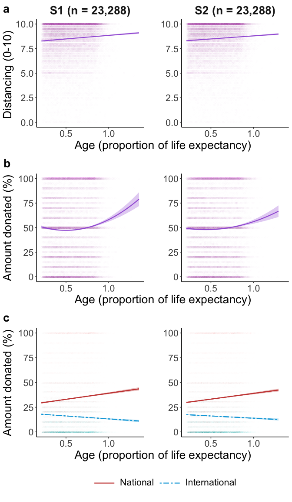

## Set up and functions

## Load and organise the data

## Means & correlations

## Mixed models

<table class="table" style="margin-left: auto; margin-right: auto;">
 <thead>
  <tr>
   <th style="text-align:left;"> Parameter </th>
   <th style="text-align:right;"> Coefficient </th>
   <th style="text-align:right;"> SE </th>
   <th style="text-align:right;"> CI_low </th>
   <th style="text-align:right;"> CI_high </th>
   <th style="text-align:right;"> t </th>
   <th style="text-align:right;"> df_error </th>
   <th style="text-align:right;"> p </th>
   <th style="text-align:right;"> d </th>
  </tr>
 </thead>
<tbody>
  <tr>
   <td style="text-align:left;"> (Intercept) </td>
   <td style="text-align:right;"> -0.1044 </td>
   <td style="text-align:right;"> 0.0363 </td>
   <td style="text-align:right;"> -0.1756 </td>
   <td style="text-align:right;"> -0.0333 </td>
   <td style="text-align:right;"> -2.876 </td>
   <td style="text-align:right;"> 70.47 </td>
   <td style="text-align:right;"> 0.0053 </td>
   <td style="text-align:right;"> -0.0380 </td>
  </tr>
  <tr>
   <td style="text-align:left;"> sexfemale </td>
   <td style="text-align:right;"> 0.2927 </td>
   <td style="text-align:right;"> 0.0127 </td>
   <td style="text-align:right;"> 0.2677 </td>
   <td style="text-align:right;"> 0.3177 </td>
   <td style="text-align:right;"> 22.955 </td>
   <td style="text-align:right;"> 22830.45 </td>
   <td style="text-align:right;"> 0.0000 </td>
   <td style="text-align:right;"> 0.3037 </td>
  </tr>
  <tr>
   <td style="text-align:left;"> risk1 </td>
   <td style="text-align:right;"> 0.0211 </td>
   <td style="text-align:right;"> 0.0129 </td>
   <td style="text-align:right;"> -0.0041 </td>
   <td style="text-align:right;"> 0.0463 </td>
   <td style="text-align:right;"> 1.639 </td>
   <td style="text-align:right;"> 53.21 </td>
   <td style="text-align:right;"> 0.1071 </td>
   <td style="text-align:right;"> 0.0217 </td>
  </tr>
  <tr>
   <td style="text-align:left;"> age </td>
   <td style="text-align:right;"> 0.0969 </td>
   <td style="text-align:right;"> 0.0159 </td>
   <td style="text-align:right;"> 0.0657 </td>
   <td style="text-align:right;"> 0.1282 </td>
   <td style="text-align:right;"> 6.082 </td>
   <td style="text-align:right;"> 54.78 </td>
   <td style="text-align:right;"> 0.0000 </td>
   <td style="text-align:right;"> 0.0805 </td>
  </tr>
</tbody>
</table>
<table class="table" style="margin-left: auto; margin-right: auto;">
 <thead>
  <tr>
   <th style="text-align:left;"> Parameter </th>
   <th style="text-align:right;"> Coefficient </th>
   <th style="text-align:right;"> SE </th>
   <th style="text-align:right;"> CI_low </th>
   <th style="text-align:right;"> CI_high </th>
   <th style="text-align:right;"> t </th>
   <th style="text-align:right;"> df_error </th>
   <th style="text-align:right;"> p </th>
   <th style="text-align:right;"> d </th>
  </tr>
 </thead>
<tbody>
  <tr>
   <td style="text-align:left;"> (Intercept) </td>
   <td style="text-align:right;"> -0.0915 </td>
   <td style="text-align:right;"> 0.0347 </td>
   <td style="text-align:right;"> -0.1595 </td>
   <td style="text-align:right;"> -0.0236 </td>
   <td style="text-align:right;"> -2.641 </td>
   <td style="text-align:right;"> 72.27 </td>
   <td style="text-align:right;"> 0.0101 </td>
   <td style="text-align:right;"> -0.0350 </td>
  </tr>
  <tr>
   <td style="text-align:left;"> sexfemale </td>
   <td style="text-align:right;"> 0.2603 </td>
   <td style="text-align:right;"> 0.0129 </td>
   <td style="text-align:right;"> 0.2351 </td>
   <td style="text-align:right;"> 0.2856 </td>
   <td style="text-align:right;"> 20.210 </td>
   <td style="text-align:right;"> 22776.56 </td>
   <td style="text-align:right;"> 0.0000 </td>
   <td style="text-align:right;"> 0.2676 </td>
  </tr>
  <tr>
   <td style="text-align:left;"> risk1 </td>
   <td style="text-align:right;"> 0.0248 </td>
   <td style="text-align:right;"> 0.0138 </td>
   <td style="text-align:right;"> -0.0022 </td>
   <td style="text-align:right;"> 0.0518 </td>
   <td style="text-align:right;"> 1.804 </td>
   <td style="text-align:right;"> 54.51 </td>
   <td style="text-align:right;"> 0.0768 </td>
   <td style="text-align:right;"> 0.0239 </td>
  </tr>
  <tr>
   <td style="text-align:left;"> age </td>
   <td style="text-align:right;"> 0.1048 </td>
   <td style="text-align:right;"> 0.0144 </td>
   <td style="text-align:right;"> 0.0765 </td>
   <td style="text-align:right;"> 0.1331 </td>
   <td style="text-align:right;"> 7.258 </td>
   <td style="text-align:right;"> 57.64 </td>
   <td style="text-align:right;"> 0.0000 </td>
   <td style="text-align:right;"> 0.0961 </td>
  </tr>
</tbody>
</table>
<table class="table" style="margin-left: auto; margin-right: auto;">
 <thead>
  <tr>
   <th style="text-align:left;"> Parameter </th>
   <th style="text-align:right;"> Coefficient </th>
   <th style="text-align:right;"> SE </th>
   <th style="text-align:right;"> CI_low </th>
   <th style="text-align:right;"> CI_high </th>
   <th style="text-align:right;"> t </th>
   <th style="text-align:right;"> df_error </th>
   <th style="text-align:right;"> p </th>
   <th style="text-align:right;"> d </th>
  </tr>
 </thead>
<tbody>
  <tr>
   <td style="text-align:left;"> (Intercept) </td>
   <td style="text-align:right;"> -0.0943 </td>
   <td style="text-align:right;"> 0.0373 </td>
   <td style="text-align:right;"> -0.1675 </td>
   <td style="text-align:right;"> -0.0212 </td>
   <td style="text-align:right;"> -2.527 </td>
   <td style="text-align:right;"> 76.86 </td>
   <td style="text-align:right;"> 0.0136 </td>
   <td style="text-align:right;"> -0.0334 </td>
  </tr>
  <tr>
   <td style="text-align:left;"> sexfemale </td>
   <td style="text-align:right;"> 0.1584 </td>
   <td style="text-align:right;"> 0.0128 </td>
   <td style="text-align:right;"> 0.1334 </td>
   <td style="text-align:right;"> 0.1835 </td>
   <td style="text-align:right;"> 12.406 </td>
   <td style="text-align:right;"> 22887.51 </td>
   <td style="text-align:right;"> 0.0000 </td>
   <td style="text-align:right;"> 0.1638 </td>
  </tr>
  <tr>
   <td style="text-align:left;"> Ladder </td>
   <td style="text-align:right;"> -0.0847 </td>
   <td style="text-align:right;"> 0.0115 </td>
   <td style="text-align:right;"> -0.1073 </td>
   <td style="text-align:right;"> -0.0621 </td>
   <td style="text-align:right;"> -7.350 </td>
   <td style="text-align:right;"> 47.72 </td>
   <td style="text-align:right;"> 0.0000 </td>
   <td style="text-align:right;"> -0.0971 </td>
  </tr>
  <tr>
   <td style="text-align:left;"> poly(age, 2, raw = TRUE)1 </td>
   <td style="text-align:right;"> 0.0563 </td>
   <td style="text-align:right;"> 0.0100 </td>
   <td style="text-align:right;"> 0.0368 </td>
   <td style="text-align:right;"> 0.0759 </td>
   <td style="text-align:right;"> 5.656 </td>
   <td style="text-align:right;"> 43.00 </td>
   <td style="text-align:right;"> 0.0000 </td>
   <td style="text-align:right;"> 0.0747 </td>
  </tr>
  <tr>
   <td style="text-align:left;"> poly(age, 2, raw = TRUE)2 </td>
   <td style="text-align:right;"> 0.0479 </td>
   <td style="text-align:right;"> 0.0067 </td>
   <td style="text-align:right;"> 0.0348 </td>
   <td style="text-align:right;"> 0.0609 </td>
   <td style="text-align:right;"> 7.174 </td>
   <td style="text-align:right;"> 5679.78 </td>
   <td style="text-align:right;"> 0.0000 </td>
   <td style="text-align:right;"> 0.0947 </td>
  </tr>
</tbody>
</table>
<table class="table" style="margin-left: auto; margin-right: auto;">
 <thead>
  <tr>
   <th style="text-align:left;"> Parameter </th>
   <th style="text-align:right;"> Coefficient </th>
   <th style="text-align:right;"> SE </th>
   <th style="text-align:right;"> CI_low </th>
   <th style="text-align:right;"> CI_high </th>
   <th style="text-align:right;"> t </th>
   <th style="text-align:right;"> df_error </th>
   <th style="text-align:right;"> p </th>
   <th style="text-align:right;"> d </th>
  </tr>
 </thead>
<tbody>
  <tr>
   <td style="text-align:left;"> (Intercept) </td>
   <td style="text-align:right;"> -0.0914 </td>
   <td style="text-align:right;"> 0.0359 </td>
   <td style="text-align:right;"> -0.1618 </td>
   <td style="text-align:right;"> -0.0211 </td>
   <td style="text-align:right;"> -2.549 </td>
   <td style="text-align:right;"> 76.94 </td>
   <td style="text-align:right;"> 0.0128 </td>
   <td style="text-align:right;"> -0.0337 </td>
  </tr>
  <tr>
   <td style="text-align:left;"> sexfemale </td>
   <td style="text-align:right;"> 0.1498 </td>
   <td style="text-align:right;"> 0.0129 </td>
   <td style="text-align:right;"> 0.1245 </td>
   <td style="text-align:right;"> 0.1750 </td>
   <td style="text-align:right;"> 11.631 </td>
   <td style="text-align:right;"> 22790.40 </td>
   <td style="text-align:right;"> 0.0000 </td>
   <td style="text-align:right;"> 0.1536 </td>
  </tr>
  <tr>
   <td style="text-align:left;"> Ladder </td>
   <td style="text-align:right;"> -0.0784 </td>
   <td style="text-align:right;"> 0.0106 </td>
   <td style="text-align:right;"> -0.0991 </td>
   <td style="text-align:right;"> -0.0576 </td>
   <td style="text-align:right;"> -7.396 </td>
   <td style="text-align:right;"> 47.98 </td>
   <td style="text-align:right;"> 0.0000 </td>
   <td style="text-align:right;"> -0.0977 </td>
  </tr>
  <tr>
   <td style="text-align:left;"> poly(age, 2, raw = TRUE)1 </td>
   <td style="text-align:right;"> 0.0352 </td>
   <td style="text-align:right;"> 0.0108 </td>
   <td style="text-align:right;"> 0.0141 </td>
   <td style="text-align:right;"> 0.0564 </td>
   <td style="text-align:right;"> 3.264 </td>
   <td style="text-align:right;"> 52.60 </td>
   <td style="text-align:right;"> 0.0019 </td>
   <td style="text-align:right;"> 0.0431 </td>
  </tr>
  <tr>
   <td style="text-align:left;"> poly(age, 2, raw = TRUE)2 </td>
   <td style="text-align:right;"> 0.0467 </td>
   <td style="text-align:right;"> 0.0068 </td>
   <td style="text-align:right;"> 0.0332 </td>
   <td style="text-align:right;"> 0.0601 </td>
   <td style="text-align:right;"> 6.812 </td>
   <td style="text-align:right;"> 8720.43 </td>
   <td style="text-align:right;"> 0.0000 </td>
   <td style="text-align:right;"> 0.0900 </td>
  </tr>
</tbody>
</table>
<table class="table" style="margin-left: auto; margin-right: auto;">
 <thead>
  <tr>
   <th style="text-align:left;"> Parameter </th>
   <th style="text-align:right;"> Coefficient </th>
   <th style="text-align:right;"> SE </th>
   <th style="text-align:right;"> CI_low </th>
   <th style="text-align:right;"> CI_high </th>
   <th style="text-align:right;"> t </th>
   <th style="text-align:right;"> df_error </th>
   <th style="text-align:right;"> p </th>
   <th style="text-align:right;"> d </th>
  </tr>
 </thead>
<tbody>
  <tr>
   <td style="text-align:left;"> (Intercept) </td>
   <td style="text-align:right;"> 0.2917 </td>
   <td style="text-align:right;"> 0.0256 </td>
   <td style="text-align:right;"> 0.2416 </td>
   <td style="text-align:right;"> 0.3418 </td>
   <td style="text-align:right;"> 11.415 </td>
   <td style="text-align:right;"> 76.17 </td>
   <td style="text-align:right;"> 0 </td>
   <td style="text-align:right;"> 0.1066 </td>
  </tr>
  <tr>
   <td style="text-align:left;"> sexfemale </td>
   <td style="text-align:right;"> 0.1144 </td>
   <td style="text-align:right;"> 0.0088 </td>
   <td style="text-align:right;"> 0.0972 </td>
   <td style="text-align:right;"> 0.1316 </td>
   <td style="text-align:right;"> 13.049 </td>
   <td style="text-align:right;"> 45735.98 </td>
   <td style="text-align:right;"> 0 </td>
   <td style="text-align:right;"> 0.1218 </td>
  </tr>
  <tr>
   <td style="text-align:left;"> Ladder </td>
   <td style="text-align:right;"> -0.0537 </td>
   <td style="text-align:right;"> 0.0079 </td>
   <td style="text-align:right;"> -0.0693 </td>
   <td style="text-align:right;"> -0.0382 </td>
   <td style="text-align:right;"> -6.769 </td>
   <td style="text-align:right;"> 50.31 </td>
   <td style="text-align:right;"> 0 </td>
   <td style="text-align:right;"> -0.0632 </td>
  </tr>
  <tr>
   <td style="text-align:left;"> age </td>
   <td style="text-align:right;"> 0.0782 </td>
   <td style="text-align:right;"> 0.0098 </td>
   <td style="text-align:right;"> 0.0590 </td>
   <td style="text-align:right;"> 0.0973 </td>
   <td style="text-align:right;"> 8.005 </td>
   <td style="text-align:right;"> 62.03 </td>
   <td style="text-align:right;"> 0 </td>
   <td style="text-align:right;"> 0.0747 </td>
  </tr>
  <tr>
   <td style="text-align:left;"> charityinternational </td>
   <td style="text-align:right;"> -0.6502 </td>
   <td style="text-align:right;"> 0.0086 </td>
   <td style="text-align:right;"> -0.6670 </td>
   <td style="text-align:right;"> -0.6334 </td>
   <td style="text-align:right;"> -75.879 </td>
   <td style="text-align:right;"> 45710.19 </td>
   <td style="text-align:right;"> 0 </td>
   <td style="text-align:right;"> -0.7085 </td>
  </tr>
  <tr>
   <td style="text-align:left;"> age:charityinternational </td>
   <td style="text-align:right;"> -0.1095 </td>
   <td style="text-align:right;"> 0.0086 </td>
   <td style="text-align:right;"> -0.1263 </td>
   <td style="text-align:right;"> -0.0927 </td>
   <td style="text-align:right;"> -12.768 </td>
   <td style="text-align:right;"> 45710.20 </td>
   <td style="text-align:right;"> 0 </td>
   <td style="text-align:right;"> -0.1192 </td>
  </tr>
</tbody>
</table>
<table class="table" style="margin-left: auto; margin-right: auto;">
 <thead>
  <tr>
   <th style="text-align:left;"> Parameter </th>
   <th style="text-align:right;"> Coefficient </th>
   <th style="text-align:right;"> SE </th>
   <th style="text-align:right;"> CI_low </th>
   <th style="text-align:right;"> CI_high </th>
   <th style="text-align:right;"> t </th>
   <th style="text-align:right;"> df_error </th>
   <th style="text-align:right;"> p </th>
   <th style="text-align:right;"> d </th>
  </tr>
 </thead>
<tbody>
  <tr>
   <td style="text-align:left;"> (Intercept) </td>
   <td style="text-align:right;"> 0.2992 </td>
   <td style="text-align:right;"> 0.0246 </td>
   <td style="text-align:right;"> 0.2510 </td>
   <td style="text-align:right;"> 0.3473 </td>
   <td style="text-align:right;"> 12.178 </td>
   <td style="text-align:right;"> 76.67 </td>
   <td style="text-align:right;"> 0 </td>
   <td style="text-align:right;"> 0.1137 </td>
  </tr>
  <tr>
   <td style="text-align:left;"> sexfemale </td>
   <td style="text-align:right;"> 0.1035 </td>
   <td style="text-align:right;"> 0.0088 </td>
   <td style="text-align:right;"> 0.0863 </td>
   <td style="text-align:right;"> 0.1208 </td>
   <td style="text-align:right;"> 11.756 </td>
   <td style="text-align:right;"> 45252.22 </td>
   <td style="text-align:right;"> 0 </td>
   <td style="text-align:right;"> 0.1098 </td>
  </tr>
  <tr>
   <td style="text-align:left;"> Ladder </td>
   <td style="text-align:right;"> -0.0512 </td>
   <td style="text-align:right;"> 0.0065 </td>
   <td style="text-align:right;"> -0.0640 </td>
   <td style="text-align:right;"> -0.0385 </td>
   <td style="text-align:right;"> -7.878 </td>
   <td style="text-align:right;"> 46.53 </td>
   <td style="text-align:right;"> 0 </td>
   <td style="text-align:right;"> -0.0736 </td>
  </tr>
  <tr>
   <td style="text-align:left;"> age </td>
   <td style="text-align:right;"> 0.0667 </td>
   <td style="text-align:right;"> 0.0097 </td>
   <td style="text-align:right;"> 0.0477 </td>
   <td style="text-align:right;"> 0.0857 </td>
   <td style="text-align:right;"> 6.877 </td>
   <td style="text-align:right;"> 72.37 </td>
   <td style="text-align:right;"> 0 </td>
   <td style="text-align:right;"> 0.0642 </td>
  </tr>
  <tr>
   <td style="text-align:left;"> charityinternational </td>
   <td style="text-align:right;"> -0.6604 </td>
   <td style="text-align:right;"> 0.0086 </td>
   <td style="text-align:right;"> -0.6772 </td>
   <td style="text-align:right;"> -0.6436 </td>
   <td style="text-align:right;"> -77.004 </td>
   <td style="text-align:right;"> 45717.50 </td>
   <td style="text-align:right;"> 0 </td>
   <td style="text-align:right;"> -0.7191 </td>
  </tr>
  <tr>
   <td style="text-align:left;"> age:charityinternational </td>
   <td style="text-align:right;"> -0.1208 </td>
   <td style="text-align:right;"> 0.0086 </td>
   <td style="text-align:right;"> -0.1376 </td>
   <td style="text-align:right;"> -0.1040 </td>
   <td style="text-align:right;"> -14.080 </td>
   <td style="text-align:right;"> 45717.50 </td>
   <td style="text-align:right;"> 0 </td>
   <td style="text-align:right;"> -0.1315 </td>
  </tr>
</tbody>
</table>
<table class="table" style="margin-left: auto; margin-right: auto;">
 <thead>
  <tr>
   <th style="text-align:left;"> Parameter </th>
   <th style="text-align:right;"> Coefficient </th>
   <th style="text-align:right;"> SE </th>
   <th style="text-align:right;"> CI_low </th>
   <th style="text-align:right;"> CI_high </th>
   <th style="text-align:right;"> t </th>
   <th style="text-align:right;"> df_error </th>
   <th style="text-align:right;"> p </th>
   <th style="text-align:right;"> d </th>
  </tr>
 </thead>
<tbody>
  <tr>
   <td style="text-align:left;"> (Intercept) </td>
   <td style="text-align:right;"> -0.0450 </td>
   <td style="text-align:right;"> 0.0356 </td>
   <td style="text-align:right;"> -0.1148 </td>
   <td style="text-align:right;"> 0.0249 </td>
   <td style="text-align:right;"> -1.262 </td>
   <td style="text-align:right;"> 71.65 </td>
   <td style="text-align:right;"> 0.2111 </td>
   <td style="text-align:right;"> -0.0167 </td>
  </tr>
  <tr>
   <td style="text-align:left;"> sexfemale </td>
   <td style="text-align:right;"> 0.1436 </td>
   <td style="text-align:right;"> 0.0129 </td>
   <td style="text-align:right;"> 0.1184 </td>
   <td style="text-align:right;"> 0.1688 </td>
   <td style="text-align:right;"> 11.162 </td>
   <td style="text-align:right;"> 22920.21 </td>
   <td style="text-align:right;"> 0.0000 </td>
   <td style="text-align:right;"> 0.1474 </td>
  </tr>
  <tr>
   <td style="text-align:left;"> Ladder </td>
   <td style="text-align:right;"> -0.0687 </td>
   <td style="text-align:right;"> 0.0111 </td>
   <td style="text-align:right;"> -0.0906 </td>
   <td style="text-align:right;"> -0.0469 </td>
   <td style="text-align:right;"> -6.172 </td>
   <td style="text-align:right;"> 48.09 </td>
   <td style="text-align:right;"> 0.0000 </td>
   <td style="text-align:right;"> -0.0815 </td>
  </tr>
  <tr>
   <td style="text-align:left;"> age </td>
   <td style="text-align:right;"> 0.0944 </td>
   <td style="text-align:right;"> 0.0117 </td>
   <td style="text-align:right;"> 0.0716 </td>
   <td style="text-align:right;"> 0.1173 </td>
   <td style="text-align:right;"> 8.094 </td>
   <td style="text-align:right;"> 43.23 </td>
   <td style="text-align:right;"> 0.0000 </td>
   <td style="text-align:right;"> 0.1069 </td>
  </tr>
</tbody>
</table>
<table class="table" style="margin-left: auto; margin-right: auto;">
 <thead>
  <tr>
   <th style="text-align:left;"> Parameter </th>
   <th style="text-align:right;"> Coefficient </th>
   <th style="text-align:right;"> SE </th>
   <th style="text-align:right;"> CI_low </th>
   <th style="text-align:right;"> CI_high </th>
   <th style="text-align:right;"> t </th>
   <th style="text-align:right;"> df_error </th>
   <th style="text-align:right;"> p </th>
   <th style="text-align:right;"> d </th>
  </tr>
 </thead>
<tbody>
  <tr>
   <td style="text-align:left;"> (Intercept) </td>
   <td style="text-align:right;"> -0.0544 </td>
   <td style="text-align:right;"> 0.0346 </td>
   <td style="text-align:right;"> -0.1221 </td>
   <td style="text-align:right;"> 0.0134 </td>
   <td style="text-align:right;"> -1.573 </td>
   <td style="text-align:right;"> 70.06 </td>
   <td style="text-align:right;"> 0.1202 </td>
   <td style="text-align:right;"> -0.0208 </td>
  </tr>
  <tr>
   <td style="text-align:left;"> sexfemale </td>
   <td style="text-align:right;"> 0.1337 </td>
   <td style="text-align:right;"> 0.0130 </td>
   <td style="text-align:right;"> 0.1083 </td>
   <td style="text-align:right;"> 0.1592 </td>
   <td style="text-align:right;"> 10.304 </td>
   <td style="text-align:right;"> 22851.95 </td>
   <td style="text-align:right;"> 0.0000 </td>
   <td style="text-align:right;"> 0.1361 </td>
  </tr>
  <tr>
   <td style="text-align:left;"> Ladder </td>
   <td style="text-align:right;"> -0.0689 </td>
   <td style="text-align:right;"> 0.0100 </td>
   <td style="text-align:right;"> -0.0885 </td>
   <td style="text-align:right;"> -0.0493 </td>
   <td style="text-align:right;"> -6.887 </td>
   <td style="text-align:right;"> 45.40 </td>
   <td style="text-align:right;"> 0.0000 </td>
   <td style="text-align:right;"> -0.0910 </td>
  </tr>
  <tr>
   <td style="text-align:left;"> age </td>
   <td style="text-align:right;"> 0.0779 </td>
   <td style="text-align:right;"> 0.0123 </td>
   <td style="text-align:right;"> 0.0538 </td>
   <td style="text-align:right;"> 0.1020 </td>
   <td style="text-align:right;"> 6.328 </td>
   <td style="text-align:right;"> 44.85 </td>
   <td style="text-align:right;"> 0.0000 </td>
   <td style="text-align:right;"> 0.0836 </td>
  </tr>
</tbody>
</table>
<table class="table" style="margin-left: auto; margin-right: auto;">
 <thead>
  <tr>
   <th style="text-align:left;"> Parameter </th>
   <th style="text-align:right;"> Coefficient </th>
   <th style="text-align:right;"> SE </th>
   <th style="text-align:right;"> CI_low </th>
   <th style="text-align:right;"> CI_high </th>
   <th style="text-align:right;"> t </th>
   <th style="text-align:right;"> df_error </th>
   <th style="text-align:right;"> p </th>
   <th style="text-align:right;"> d </th>
  </tr>
 </thead>
<tbody>
  <tr>
   <td style="text-align:left;"> (Intercept) </td>
   <td style="text-align:right;"> -0.0272 </td>
   <td style="text-align:right;"> 0.0322 </td>
   <td style="text-align:right;"> -0.0904 </td>
   <td style="text-align:right;"> 0.0360 </td>
   <td style="text-align:right;"> -0.8443 </td>
   <td style="text-align:right;"> 67.52 </td>
   <td style="text-align:right;"> 0.4015 </td>
   <td style="text-align:right;"> -0.0111 </td>
  </tr>
  <tr>
   <td style="text-align:left;"> sexfemale </td>
   <td style="text-align:right;"> 0.0937 </td>
   <td style="text-align:right;"> 0.0130 </td>
   <td style="text-align:right;"> 0.0683 </td>
   <td style="text-align:right;"> 0.1192 </td>
   <td style="text-align:right;"> 7.2334 </td>
   <td style="text-align:right;"> 22932.88 </td>
   <td style="text-align:right;"> 0.0000 </td>
   <td style="text-align:right;"> 0.0955 </td>
  </tr>
  <tr>
   <td style="text-align:left;"> Ladder </td>
   <td style="text-align:right;"> -0.0427 </td>
   <td style="text-align:right;"> 0.0114 </td>
   <td style="text-align:right;"> -0.0652 </td>
   <td style="text-align:right;"> -0.0203 </td>
   <td style="text-align:right;"> -3.7368 </td>
   <td style="text-align:right;"> 51.49 </td>
   <td style="text-align:right;"> 0.0005 </td>
   <td style="text-align:right;"> -0.0493 </td>
  </tr>
  <tr>
   <td style="text-align:left;"> age </td>
   <td style="text-align:right;"> -0.0628 </td>
   <td style="text-align:right;"> 0.0142 </td>
   <td style="text-align:right;"> -0.0907 </td>
   <td style="text-align:right;"> -0.0349 </td>
   <td style="text-align:right;"> -4.4137 </td>
   <td style="text-align:right;"> 53.04 </td>
   <td style="text-align:right;"> 0.0001 </td>
   <td style="text-align:right;"> -0.0583 </td>
  </tr>
</tbody>
</table>
<table class="table" style="margin-left: auto; margin-right: auto;">
 <thead>
  <tr>
   <th style="text-align:left;"> Parameter </th>
   <th style="text-align:right;"> Coefficient </th>
   <th style="text-align:right;"> SE </th>
   <th style="text-align:right;"> CI_low </th>
   <th style="text-align:right;"> CI_high </th>
   <th style="text-align:right;"> t </th>
   <th style="text-align:right;"> df_error </th>
   <th style="text-align:right;"> p </th>
   <th style="text-align:right;"> d </th>
  </tr>
 </thead>
<tbody>
  <tr>
   <td style="text-align:left;"> (Intercept) </td>
   <td style="text-align:right;"> -0.0085 </td>
   <td style="text-align:right;"> 0.0324 </td>
   <td style="text-align:right;"> -0.0721 </td>
   <td style="text-align:right;"> 0.0550 </td>
   <td style="text-align:right;"> -0.2634 </td>
   <td style="text-align:right;"> 66.47 </td>
   <td style="text-align:right;"> 0.7931 </td>
   <td style="text-align:right;"> -0.0035 </td>
  </tr>
  <tr>
   <td style="text-align:left;"> sexfemale </td>
   <td style="text-align:right;"> 0.0808 </td>
   <td style="text-align:right;"> 0.0130 </td>
   <td style="text-align:right;"> 0.0552 </td>
   <td style="text-align:right;"> 0.1063 </td>
   <td style="text-align:right;"> 6.2051 </td>
   <td style="text-align:right;"> 22870.19 </td>
   <td style="text-align:right;"> 0.0000 </td>
   <td style="text-align:right;"> 0.0819 </td>
  </tr>
  <tr>
   <td style="text-align:left;"> Ladder </td>
   <td style="text-align:right;"> -0.0366 </td>
   <td style="text-align:right;"> 0.0092 </td>
   <td style="text-align:right;"> -0.0546 </td>
   <td style="text-align:right;"> -0.0186 </td>
   <td style="text-align:right;"> -3.9798 </td>
   <td style="text-align:right;"> 52.14 </td>
   <td style="text-align:right;"> 0.0002 </td>
   <td style="text-align:right;"> -0.0526 </td>
  </tr>
  <tr>
   <td style="text-align:left;"> age </td>
   <td style="text-align:right;"> -0.0824 </td>
   <td style="text-align:right;"> 0.0127 </td>
   <td style="text-align:right;"> -0.1073 </td>
   <td style="text-align:right;"> -0.0574 </td>
   <td style="text-align:right;"> -6.4758 </td>
   <td style="text-align:right;"> 53.47 </td>
   <td style="text-align:right;"> 0.0000 </td>
   <td style="text-align:right;"> -0.0855 </td>
  </tr>
</tbody>
</table>

## Plots of age (raw & adjusted) with distancing & giving

## Mixed model controlling for objective wealth

<table class="table" style="margin-left: auto; margin-right: auto;">
 <thead>
  <tr>
   <th style="text-align:left;"> Parameter </th>
   <th style="text-align:right;"> Coefficient </th>
   <th style="text-align:right;"> SE </th>
   <th style="text-align:right;"> CI_low </th>
   <th style="text-align:right;"> CI_high </th>
   <th style="text-align:right;"> t </th>
   <th style="text-align:right;"> df_error </th>
   <th style="text-align:right;"> p </th>
   <th style="text-align:right;"> d </th>
  </tr>
 </thead>
<tbody>
  <tr>
   <td style="text-align:left;"> (Intercept) </td>
   <td style="text-align:right;"> 0.2822 </td>
   <td style="text-align:right;"> 0.0806 </td>
   <td style="text-align:right;"> 0.1243 </td>
   <td style="text-align:right;"> 0.4402 </td>
   <td style="text-align:right;"> 3.5027 </td>
   <td style="text-align:right;"> 4.409 </td>
   <td style="text-align:right;"> 0.0212 </td>
   <td style="text-align:right;"> 0.0969 </td>
  </tr>
  <tr>
   <td style="text-align:left;"> sexfemale </td>
   <td style="text-align:right;"> 0.1274 </td>
   <td style="text-align:right;"> 0.0256 </td>
   <td style="text-align:right;"> 0.0773 </td>
   <td style="text-align:right;"> 0.1775 </td>
   <td style="text-align:right;"> 4.9843 </td>
   <td style="text-align:right;"> 5199.646 </td>
   <td style="text-align:right;"> 0.0000 </td>
   <td style="text-align:right;"> 0.1379 </td>
  </tr>
  <tr>
   <td style="text-align:left;"> Income </td>
   <td style="text-align:right;"> 0.0192 </td>
   <td style="text-align:right;"> 0.0232 </td>
   <td style="text-align:right;"> -0.0262 </td>
   <td style="text-align:right;"> 0.0646 </td>
   <td style="text-align:right;"> 0.8292 </td>
   <td style="text-align:right;"> 4.185 </td>
   <td style="text-align:right;"> 0.4517 </td>
   <td style="text-align:right;"> 0.0229 </td>
  </tr>
  <tr>
   <td style="text-align:left;"> age </td>
   <td style="text-align:right;"> 0.1106 </td>
   <td style="text-align:right;"> 0.0357 </td>
   <td style="text-align:right;"> 0.0407 </td>
   <td style="text-align:right;"> 0.1806 </td>
   <td style="text-align:right;"> 3.1013 </td>
   <td style="text-align:right;"> 5.512 </td>
   <td style="text-align:right;"> 0.0236 </td>
   <td style="text-align:right;"> 0.0858 </td>
  </tr>
  <tr>
   <td style="text-align:left;"> charityinternational </td>
   <td style="text-align:right;"> -0.7104 </td>
   <td style="text-align:right;"> 0.0252 </td>
   <td style="text-align:right;"> -0.7598 </td>
   <td style="text-align:right;"> -0.6610 </td>
   <td style="text-align:right;"> -28.1764 </td>
   <td style="text-align:right;"> 5220.298 </td>
   <td style="text-align:right;"> 0.0000 </td>
   <td style="text-align:right;"> -0.7794 </td>
  </tr>
  <tr>
   <td style="text-align:left;"> age:charityinternational </td>
   <td style="text-align:right;"> -0.2182 </td>
   <td style="text-align:right;"> 0.0252 </td>
   <td style="text-align:right;"> -0.2676 </td>
   <td style="text-align:right;"> -0.1688 </td>
   <td style="text-align:right;"> -8.6516 </td>
   <td style="text-align:right;"> 5220.298 </td>
   <td style="text-align:right;"> 0.0000 </td>
   <td style="text-align:right;"> -0.2393 </td>
  </tr>
</tbody>
</table>

## Quantification of effects in each country & map plots

## Country-level variables in mixed models of donations - model comparison (done manually)

## Country-level variables in mixed models of donations & distancing - final models & formatting

<table class="table" style="margin-left: auto; margin-right: auto;">
 <thead>
  <tr>
   <th style="text-align:left;"> Parameter </th>
   <th style="text-align:right;"> Coefficient </th>
   <th style="text-align:right;"> SE </th>
   <th style="text-align:right;"> CI_low </th>
   <th style="text-align:right;"> CI_high </th>
   <th style="text-align:right;"> t </th>
   <th style="text-align:right;"> df_error </th>
   <th style="text-align:right;"> p </th>
   <th style="text-align:right;"> d </th>
  </tr>
 </thead>
<tbody>
  <tr>
   <td style="text-align:left;"> (Intercept) </td>
   <td style="text-align:right;"> -0.1473 </td>
   <td style="text-align:right;"> 0.0395 </td>
   <td style="text-align:right;"> -0.2246 </td>
   <td style="text-align:right;"> -0.0699 </td>
   <td style="text-align:right;"> -3.7311 </td>
   <td style="text-align:right;"> 41.84 </td>
   <td style="text-align:right;"> 0.0006 </td>
   <td style="text-align:right;"> -0.0537 </td>
  </tr>
  <tr>
   <td style="text-align:left;"> sexfemale </td>
   <td style="text-align:right;"> 0.3077 </td>
   <td style="text-align:right;"> 0.0140 </td>
   <td style="text-align:right;"> 0.2803 </td>
   <td style="text-align:right;"> 0.3350 </td>
   <td style="text-align:right;"> 22.0320 </td>
   <td style="text-align:right;"> 19268.23 </td>
   <td style="text-align:right;"> 0.0000 </td>
   <td style="text-align:right;"> 0.3174 </td>
  </tr>
  <tr>
   <td style="text-align:left;"> risk1 </td>
   <td style="text-align:right;"> 0.0309 </td>
   <td style="text-align:right;"> 0.0073 </td>
   <td style="text-align:right;"> 0.0166 </td>
   <td style="text-align:right;"> 0.0452 </td>
   <td style="text-align:right;"> 4.2348 </td>
   <td style="text-align:right;"> 19237.74 </td>
   <td style="text-align:right;"> 0.0000 </td>
   <td style="text-align:right;"> 0.0610 </td>
  </tr>
  <tr>
   <td style="text-align:left;"> age </td>
   <td style="text-align:right;"> 0.1115 </td>
   <td style="text-align:right;"> 0.0185 </td>
   <td style="text-align:right;"> 0.0753 </td>
   <td style="text-align:right;"> 0.1478 </td>
   <td style="text-align:right;"> 6.0327 </td>
   <td style="text-align:right;"> 32.65 </td>
   <td style="text-align:right;"> 0.0000 </td>
   <td style="text-align:right;"> 0.0869 </td>
  </tr>
  <tr>
   <td style="text-align:left;"> world_total_deaths </td>
   <td style="text-align:right;"> -0.0405 </td>
   <td style="text-align:right;"> 0.0175 </td>
   <td style="text-align:right;"> -0.0748 </td>
   <td style="text-align:right;"> -0.0063 </td>
   <td style="text-align:right;"> -2.3187 </td>
   <td style="text-align:right;"> 791.71 </td>
   <td style="text-align:right;"> 0.0207 </td>
   <td style="text-align:right;"> -0.0334 </td>
  </tr>
  <tr>
   <td style="text-align:left;"> world_rolling_deaths_slope </td>
   <td style="text-align:right;"> -0.0339 </td>
   <td style="text-align:right;"> 0.0120 </td>
   <td style="text-align:right;"> -0.0573 </td>
   <td style="text-align:right;"> -0.0104 </td>
   <td style="text-align:right;"> -2.8309 </td>
   <td style="text-align:right;"> 4829.87 </td>
   <td style="text-align:right;"> 0.0047 </td>
   <td style="text-align:right;"> -0.0408 </td>
  </tr>
  <tr>
   <td style="text-align:left;"> total_deaths </td>
   <td style="text-align:right;"> 0.0994 </td>
   <td style="text-align:right;"> 0.0403 </td>
   <td style="text-align:right;"> 0.0203 </td>
   <td style="text-align:right;"> 0.1785 </td>
   <td style="text-align:right;"> 2.4633 </td>
   <td style="text-align:right;"> 46.69 </td>
   <td style="text-align:right;"> 0.0175 </td>
   <td style="text-align:right;"> 0.0355 </td>
  </tr>
  <tr>
   <td style="text-align:left;"> rolling_deaths_slope </td>
   <td style="text-align:right;"> 0.0689 </td>
   <td style="text-align:right;"> 0.0261 </td>
   <td style="text-align:right;"> 0.0178 </td>
   <td style="text-align:right;"> 0.1201 </td>
   <td style="text-align:right;"> 2.6404 </td>
   <td style="text-align:right;"> 556.04 </td>
   <td style="text-align:right;"> 0.0085 </td>
   <td style="text-align:right;"> 0.0380 </td>
  </tr>
  <tr>
   <td style="text-align:left;"> x2018GNI </td>
   <td style="text-align:right;"> -0.0983 </td>
   <td style="text-align:right;"> 0.0386 </td>
   <td style="text-align:right;"> -0.1740 </td>
   <td style="text-align:right;"> -0.0226 </td>
   <td style="text-align:right;"> -2.5452 </td>
   <td style="text-align:right;"> 40.53 </td>
   <td style="text-align:right;"> 0.0148 </td>
   <td style="text-align:right;"> -0.0367 </td>
  </tr>
  <tr>
   <td style="text-align:left;"> age:world_total_deaths </td>
   <td style="text-align:right;"> -0.0032 </td>
   <td style="text-align:right;"> 0.0141 </td>
   <td style="text-align:right;"> -0.0307 </td>
   <td style="text-align:right;"> 0.0244 </td>
   <td style="text-align:right;"> -0.2250 </td>
   <td style="text-align:right;"> 204.03 </td>
   <td style="text-align:right;"> 0.8222 </td>
   <td style="text-align:right;"> -0.0032 </td>
  </tr>
  <tr>
   <td style="text-align:left;"> age:world_rolling_deaths_slope </td>
   <td style="text-align:right;"> 0.0106 </td>
   <td style="text-align:right;"> 0.0111 </td>
   <td style="text-align:right;"> -0.0111 </td>
   <td style="text-align:right;"> 0.0323 </td>
   <td style="text-align:right;"> 0.9591 </td>
   <td style="text-align:right;"> 686.76 </td>
   <td style="text-align:right;"> 0.3379 </td>
   <td style="text-align:right;"> 0.0138 </td>
  </tr>
  <tr>
   <td style="text-align:left;"> age:total_deaths </td>
   <td style="text-align:right;"> -0.0068 </td>
   <td style="text-align:right;"> 0.0208 </td>
   <td style="text-align:right;"> -0.0475 </td>
   <td style="text-align:right;"> 0.0339 </td>
   <td style="text-align:right;"> -0.3289 </td>
   <td style="text-align:right;"> 39.42 </td>
   <td style="text-align:right;"> 0.7440 </td>
   <td style="text-align:right;"> -0.0047 </td>
  </tr>
  <tr>
   <td style="text-align:left;"> age:rolling_deaths_slope </td>
   <td style="text-align:right;"> -0.0161 </td>
   <td style="text-align:right;"> 0.0183 </td>
   <td style="text-align:right;"> -0.0520 </td>
   <td style="text-align:right;"> 0.0197 </td>
   <td style="text-align:right;"> -0.8821 </td>
   <td style="text-align:right;"> 70.78 </td>
   <td style="text-align:right;"> 0.3807 </td>
   <td style="text-align:right;"> -0.0127 </td>
  </tr>
  <tr>
   <td style="text-align:left;"> age:x2018GNI </td>
   <td style="text-align:right;"> 0.0467 </td>
   <td style="text-align:right;"> 0.0188 </td>
   <td style="text-align:right;"> 0.0098 </td>
   <td style="text-align:right;"> 0.0836 </td>
   <td style="text-align:right;"> 2.4803 </td>
   <td style="text-align:right;"> 35.78 </td>
   <td style="text-align:right;"> 0.0180 </td>
   <td style="text-align:right;"> 0.0357 </td>
  </tr>
</tbody>
</table>
<table class="table" style="margin-left: auto; margin-right: auto;">
 <thead>
  <tr>
   <th style="text-align:left;"> Parameter </th>
   <th style="text-align:right;"> Coefficient </th>
   <th style="text-align:right;"> SE </th>
   <th style="text-align:right;"> CI_low </th>
   <th style="text-align:right;"> CI_high </th>
   <th style="text-align:right;"> t </th>
   <th style="text-align:right;"> df_error </th>
   <th style="text-align:right;"> p </th>
   <th style="text-align:right;"> d </th>
  </tr>
 </thead>
<tbody>
  <tr>
   <td style="text-align:left;"> (Intercept) </td>
   <td style="text-align:right;"> -0.1140 </td>
   <td style="text-align:right;"> 0.0365 </td>
   <td style="text-align:right;"> -0.1856 </td>
   <td style="text-align:right;"> -0.0424 </td>
   <td style="text-align:right;"> -3.1199 </td>
   <td style="text-align:right;"> 43.20 </td>
   <td style="text-align:right;"> 0.0032 </td>
   <td style="text-align:right;"> -0.0452 </td>
  </tr>
  <tr>
   <td style="text-align:left;"> sexfemale </td>
   <td style="text-align:right;"> 0.2651 </td>
   <td style="text-align:right;"> 0.0142 </td>
   <td style="text-align:right;"> 0.2373 </td>
   <td style="text-align:right;"> 0.2929 </td>
   <td style="text-align:right;"> 18.6735 </td>
   <td style="text-align:right;"> 19071.58 </td>
   <td style="text-align:right;"> 0.0000 </td>
   <td style="text-align:right;"> 0.2703 </td>
  </tr>
  <tr>
   <td style="text-align:left;"> risk1 </td>
   <td style="text-align:right;"> 0.0257 </td>
   <td style="text-align:right;"> 0.0074 </td>
   <td style="text-align:right;"> 0.0111 </td>
   <td style="text-align:right;"> 0.0402 </td>
   <td style="text-align:right;"> 3.4524 </td>
   <td style="text-align:right;"> 19036.94 </td>
   <td style="text-align:right;"> 0.0006 </td>
   <td style="text-align:right;"> 0.0500 </td>
  </tr>
  <tr>
   <td style="text-align:left;"> age </td>
   <td style="text-align:right;"> 0.1167 </td>
   <td style="text-align:right;"> 0.0170 </td>
   <td style="text-align:right;"> 0.0833 </td>
   <td style="text-align:right;"> 0.1500 </td>
   <td style="text-align:right;"> 6.8605 </td>
   <td style="text-align:right;"> 30.95 </td>
   <td style="text-align:right;"> 0.0000 </td>
   <td style="text-align:right;"> 0.0993 </td>
  </tr>
  <tr>
   <td style="text-align:left;"> world_total_deaths </td>
   <td style="text-align:right;"> -0.0419 </td>
   <td style="text-align:right;"> 0.0173 </td>
   <td style="text-align:right;"> -0.0757 </td>
   <td style="text-align:right;"> -0.0081 </td>
   <td style="text-align:right;"> -2.4305 </td>
   <td style="text-align:right;"> 654.15 </td>
   <td style="text-align:right;"> 0.0153 </td>
   <td style="text-align:right;"> -0.0352 </td>
  </tr>
  <tr>
   <td style="text-align:left;"> world_rolling_deaths_slope </td>
   <td style="text-align:right;"> -0.0132 </td>
   <td style="text-align:right;"> 0.0121 </td>
   <td style="text-align:right;"> -0.0369 </td>
   <td style="text-align:right;"> 0.0106 </td>
   <td style="text-align:right;"> -1.0855 </td>
   <td style="text-align:right;"> 3706.90 </td>
   <td style="text-align:right;"> 0.2778 </td>
   <td style="text-align:right;"> -0.0157 </td>
  </tr>
  <tr>
   <td style="text-align:left;"> total_deaths </td>
   <td style="text-align:right;"> 0.0821 </td>
   <td style="text-align:right;"> 0.0378 </td>
   <td style="text-align:right;"> 0.0081 </td>
   <td style="text-align:right;"> 0.1561 </td>
   <td style="text-align:right;"> 2.1753 </td>
   <td style="text-align:right;"> 47.37 </td>
   <td style="text-align:right;"> 0.0346 </td>
   <td style="text-align:right;"> 0.0315 </td>
  </tr>
  <tr>
   <td style="text-align:left;"> rolling_deaths_slope </td>
   <td style="text-align:right;"> 0.0245 </td>
   <td style="text-align:right;"> 0.0261 </td>
   <td style="text-align:right;"> -0.0267 </td>
   <td style="text-align:right;"> 0.0756 </td>
   <td style="text-align:right;"> 0.9366 </td>
   <td style="text-align:right;"> 430.69 </td>
   <td style="text-align:right;"> 0.3495 </td>
   <td style="text-align:right;"> 0.0136 </td>
  </tr>
  <tr>
   <td style="text-align:left;"> x2018GNI </td>
   <td style="text-align:right;"> -0.1083 </td>
   <td style="text-align:right;"> 0.0358 </td>
   <td style="text-align:right;"> -0.1785 </td>
   <td style="text-align:right;"> -0.0381 </td>
   <td style="text-align:right;"> -3.0233 </td>
   <td style="text-align:right;"> 41.45 </td>
   <td style="text-align:right;"> 0.0043 </td>
   <td style="text-align:right;"> -0.0438 </td>
  </tr>
  <tr>
   <td style="text-align:left;"> age:world_total_deaths </td>
   <td style="text-align:right;"> 0.0111 </td>
   <td style="text-align:right;"> 0.0136 </td>
   <td style="text-align:right;"> -0.0157 </td>
   <td style="text-align:right;"> 0.0378 </td>
   <td style="text-align:right;"> 0.8124 </td>
   <td style="text-align:right;"> 164.09 </td>
   <td style="text-align:right;"> 0.4177 </td>
   <td style="text-align:right;"> 0.0118 </td>
  </tr>
  <tr>
   <td style="text-align:left;"> age:world_rolling_deaths_slope </td>
   <td style="text-align:right;"> 0.0137 </td>
   <td style="text-align:right;"> 0.0112 </td>
   <td style="text-align:right;"> -0.0082 </td>
   <td style="text-align:right;"> 0.0355 </td>
   <td style="text-align:right;"> 1.2231 </td>
   <td style="text-align:right;"> 476.10 </td>
   <td style="text-align:right;"> 0.2219 </td>
   <td style="text-align:right;"> 0.0177 </td>
  </tr>
  <tr>
   <td style="text-align:left;"> age:total_deaths </td>
   <td style="text-align:right;"> -0.0138 </td>
   <td style="text-align:right;"> 0.0193 </td>
   <td style="text-align:right;"> -0.0516 </td>
   <td style="text-align:right;"> 0.0241 </td>
   <td style="text-align:right;"> -0.7128 </td>
   <td style="text-align:right;"> 37.34 </td>
   <td style="text-align:right;"> 0.4804 </td>
   <td style="text-align:right;"> -0.0103 </td>
  </tr>
  <tr>
   <td style="text-align:left;"> age:rolling_deaths_slope </td>
   <td style="text-align:right;"> -0.0208 </td>
   <td style="text-align:right;"> 0.0177 </td>
   <td style="text-align:right;"> -0.0554 </td>
   <td style="text-align:right;"> 0.0138 </td>
   <td style="text-align:right;"> -1.1769 </td>
   <td style="text-align:right;"> 57.94 </td>
   <td style="text-align:right;"> 0.2440 </td>
   <td style="text-align:right;"> -0.0170 </td>
  </tr>
  <tr>
   <td style="text-align:left;"> age:x2018GNI </td>
   <td style="text-align:right;"> 0.0349 </td>
   <td style="text-align:right;"> 0.0175 </td>
   <td style="text-align:right;"> 0.0005 </td>
   <td style="text-align:right;"> 0.0692 </td>
   <td style="text-align:right;"> 1.9913 </td>
   <td style="text-align:right;"> 34.66 </td>
   <td style="text-align:right;"> 0.0544 </td>
   <td style="text-align:right;"> 0.0288 </td>
  </tr>
</tbody>
</table>
<table class="table" style="margin-left: auto; margin-right: auto;">
 <thead>
  <tr>
   <th style="text-align:left;"> Parameter </th>
   <th style="text-align:right;"> Coefficient </th>
   <th style="text-align:right;"> SE </th>
   <th style="text-align:right;"> CI_low </th>
   <th style="text-align:right;"> CI_high </th>
   <th style="text-align:right;"> t </th>
   <th style="text-align:right;"> df_error </th>
   <th style="text-align:right;"> p </th>
   <th style="text-align:right;"> d </th>
  </tr>
 </thead>
<tbody>
  <tr>
   <td style="text-align:left;"> (Intercept) </td>
   <td style="text-align:right;"> 0.2658 </td>
   <td style="text-align:right;"> 0.0261 </td>
   <td style="text-align:right;"> 0.2147 </td>
   <td style="text-align:right;"> 0.3170 </td>
   <td style="text-align:right;"> 10.1836 </td>
   <td style="text-align:right;"> 44.14 </td>
   <td style="text-align:right;"> 0.0000 </td>
   <td style="text-align:right;"> 0.1035 </td>
  </tr>
  <tr>
   <td style="text-align:left;"> sexfemale </td>
   <td style="text-align:right;"> 0.1202 </td>
   <td style="text-align:right;"> 0.0095 </td>
   <td style="text-align:right;"> 0.1016 </td>
   <td style="text-align:right;"> 0.1389 </td>
   <td style="text-align:right;"> 12.6168 </td>
   <td style="text-align:right;"> 38570.48 </td>
   <td style="text-align:right;"> 0.0000 </td>
   <td style="text-align:right;"> 0.1282 </td>
  </tr>
  <tr>
   <td style="text-align:left;"> Ladder </td>
   <td style="text-align:right;"> -0.0565 </td>
   <td style="text-align:right;"> 0.0082 </td>
   <td style="text-align:right;"> -0.0725 </td>
   <td style="text-align:right;"> -0.0404 </td>
   <td style="text-align:right;"> -6.8822 </td>
   <td style="text-align:right;"> 41.05 </td>
   <td style="text-align:right;"> 0.0000 </td>
   <td style="text-align:right;"> -0.0700 </td>
  </tr>
  <tr>
   <td style="text-align:left;"> age </td>
   <td style="text-align:right;"> 0.1004 </td>
   <td style="text-align:right;"> 0.0102 </td>
   <td style="text-align:right;"> 0.0803 </td>
   <td style="text-align:right;"> 0.1204 </td>
   <td style="text-align:right;"> 9.8169 </td>
   <td style="text-align:right;"> 48.43 </td>
   <td style="text-align:right;"> 0.0000 </td>
   <td style="text-align:right;"> 0.0998 </td>
  </tr>
  <tr>
   <td style="text-align:left;"> charityinternational </td>
   <td style="text-align:right;"> -0.6564 </td>
   <td style="text-align:right;"> 0.0094 </td>
   <td style="text-align:right;"> -0.6748 </td>
   <td style="text-align:right;"> -0.6380 </td>
   <td style="text-align:right;"> -69.9636 </td>
   <td style="text-align:right;"> 38591.82 </td>
   <td style="text-align:right;"> 0.0000 </td>
   <td style="text-align:right;"> -0.7112 </td>
  </tr>
  <tr>
   <td style="text-align:left;"> world_total_deaths </td>
   <td style="text-align:right;"> -0.0231 </td>
   <td style="text-align:right;"> 0.0126 </td>
   <td style="text-align:right;"> -0.0478 </td>
   <td style="text-align:right;"> 0.0015 </td>
   <td style="text-align:right;"> -1.8395 </td>
   <td style="text-align:right;"> 1001.42 </td>
   <td style="text-align:right;"> 0.0661 </td>
   <td style="text-align:right;"> -0.0187 </td>
  </tr>
  <tr>
   <td style="text-align:left;"> world_rolling_deaths_slope </td>
   <td style="text-align:right;"> -0.0035 </td>
   <td style="text-align:right;"> 0.0081 </td>
   <td style="text-align:right;"> -0.0193 </td>
   <td style="text-align:right;"> 0.0123 </td>
   <td style="text-align:right;"> -0.4325 </td>
   <td style="text-align:right;"> 4716.28 </td>
   <td style="text-align:right;"> 0.6654 </td>
   <td style="text-align:right;"> -0.0044 </td>
  </tr>
  <tr>
   <td style="text-align:left;"> total_deaths </td>
   <td style="text-align:right;"> 0.0011 </td>
   <td style="text-align:right;"> 0.0268 </td>
   <td style="text-align:right;"> -0.0514 </td>
   <td style="text-align:right;"> 0.0536 </td>
   <td style="text-align:right;"> 0.0402 </td>
   <td style="text-align:right;"> 49.28 </td>
   <td style="text-align:right;"> 0.9681 </td>
   <td style="text-align:right;"> 0.0004 </td>
  </tr>
  <tr>
   <td style="text-align:left;"> rolling_deaths_slope </td>
   <td style="text-align:right;"> 0.0231 </td>
   <td style="text-align:right;"> 0.0183 </td>
   <td style="text-align:right;"> -0.0129 </td>
   <td style="text-align:right;"> 0.0590 </td>
   <td style="text-align:right;"> 1.2579 </td>
   <td style="text-align:right;"> 570.46 </td>
   <td style="text-align:right;"> 0.2090 </td>
   <td style="text-align:right;"> 0.0128 </td>
  </tr>
  <tr>
   <td style="text-align:left;"> x2018GNI </td>
   <td style="text-align:right;"> -0.1836 </td>
   <td style="text-align:right;"> 0.0256 </td>
   <td style="text-align:right;"> -0.2339 </td>
   <td style="text-align:right;"> -0.1334 </td>
   <td style="text-align:right;"> -7.1619 </td>
   <td style="text-align:right;"> 43.21 </td>
   <td style="text-align:right;"> 0.0000 </td>
   <td style="text-align:right;"> -0.0728 </td>
  </tr>
  <tr>
   <td style="text-align:left;"> age:charityinternational </td>
   <td style="text-align:right;"> -0.1530 </td>
   <td style="text-align:right;"> 0.0096 </td>
   <td style="text-align:right;"> -0.1719 </td>
   <td style="text-align:right;"> -0.1341 </td>
   <td style="text-align:right;"> -15.8657 </td>
   <td style="text-align:right;"> 38591.82 </td>
   <td style="text-align:right;"> 0.0000 </td>
   <td style="text-align:right;"> -0.1613 </td>
  </tr>
  <tr>
   <td style="text-align:left;"> age:world_total_deaths </td>
   <td style="text-align:right;"> -0.0124 </td>
   <td style="text-align:right;"> 0.0078 </td>
   <td style="text-align:right;"> -0.0278 </td>
   <td style="text-align:right;"> 0.0029 </td>
   <td style="text-align:right;"> -1.5898 </td>
   <td style="text-align:right;"> 106.54 </td>
   <td style="text-align:right;"> 0.1148 </td>
   <td style="text-align:right;"> -0.0162 </td>
  </tr>
  <tr>
   <td style="text-align:left;"> charityinternational:world_total_deaths </td>
   <td style="text-align:right;"> 0.0582 </td>
   <td style="text-align:right;"> 0.0096 </td>
   <td style="text-align:right;"> 0.0394 </td>
   <td style="text-align:right;"> 0.0770 </td>
   <td style="text-align:right;"> 6.0596 </td>
   <td style="text-align:right;"> 38591.82 </td>
   <td style="text-align:right;"> 0.0000 </td>
   <td style="text-align:right;"> 0.0616 </td>
  </tr>
  <tr>
   <td style="text-align:left;"> age:total_deaths </td>
   <td style="text-align:right;"> -0.0212 </td>
   <td style="text-align:right;"> 0.0115 </td>
   <td style="text-align:right;"> -0.0438 </td>
   <td style="text-align:right;"> 0.0014 </td>
   <td style="text-align:right;"> -1.8354 </td>
   <td style="text-align:right;"> 53.23 </td>
   <td style="text-align:right;"> 0.0720 </td>
   <td style="text-align:right;"> -0.0187 </td>
  </tr>
  <tr>
   <td style="text-align:left;"> charityinternational:total_deaths </td>
   <td style="text-align:right;"> 0.0496 </td>
   <td style="text-align:right;"> 0.0107 </td>
   <td style="text-align:right;"> 0.0285 </td>
   <td style="text-align:right;"> 0.0707 </td>
   <td style="text-align:right;"> 4.6138 </td>
   <td style="text-align:right;"> 38591.82 </td>
   <td style="text-align:right;"> 0.0000 </td>
   <td style="text-align:right;"> 0.0469 </td>
  </tr>
  <tr>
   <td style="text-align:left;"> age:rolling_deaths_slope </td>
   <td style="text-align:right;"> -0.0271 </td>
   <td style="text-align:right;"> 0.0107 </td>
   <td style="text-align:right;"> -0.0480 </td>
   <td style="text-align:right;"> -0.0062 </td>
   <td style="text-align:right;"> -2.5366 </td>
   <td style="text-align:right;"> 69.95 </td>
   <td style="text-align:right;"> 0.0134 </td>
   <td style="text-align:right;"> -0.0258 </td>
  </tr>
  <tr>
   <td style="text-align:left;"> charityinternational:rolling_deaths_slope </td>
   <td style="text-align:right;"> -0.0215 </td>
   <td style="text-align:right;"> 0.0107 </td>
   <td style="text-align:right;"> -0.0425 </td>
   <td style="text-align:right;"> -0.0005 </td>
   <td style="text-align:right;"> -2.0112 </td>
   <td style="text-align:right;"> 38591.82 </td>
   <td style="text-align:right;"> 0.0443 </td>
   <td style="text-align:right;"> -0.0204 </td>
  </tr>
  <tr>
   <td style="text-align:left;"> age:x2018GNI </td>
   <td style="text-align:right;"> 0.0229 </td>
   <td style="text-align:right;"> 0.0093 </td>
   <td style="text-align:right;"> 0.0046 </td>
   <td style="text-align:right;"> 0.0411 </td>
   <td style="text-align:right;"> 2.4568 </td>
   <td style="text-align:right;"> 32.50 </td>
   <td style="text-align:right;"> 0.0195 </td>
   <td style="text-align:right;"> 0.0250 </td>
  </tr>
  <tr>
   <td style="text-align:left;"> charityinternational:x2018GNI </td>
   <td style="text-align:right;"> 0.1492 </td>
   <td style="text-align:right;"> 0.0103 </td>
   <td style="text-align:right;"> 0.1289 </td>
   <td style="text-align:right;"> 0.1694 </td>
   <td style="text-align:right;"> 14.4218 </td>
   <td style="text-align:right;"> 38591.82 </td>
   <td style="text-align:right;"> 0.0000 </td>
   <td style="text-align:right;"> 0.1466 </td>
  </tr>
  <tr>
   <td style="text-align:left;"> age:charityinternational:total_deaths </td>
   <td style="text-align:right;"> 0.0364 </td>
   <td style="text-align:right;"> 0.0107 </td>
   <td style="text-align:right;"> 0.0154 </td>
   <td style="text-align:right;"> 0.0575 </td>
   <td style="text-align:right;"> 3.3930 </td>
   <td style="text-align:right;"> 38591.82 </td>
   <td style="text-align:right;"> 0.0007 </td>
   <td style="text-align:right;"> 0.0345 </td>
  </tr>
  <tr>
   <td style="text-align:left;"> age:charityinternational:rolling_deaths_slope </td>
   <td style="text-align:right;"> 0.0550 </td>
   <td style="text-align:right;"> 0.0104 </td>
   <td style="text-align:right;"> 0.0346 </td>
   <td style="text-align:right;"> 0.0754 </td>
   <td style="text-align:right;"> 5.2803 </td>
   <td style="text-align:right;"> 38591.82 </td>
   <td style="text-align:right;"> 0.0000 </td>
   <td style="text-align:right;"> 0.0537 </td>
  </tr>
</tbody>
</table>
<table class="table" style="margin-left: auto; margin-right: auto;">
 <thead>
  <tr>
   <th style="text-align:left;"> Parameter </th>
   <th style="text-align:right;"> Coefficient </th>
   <th style="text-align:right;"> SE </th>
   <th style="text-align:right;"> CI_low </th>
   <th style="text-align:right;"> CI_high </th>
   <th style="text-align:right;"> t </th>
   <th style="text-align:right;"> df_error </th>
   <th style="text-align:right;"> p </th>
   <th style="text-align:right;"> d </th>
  </tr>
 </thead>
<tbody>
  <tr>
   <td style="text-align:left;"> (Intercept) </td>
   <td style="text-align:right;"> 0.2771 </td>
   <td style="text-align:right;"> 0.0243 </td>
   <td style="text-align:right;"> 0.2295 </td>
   <td style="text-align:right;"> 0.3247 </td>
   <td style="text-align:right;"> 11.4155 </td>
   <td style="text-align:right;"> 45.08 </td>
   <td style="text-align:right;"> 0.0000 </td>
   <td style="text-align:right;"> 0.1165 </td>
  </tr>
  <tr>
   <td style="text-align:left;"> sexfemale </td>
   <td style="text-align:right;"> 0.1165 </td>
   <td style="text-align:right;"> 0.0096 </td>
   <td style="text-align:right;"> 0.0977 </td>
   <td style="text-align:right;"> 0.1353 </td>
   <td style="text-align:right;"> 12.1595 </td>
   <td style="text-align:right;"> 37736.16 </td>
   <td style="text-align:right;"> 0.0000 </td>
   <td style="text-align:right;"> 0.1240 </td>
  </tr>
  <tr>
   <td style="text-align:left;"> Ladder </td>
   <td style="text-align:right;"> -0.0529 </td>
   <td style="text-align:right;"> 0.0074 </td>
   <td style="text-align:right;"> -0.0673 </td>
   <td style="text-align:right;"> -0.0384 </td>
   <td style="text-align:right;"> -7.1799 </td>
   <td style="text-align:right;"> 35.93 </td>
   <td style="text-align:right;"> 0.0000 </td>
   <td style="text-align:right;"> -0.0732 </td>
  </tr>
  <tr>
   <td style="text-align:left;"> age </td>
   <td style="text-align:right;"> 0.0890 </td>
   <td style="text-align:right;"> 0.0093 </td>
   <td style="text-align:right;"> 0.0708 </td>
   <td style="text-align:right;"> 0.1072 </td>
   <td style="text-align:right;"> 9.5642 </td>
   <td style="text-align:right;"> 72.79 </td>
   <td style="text-align:right;"> 0.0000 </td>
   <td style="text-align:right;"> 0.0976 </td>
  </tr>
  <tr>
   <td style="text-align:left;"> charityinternational </td>
   <td style="text-align:right;"> -0.6724 </td>
   <td style="text-align:right;"> 0.0094 </td>
   <td style="text-align:right;"> -0.6909 </td>
   <td style="text-align:right;"> -0.6540 </td>
   <td style="text-align:right;"> -71.4542 </td>
   <td style="text-align:right;"> 38322.20 </td>
   <td style="text-align:right;"> 0.0000 </td>
   <td style="text-align:right;"> -0.7290 </td>
  </tr>
  <tr>
   <td style="text-align:left;"> world_total_deaths </td>
   <td style="text-align:right;"> -0.0505 </td>
   <td style="text-align:right;"> 0.0123 </td>
   <td style="text-align:right;"> -0.0747 </td>
   <td style="text-align:right;"> -0.0264 </td>
   <td style="text-align:right;"> -4.0978 </td>
   <td style="text-align:right;"> 850.01 </td>
   <td style="text-align:right;"> 0.0000 </td>
   <td style="text-align:right;"> -0.0418 </td>
  </tr>
  <tr>
   <td style="text-align:left;"> world_rolling_deaths_slope </td>
   <td style="text-align:right;"> 0.0075 </td>
   <td style="text-align:right;"> 0.0081 </td>
   <td style="text-align:right;"> -0.0084 </td>
   <td style="text-align:right;"> 0.0234 </td>
   <td style="text-align:right;"> 0.9274 </td>
   <td style="text-align:right;"> 3614.98 </td>
   <td style="text-align:right;"> 0.3538 </td>
   <td style="text-align:right;"> 0.0095 </td>
  </tr>
  <tr>
   <td style="text-align:left;"> total_deaths </td>
   <td style="text-align:right;"> -0.0003 </td>
   <td style="text-align:right;"> 0.0252 </td>
   <td style="text-align:right;"> -0.0498 </td>
   <td style="text-align:right;"> 0.0491 </td>
   <td style="text-align:right;"> -0.0137 </td>
   <td style="text-align:right;"> 49.63 </td>
   <td style="text-align:right;"> 0.9891 </td>
   <td style="text-align:right;"> -0.0001 </td>
  </tr>
  <tr>
   <td style="text-align:left;"> rolling_deaths_slope </td>
   <td style="text-align:right;"> 0.0536 </td>
   <td style="text-align:right;"> 0.0182 </td>
   <td style="text-align:right;"> 0.0178 </td>
   <td style="text-align:right;"> 0.0893 </td>
   <td style="text-align:right;"> 2.9392 </td>
   <td style="text-align:right;"> 451.86 </td>
   <td style="text-align:right;"> 0.0035 </td>
   <td style="text-align:right;"> 0.0300 </td>
  </tr>
  <tr>
   <td style="text-align:left;"> x2018GNI </td>
   <td style="text-align:right;"> -0.1619 </td>
   <td style="text-align:right;"> 0.0239 </td>
   <td style="text-align:right;"> -0.2088 </td>
   <td style="text-align:right;"> -0.1150 </td>
   <td style="text-align:right;"> -6.7677 </td>
   <td style="text-align:right;"> 43.85 </td>
   <td style="text-align:right;"> 0.0000 </td>
   <td style="text-align:right;"> -0.0690 </td>
  </tr>
  <tr>
   <td style="text-align:left;"> age:charityinternational </td>
   <td style="text-align:right;"> -0.1629 </td>
   <td style="text-align:right;"> 0.0097 </td>
   <td style="text-align:right;"> -0.1818 </td>
   <td style="text-align:right;"> -0.1439 </td>
   <td style="text-align:right;"> -16.8550 </td>
   <td style="text-align:right;"> 38322.20 </td>
   <td style="text-align:right;"> 0.0000 </td>
   <td style="text-align:right;"> -0.1720 </td>
  </tr>
  <tr>
   <td style="text-align:left;"> age:world_total_deaths </td>
   <td style="text-align:right;"> -0.0209 </td>
   <td style="text-align:right;"> 0.0073 </td>
   <td style="text-align:right;"> -0.0352 </td>
   <td style="text-align:right;"> -0.0065 </td>
   <td style="text-align:right;"> -2.8508 </td>
   <td style="text-align:right;"> 129.50 </td>
   <td style="text-align:right;"> 0.0051 </td>
   <td style="text-align:right;"> -0.0291 </td>
  </tr>
  <tr>
   <td style="text-align:left;"> charityinternational:world_total_deaths </td>
   <td style="text-align:right;"> 0.0523 </td>
   <td style="text-align:right;"> 0.0096 </td>
   <td style="text-align:right;"> 0.0334 </td>
   <td style="text-align:right;"> 0.0711 </td>
   <td style="text-align:right;"> 5.4359 </td>
   <td style="text-align:right;"> 38322.20 </td>
   <td style="text-align:right;"> 0.0000 </td>
   <td style="text-align:right;"> 0.0555 </td>
  </tr>
  <tr>
   <td style="text-align:left;"> age:total_deaths </td>
   <td style="text-align:right;"> 0.0039 </td>
   <td style="text-align:right;"> 0.0106 </td>
   <td style="text-align:right;"> -0.0169 </td>
   <td style="text-align:right;"> 0.0247 </td>
   <td style="text-align:right;"> 0.3696 </td>
   <td style="text-align:right;"> 77.78 </td>
   <td style="text-align:right;"> 0.7127 </td>
   <td style="text-align:right;"> 0.0038 </td>
  </tr>
  <tr>
   <td style="text-align:left;"> charityinternational:total_deaths </td>
   <td style="text-align:right;"> 0.0499 </td>
   <td style="text-align:right;"> 0.0108 </td>
   <td style="text-align:right;"> 0.0287 </td>
   <td style="text-align:right;"> 0.0711 </td>
   <td style="text-align:right;"> 4.6081 </td>
   <td style="text-align:right;"> 38322.20 </td>
   <td style="text-align:right;"> 0.0000 </td>
   <td style="text-align:right;"> 0.0470 </td>
  </tr>
  <tr>
   <td style="text-align:left;"> age:rolling_deaths_slope </td>
   <td style="text-align:right;"> -0.0187 </td>
   <td style="text-align:right;"> 0.0101 </td>
   <td style="text-align:right;"> -0.0385 </td>
   <td style="text-align:right;"> 0.0011 </td>
   <td style="text-align:right;"> -1.8529 </td>
   <td style="text-align:right;"> 90.28 </td>
   <td style="text-align:right;"> 0.0672 </td>
   <td style="text-align:right;"> -0.0189 </td>
  </tr>
  <tr>
   <td style="text-align:left;"> charityinternational:rolling_deaths_slope </td>
   <td style="text-align:right;"> -0.0290 </td>
   <td style="text-align:right;"> 0.0107 </td>
   <td style="text-align:right;"> -0.0500 </td>
   <td style="text-align:right;"> -0.0080 </td>
   <td style="text-align:right;"> -2.7016 </td>
   <td style="text-align:right;"> 38322.20 </td>
   <td style="text-align:right;"> 0.0069 </td>
   <td style="text-align:right;"> -0.0276 </td>
  </tr>
  <tr>
   <td style="text-align:left;"> age:x2018GNI </td>
   <td style="text-align:right;"> 0.0178 </td>
   <td style="text-align:right;"> 0.0083 </td>
   <td style="text-align:right;"> 0.0015 </td>
   <td style="text-align:right;"> 0.0342 </td>
   <td style="text-align:right;"> 2.1405 </td>
   <td style="text-align:right;"> 43.79 </td>
   <td style="text-align:right;"> 0.0379 </td>
   <td style="text-align:right;"> 0.0218 </td>
  </tr>
  <tr>
   <td style="text-align:left;"> charityinternational:x2018GNI </td>
   <td style="text-align:right;"> 0.1277 </td>
   <td style="text-align:right;"> 0.0104 </td>
   <td style="text-align:right;"> 0.1073 </td>
   <td style="text-align:right;"> 0.1480 </td>
   <td style="text-align:right;"> 12.2738 </td>
   <td style="text-align:right;"> 38322.20 </td>
   <td style="text-align:right;"> 0.0000 </td>
   <td style="text-align:right;"> 0.1252 </td>
  </tr>
  <tr>
   <td style="text-align:left;"> age:charityinternational:total_deaths </td>
   <td style="text-align:right;"> 0.0270 </td>
   <td style="text-align:right;"> 0.0108 </td>
   <td style="text-align:right;"> 0.0059 </td>
   <td style="text-align:right;"> 0.0482 </td>
   <td style="text-align:right;"> 2.5075 </td>
   <td style="text-align:right;"> 38322.20 </td>
   <td style="text-align:right;"> 0.0122 </td>
   <td style="text-align:right;"> 0.0256 </td>
  </tr>
  <tr>
   <td style="text-align:left;"> age:charityinternational:rolling_deaths_slope </td>
   <td style="text-align:right;"> 0.0520 </td>
   <td style="text-align:right;"> 0.0107 </td>
   <td style="text-align:right;"> 0.0311 </td>
   <td style="text-align:right;"> 0.0730 </td>
   <td style="text-align:right;"> 4.8647 </td>
   <td style="text-align:right;"> 38322.20 </td>
   <td style="text-align:right;"> 0.0000 </td>
   <td style="text-align:right;"> 0.0496 </td>
  </tr>
</tbody>
</table>

## Quantifying changes in distancing & donations with betas and standard deviations

## Factor analysis

## Plots of factor scores

## Correlations with factor scores

## Mediation analysis

# Supplementary analyses & figures

## Mixed models excluding participants in pilot

<table class="table" style="margin-left: auto; margin-right: auto;">
 <thead>
  <tr>
   <th style="text-align:left;"> Parameter </th>
   <th style="text-align:right;"> Coefficient </th>
   <th style="text-align:right;"> SE </th>
   <th style="text-align:right;"> CI_low </th>
   <th style="text-align:right;"> CI_high </th>
   <th style="text-align:right;"> t </th>
   <th style="text-align:right;"> df_error </th>
   <th style="text-align:right;"> p </th>
   <th style="text-align:right;"> d </th>
  </tr>
 </thead>
<tbody>
  <tr>
   <td style="text-align:left;"> (Intercept) </td>
   <td style="text-align:right;"> -0.0973 </td>
   <td style="text-align:right;"> 0.0367 </td>
   <td style="text-align:right;"> -0.1692 </td>
   <td style="text-align:right;"> -0.0254 </td>
   <td style="text-align:right;"> -2.652 </td>
   <td style="text-align:right;"> 70.69 </td>
   <td style="text-align:right;"> 0.0099 </td>
   <td style="text-align:right;"> -0.0370 </td>
  </tr>
  <tr>
   <td style="text-align:left;"> sexfemale </td>
   <td style="text-align:right;"> 0.2846 </td>
   <td style="text-align:right;"> 0.0135 </td>
   <td style="text-align:right;"> 0.2582 </td>
   <td style="text-align:right;"> 0.3109 </td>
   <td style="text-align:right;"> 21.150 </td>
   <td style="text-align:right;"> 20550.15 </td>
   <td style="text-align:right;"> 0.0000 </td>
   <td style="text-align:right;"> 0.2949 </td>
  </tr>
  <tr>
   <td style="text-align:left;"> risk1 </td>
   <td style="text-align:right;"> 0.0238 </td>
   <td style="text-align:right;"> 0.0132 </td>
   <td style="text-align:right;"> -0.0020 </td>
   <td style="text-align:right;"> 0.0496 </td>
   <td style="text-align:right;"> 1.806 </td>
   <td style="text-align:right;"> 52.74 </td>
   <td style="text-align:right;"> 0.0766 </td>
   <td style="text-align:right;"> 0.0252 </td>
  </tr>
  <tr>
   <td style="text-align:left;"> age </td>
   <td style="text-align:right;"> 0.0950 </td>
   <td style="text-align:right;"> 0.0161 </td>
   <td style="text-align:right;"> 0.0635 </td>
   <td style="text-align:right;"> 0.1264 </td>
   <td style="text-align:right;"> 5.913 </td>
   <td style="text-align:right;"> 53.29 </td>
   <td style="text-align:right;"> 0.0000 </td>
   <td style="text-align:right;"> 0.0824 </td>
  </tr>
</tbody>
</table>
<table class="table" style="margin-left: auto; margin-right: auto;">
 <thead>
  <tr>
   <th style="text-align:left;"> Parameter </th>
   <th style="text-align:right;"> Coefficient </th>
   <th style="text-align:right;"> SE </th>
   <th style="text-align:right;"> CI_low </th>
   <th style="text-align:right;"> CI_high </th>
   <th style="text-align:right;"> t </th>
   <th style="text-align:right;"> df_error </th>
   <th style="text-align:right;"> p </th>
   <th style="text-align:right;"> d </th>
  </tr>
 </thead>
<tbody>
  <tr>
   <td style="text-align:left;"> (Intercept) </td>
   <td style="text-align:right;"> -0.0863 </td>
   <td style="text-align:right;"> 0.0358 </td>
   <td style="text-align:right;"> -0.1565 </td>
   <td style="text-align:right;"> -0.0161 </td>
   <td style="text-align:right;"> -2.411 </td>
   <td style="text-align:right;"> 71.94 </td>
   <td style="text-align:right;"> 0.0185 </td>
   <td style="text-align:right;"> -0.0336 </td>
  </tr>
  <tr>
   <td style="text-align:left;"> sexfemale </td>
   <td style="text-align:right;"> 0.2597 </td>
   <td style="text-align:right;"> 0.0136 </td>
   <td style="text-align:right;"> 0.2331 </td>
   <td style="text-align:right;"> 0.2862 </td>
   <td style="text-align:right;"> 19.164 </td>
   <td style="text-align:right;"> 20503.10 </td>
   <td style="text-align:right;"> 0.0000 </td>
   <td style="text-align:right;"> 0.2674 </td>
  </tr>
  <tr>
   <td style="text-align:left;"> risk1 </td>
   <td style="text-align:right;"> 0.0250 </td>
   <td style="text-align:right;"> 0.0137 </td>
   <td style="text-align:right;"> -0.0018 </td>
   <td style="text-align:right;"> 0.0518 </td>
   <td style="text-align:right;"> 1.831 </td>
   <td style="text-align:right;"> 52.53 </td>
   <td style="text-align:right;"> 0.0728 </td>
   <td style="text-align:right;"> 0.0255 </td>
  </tr>
  <tr>
   <td style="text-align:left;"> age </td>
   <td style="text-align:right;"> 0.1087 </td>
   <td style="text-align:right;"> 0.0141 </td>
   <td style="text-align:right;"> 0.0811 </td>
   <td style="text-align:right;"> 0.1364 </td>
   <td style="text-align:right;"> 7.709 </td>
   <td style="text-align:right;"> 56.32 </td>
   <td style="text-align:right;"> 0.0000 </td>
   <td style="text-align:right;"> 0.1076 </td>
  </tr>
</tbody>
</table>
<table class="table" style="margin-left: auto; margin-right: auto;">
 <thead>
  <tr>
   <th style="text-align:left;"> Parameter </th>
   <th style="text-align:right;"> Coefficient </th>
   <th style="text-align:right;"> SE </th>
   <th style="text-align:right;"> CI_low </th>
   <th style="text-align:right;"> CI_high </th>
   <th style="text-align:right;"> t </th>
   <th style="text-align:right;"> df_error </th>
   <th style="text-align:right;"> p </th>
   <th style="text-align:right;"> d </th>
  </tr>
 </thead>
<tbody>
  <tr>
   <td style="text-align:left;"> (Intercept) </td>
   <td style="text-align:right;"> -0.1000 </td>
   <td style="text-align:right;"> 0.0376 </td>
   <td style="text-align:right;"> -0.1738 </td>
   <td style="text-align:right;"> -0.0262 </td>
   <td style="text-align:right;"> -2.656 </td>
   <td style="text-align:right;"> 76.86 </td>
   <td style="text-align:right;"> 0.0096 </td>
   <td style="text-align:right;"> -0.0370 </td>
  </tr>
  <tr>
   <td style="text-align:left;"> sexfemale </td>
   <td style="text-align:right;"> 0.1563 </td>
   <td style="text-align:right;"> 0.0135 </td>
   <td style="text-align:right;"> 0.1299 </td>
   <td style="text-align:right;"> 0.1826 </td>
   <td style="text-align:right;"> 11.607 </td>
   <td style="text-align:right;"> 20601.58 </td>
   <td style="text-align:right;"> 0.0000 </td>
   <td style="text-align:right;"> 0.1615 </td>
  </tr>
  <tr>
   <td style="text-align:left;"> Ladder </td>
   <td style="text-align:right;"> -0.0866 </td>
   <td style="text-align:right;"> 0.0120 </td>
   <td style="text-align:right;"> -0.1102 </td>
   <td style="text-align:right;"> -0.0631 </td>
   <td style="text-align:right;"> -7.203 </td>
   <td style="text-align:right;"> 47.50 </td>
   <td style="text-align:right;"> 0.0000 </td>
   <td style="text-align:right;"> -0.1002 </td>
  </tr>
  <tr>
   <td style="text-align:left;"> poly(age, 2, raw = TRUE)1 </td>
   <td style="text-align:right;"> 0.0493 </td>
   <td style="text-align:right;"> 0.0104 </td>
   <td style="text-align:right;"> 0.0289 </td>
   <td style="text-align:right;"> 0.0697 </td>
   <td style="text-align:right;"> 4.740 </td>
   <td style="text-align:right;"> 45.64 </td>
   <td style="text-align:right;"> 0.0000 </td>
   <td style="text-align:right;"> 0.0660 </td>
  </tr>
  <tr>
   <td style="text-align:left;"> poly(age, 2, raw = TRUE)2 </td>
   <td style="text-align:right;"> 0.0498 </td>
   <td style="text-align:right;"> 0.0070 </td>
   <td style="text-align:right;"> 0.0361 </td>
   <td style="text-align:right;"> 0.0636 </td>
   <td style="text-align:right;"> 7.101 </td>
   <td style="text-align:right;"> 5468.44 </td>
   <td style="text-align:right;"> 0.0000 </td>
   <td style="text-align:right;"> 0.0988 </td>
  </tr>
</tbody>
</table>
<table class="table" style="margin-left: auto; margin-right: auto;">
 <thead>
  <tr>
   <th style="text-align:left;"> Parameter </th>
   <th style="text-align:right;"> Coefficient </th>
   <th style="text-align:right;"> SE </th>
   <th style="text-align:right;"> CI_low </th>
   <th style="text-align:right;"> CI_high </th>
   <th style="text-align:right;"> t </th>
   <th style="text-align:right;"> df_error </th>
   <th style="text-align:right;"> p </th>
   <th style="text-align:right;"> d </th>
  </tr>
 </thead>
<tbody>
  <tr>
   <td style="text-align:left;"> (Intercept) </td>
   <td style="text-align:right;"> -0.0934 </td>
   <td style="text-align:right;"> 0.0363 </td>
   <td style="text-align:right;"> -0.1646 </td>
   <td style="text-align:right;"> -0.0222 </td>
   <td style="text-align:right;"> -2.570 </td>
   <td style="text-align:right;"> 77.81 </td>
   <td style="text-align:right;"> 0.0121 </td>
   <td style="text-align:right;"> -0.0358 </td>
  </tr>
  <tr>
   <td style="text-align:left;"> sexfemale </td>
   <td style="text-align:right;"> 0.1477 </td>
   <td style="text-align:right;"> 0.0135 </td>
   <td style="text-align:right;"> 0.1211 </td>
   <td style="text-align:right;"> 0.1742 </td>
   <td style="text-align:right;"> 10.903 </td>
   <td style="text-align:right;"> 20527.56 </td>
   <td style="text-align:right;"> 0.0000 </td>
   <td style="text-align:right;"> 0.1517 </td>
  </tr>
  <tr>
   <td style="text-align:left;"> Ladder </td>
   <td style="text-align:right;"> -0.0790 </td>
   <td style="text-align:right;"> 0.0110 </td>
   <td style="text-align:right;"> -0.1007 </td>
   <td style="text-align:right;"> -0.0574 </td>
   <td style="text-align:right;"> -7.162 </td>
   <td style="text-align:right;"> 46.97 </td>
   <td style="text-align:right;"> 0.0000 </td>
   <td style="text-align:right;"> -0.0997 </td>
  </tr>
  <tr>
   <td style="text-align:left;"> poly(age, 2, raw = TRUE)1 </td>
   <td style="text-align:right;"> 0.0360 </td>
   <td style="text-align:right;"> 0.0113 </td>
   <td style="text-align:right;"> 0.0138 </td>
   <td style="text-align:right;"> 0.0581 </td>
   <td style="text-align:right;"> 3.188 </td>
   <td style="text-align:right;"> 49.26 </td>
   <td style="text-align:right;"> 0.0025 </td>
   <td style="text-align:right;"> 0.0444 </td>
  </tr>
  <tr>
   <td style="text-align:left;"> poly(age, 2, raw = TRUE)2 </td>
   <td style="text-align:right;"> 0.0469 </td>
   <td style="text-align:right;"> 0.0072 </td>
   <td style="text-align:right;"> 0.0327 </td>
   <td style="text-align:right;"> 0.0610 </td>
   <td style="text-align:right;"> 6.483 </td>
   <td style="text-align:right;"> 7923.10 </td>
   <td style="text-align:right;"> 0.0000 </td>
   <td style="text-align:right;"> 0.0902 </td>
  </tr>
</tbody>
</table>
<table class="table" style="margin-left: auto; margin-right: auto;">
 <thead>
  <tr>
   <th style="text-align:left;"> Parameter </th>
   <th style="text-align:right;"> Coefficient </th>
   <th style="text-align:right;"> SE </th>
   <th style="text-align:right;"> CI_low </th>
   <th style="text-align:right;"> CI_high </th>
   <th style="text-align:right;"> t </th>
   <th style="text-align:right;"> df_error </th>
   <th style="text-align:right;"> p </th>
   <th style="text-align:right;"> d </th>
  </tr>
 </thead>
<tbody>
  <tr>
   <td style="text-align:left;"> (Intercept) </td>
   <td style="text-align:right;"> 0.2883 </td>
   <td style="text-align:right;"> 0.0257 </td>
   <td style="text-align:right;"> 0.2378 </td>
   <td style="text-align:right;"> 0.3387 </td>
   <td style="text-align:right;"> 11.201 </td>
   <td style="text-align:right;"> 76.34 </td>
   <td style="text-align:right;"> 0 </td>
   <td style="text-align:right;"> 0.1102 </td>
  </tr>
  <tr>
   <td style="text-align:left;"> sexfemale </td>
   <td style="text-align:right;"> 0.1125 </td>
   <td style="text-align:right;"> 0.0093 </td>
   <td style="text-align:right;"> 0.0943 </td>
   <td style="text-align:right;"> 0.1306 </td>
   <td style="text-align:right;"> 12.147 </td>
   <td style="text-align:right;"> 41148.23 </td>
   <td style="text-align:right;"> 0 </td>
   <td style="text-align:right;"> 0.1195 </td>
  </tr>
  <tr>
   <td style="text-align:left;"> Ladder </td>
   <td style="text-align:right;"> -0.0555 </td>
   <td style="text-align:right;"> 0.0083 </td>
   <td style="text-align:right;"> -0.0717 </td>
   <td style="text-align:right;"> -0.0393 </td>
   <td style="text-align:right;"> -6.713 </td>
   <td style="text-align:right;"> 49.38 </td>
   <td style="text-align:right;"> 0 </td>
   <td style="text-align:right;"> -0.0661 </td>
  </tr>
  <tr>
   <td style="text-align:left;"> age </td>
   <td style="text-align:right;"> 0.0728 </td>
   <td style="text-align:right;"> 0.0101 </td>
   <td style="text-align:right;"> 0.0530 </td>
   <td style="text-align:right;"> 0.0927 </td>
   <td style="text-align:right;"> 7.193 </td>
   <td style="text-align:right;"> 63.59 </td>
   <td style="text-align:right;"> 0 </td>
   <td style="text-align:right;"> 0.0708 </td>
  </tr>
  <tr>
   <td style="text-align:left;"> charityinternational </td>
   <td style="text-align:right;"> -0.6468 </td>
   <td style="text-align:right;"> 0.0090 </td>
   <td style="text-align:right;"> -0.6645 </td>
   <td style="text-align:right;"> -0.6291 </td>
   <td style="text-align:right;"> -71.531 </td>
   <td style="text-align:right;"> 41139.76 </td>
   <td style="text-align:right;"> 0 </td>
   <td style="text-align:right;"> -0.7039 </td>
  </tr>
  <tr>
   <td style="text-align:left;"> age:charityinternational </td>
   <td style="text-align:right;"> -0.1073 </td>
   <td style="text-align:right;"> 0.0090 </td>
   <td style="text-align:right;"> -0.1250 </td>
   <td style="text-align:right;"> -0.0896 </td>
   <td style="text-align:right;"> -11.865 </td>
   <td style="text-align:right;"> 41139.76 </td>
   <td style="text-align:right;"> 0 </td>
   <td style="text-align:right;"> -0.1168 </td>
  </tr>
</tbody>
</table>
<table class="table" style="margin-left: auto; margin-right: auto;">
 <thead>
  <tr>
   <th style="text-align:left;"> Parameter </th>
   <th style="text-align:right;"> Coefficient </th>
   <th style="text-align:right;"> SE </th>
   <th style="text-align:right;"> CI_low </th>
   <th style="text-align:right;"> CI_high </th>
   <th style="text-align:right;"> t </th>
   <th style="text-align:right;"> df_error </th>
   <th style="text-align:right;"> p </th>
   <th style="text-align:right;"> d </th>
  </tr>
 </thead>
<tbody>
  <tr>
   <td style="text-align:left;"> (Intercept) </td>
   <td style="text-align:right;"> 0.2977 </td>
   <td style="text-align:right;"> 0.0248 </td>
   <td style="text-align:right;"> 0.2492 </td>
   <td style="text-align:right;"> 0.3463 </td>
   <td style="text-align:right;"> 12.014 </td>
   <td style="text-align:right;"> 77.54 </td>
   <td style="text-align:right;"> 0 </td>
   <td style="text-align:right;"> 0.1182 </td>
  </tr>
  <tr>
   <td style="text-align:left;"> sexfemale </td>
   <td style="text-align:right;"> 0.1021 </td>
   <td style="text-align:right;"> 0.0093 </td>
   <td style="text-align:right;"> 0.0839 </td>
   <td style="text-align:right;"> 0.1203 </td>
   <td style="text-align:right;"> 11.013 </td>
   <td style="text-align:right;"> 40750.98 </td>
   <td style="text-align:right;"> 0 </td>
   <td style="text-align:right;"> 0.1084 </td>
  </tr>
  <tr>
   <td style="text-align:left;"> Ladder </td>
   <td style="text-align:right;"> -0.0520 </td>
   <td style="text-align:right;"> 0.0067 </td>
   <td style="text-align:right;"> -0.0653 </td>
   <td style="text-align:right;"> -0.0388 </td>
   <td style="text-align:right;"> -7.719 </td>
   <td style="text-align:right;"> 45.08 </td>
   <td style="text-align:right;"> 0 </td>
   <td style="text-align:right;"> -0.0760 </td>
  </tr>
  <tr>
   <td style="text-align:left;"> age </td>
   <td style="text-align:right;"> 0.0674 </td>
   <td style="text-align:right;"> 0.0102 </td>
   <td style="text-align:right;"> 0.0474 </td>
   <td style="text-align:right;"> 0.0874 </td>
   <td style="text-align:right;"> 6.610 </td>
   <td style="text-align:right;"> 68.14 </td>
   <td style="text-align:right;"> 0 </td>
   <td style="text-align:right;"> 0.0650 </td>
  </tr>
  <tr>
   <td style="text-align:left;"> charityinternational </td>
   <td style="text-align:right;"> -0.6599 </td>
   <td style="text-align:right;"> 0.0090 </td>
   <td style="text-align:right;"> -0.6776 </td>
   <td style="text-align:right;"> -0.6422 </td>
   <td style="text-align:right;"> -73.056 </td>
   <td style="text-align:right;"> 41154.32 </td>
   <td style="text-align:right;"> 0 </td>
   <td style="text-align:right;"> -0.7189 </td>
  </tr>
  <tr>
   <td style="text-align:left;"> age:charityinternational </td>
   <td style="text-align:right;"> -0.1219 </td>
   <td style="text-align:right;"> 0.0090 </td>
   <td style="text-align:right;"> -0.1396 </td>
   <td style="text-align:right;"> -0.1042 </td>
   <td style="text-align:right;"> -13.489 </td>
   <td style="text-align:right;"> 41154.32 </td>
   <td style="text-align:right;"> 0 </td>
   <td style="text-align:right;"> -0.1327 </td>
  </tr>
</tbody>
</table>

## Mixed models using adjusted age as the predictor

<table class="table" style="margin-left: auto; margin-right: auto;">
 <thead>
  <tr>
   <th style="text-align:left;"> Parameter </th>
   <th style="text-align:right;"> Coefficient </th>
   <th style="text-align:right;"> SE </th>
   <th style="text-align:right;"> CI_low </th>
   <th style="text-align:right;"> CI_high </th>
   <th style="text-align:right;"> t </th>
   <th style="text-align:right;"> df_error </th>
   <th style="text-align:right;"> p </th>
   <th style="text-align:right;"> d </th>
  </tr>
 </thead>
<tbody>
  <tr>
   <td style="text-align:left;"> (Intercept) </td>
   <td style="text-align:right;"> -0.1069 </td>
   <td style="text-align:right;"> 0.0358 </td>
   <td style="text-align:right;"> -0.1770 </td>
   <td style="text-align:right;"> -0.0368 </td>
   <td style="text-align:right;"> -2.987 </td>
   <td style="text-align:right;"> 385.59 </td>
   <td style="text-align:right;"> 0.003 </td>
   <td style="text-align:right;"> -0.0395 </td>
  </tr>
  <tr>
   <td style="text-align:left;"> sexfemale </td>
   <td style="text-align:right;"> 0.2922 </td>
   <td style="text-align:right;"> 0.0127 </td>
   <td style="text-align:right;"> 0.2672 </td>
   <td style="text-align:right;"> 0.3171 </td>
   <td style="text-align:right;"> 22.959 </td>
   <td style="text-align:right;"> 763643.32 </td>
   <td style="text-align:right;"> 0.000 </td>
   <td style="text-align:right;"> 0.3037 </td>
  </tr>
  <tr>
   <td style="text-align:left;"> risk1 </td>
   <td style="text-align:right;"> 0.0211 </td>
   <td style="text-align:right;"> 0.0128 </td>
   <td style="text-align:right;"> -0.0040 </td>
   <td style="text-align:right;"> 0.0463 </td>
   <td style="text-align:right;"> 1.645 </td>
   <td style="text-align:right;"> 614347.53 </td>
   <td style="text-align:right;"> 0.100 </td>
   <td style="text-align:right;"> 0.0218 </td>
  </tr>
  <tr>
   <td style="text-align:left;"> Adjusted_age </td>
   <td style="text-align:right;"> 0.0939 </td>
   <td style="text-align:right;"> 0.0156 </td>
   <td style="text-align:right;"> 0.0634 </td>
   <td style="text-align:right;"> 0.1244 </td>
   <td style="text-align:right;"> 6.029 </td>
   <td style="text-align:right;"> 57.22 </td>
   <td style="text-align:right;"> 0.000 </td>
   <td style="text-align:right;"> 0.0798 </td>
  </tr>
</tbody>
</table>
<table class="table" style="margin-left: auto; margin-right: auto;">
 <thead>
  <tr>
   <th style="text-align:left;"> Parameter </th>
   <th style="text-align:right;"> Coefficient </th>
   <th style="text-align:right;"> SE </th>
   <th style="text-align:right;"> CI_low </th>
   <th style="text-align:right;"> CI_high </th>
   <th style="text-align:right;"> t </th>
   <th style="text-align:right;"> df_error </th>
   <th style="text-align:right;"> p </th>
   <th style="text-align:right;"> d </th>
  </tr>
 </thead>
<tbody>
  <tr>
   <td style="text-align:left;"> (Intercept) </td>
   <td style="text-align:right;"> -0.0946 </td>
   <td style="text-align:right;"> 0.0340 </td>
   <td style="text-align:right;"> -0.1613 </td>
   <td style="text-align:right;"> -0.0279 </td>
   <td style="text-align:right;"> -2.781 </td>
   <td style="text-align:right;"> 391.06 </td>
   <td style="text-align:right;"> 0.0057 </td>
   <td style="text-align:right;"> -0.0368 </td>
  </tr>
  <tr>
   <td style="text-align:left;"> sexfemale </td>
   <td style="text-align:right;"> 0.2597 </td>
   <td style="text-align:right;"> 0.0128 </td>
   <td style="text-align:right;"> 0.2346 </td>
   <td style="text-align:right;"> 0.2849 </td>
   <td style="text-align:right;"> 20.221 </td>
   <td style="text-align:right;"> 772152.49 </td>
   <td style="text-align:right;"> 0.0000 </td>
   <td style="text-align:right;"> 0.2678 </td>
  </tr>
  <tr>
   <td style="text-align:left;"> risk1 </td>
   <td style="text-align:right;"> 0.0249 </td>
   <td style="text-align:right;"> 0.0137 </td>
   <td style="text-align:right;"> -0.0020 </td>
   <td style="text-align:right;"> 0.0518 </td>
   <td style="text-align:right;"> 1.815 </td>
   <td style="text-align:right;"> 528118.74 </td>
   <td style="text-align:right;"> 0.0696 </td>
   <td style="text-align:right;"> 0.0240 </td>
  </tr>
  <tr>
   <td style="text-align:left;"> Adjusted_age </td>
   <td style="text-align:right;"> 0.1016 </td>
   <td style="text-align:right;"> 0.0140 </td>
   <td style="text-align:right;"> 0.0741 </td>
   <td style="text-align:right;"> 0.1291 </td>
   <td style="text-align:right;"> 7.252 </td>
   <td style="text-align:right;"> 28.32 </td>
   <td style="text-align:right;"> 0.0000 </td>
   <td style="text-align:right;"> 0.0960 </td>
  </tr>
</tbody>
</table>
<table class="table" style="margin-left: auto; margin-right: auto;">
 <thead>
  <tr>
   <th style="text-align:left;"> Parameter </th>
   <th style="text-align:right;"> Coefficient </th>
   <th style="text-align:right;"> SE </th>
   <th style="text-align:right;"> CI_low </th>
   <th style="text-align:right;"> CI_high </th>
   <th style="text-align:right;"> t </th>
   <th style="text-align:right;"> df_error </th>
   <th style="text-align:right;"> p </th>
   <th style="text-align:right;"> d </th>
  </tr>
 </thead>
<tbody>
  <tr>
   <td style="text-align:left;"> (Intercept) </td>
   <td style="text-align:right;"> -0.0929 </td>
   <td style="text-align:right;"> 0.0368 </td>
   <td style="text-align:right;"> -0.1650 </td>
   <td style="text-align:right;"> -0.0208 </td>
   <td style="text-align:right;"> -2.525 </td>
   <td style="text-align:right;"> 77.04 </td>
   <td style="text-align:right;"> 0.0136 </td>
   <td style="text-align:right;"> -0.0333 </td>
  </tr>
  <tr>
   <td style="text-align:left;"> sexfemale </td>
   <td style="text-align:right;"> 0.1585 </td>
   <td style="text-align:right;"> 0.0128 </td>
   <td style="text-align:right;"> 0.1335 </td>
   <td style="text-align:right;"> 0.1836 </td>
   <td style="text-align:right;"> 12.408 </td>
   <td style="text-align:right;"> 22904.56 </td>
   <td style="text-align:right;"> 0.0000 </td>
   <td style="text-align:right;"> 0.1638 </td>
  </tr>
  <tr>
   <td style="text-align:left;"> Ladder </td>
   <td style="text-align:right;"> -0.0844 </td>
   <td style="text-align:right;"> 0.0116 </td>
   <td style="text-align:right;"> -0.1071 </td>
   <td style="text-align:right;"> -0.0617 </td>
   <td style="text-align:right;"> -7.294 </td>
   <td style="text-align:right;"> 47.73 </td>
   <td style="text-align:right;"> 0.0000 </td>
   <td style="text-align:right;"> -0.0963 </td>
  </tr>
  <tr>
   <td style="text-align:left;"> poly(Adjusted_age, 2, raw = TRUE)1 </td>
   <td style="text-align:right;"> 0.0551 </td>
   <td style="text-align:right;"> 0.0105 </td>
   <td style="text-align:right;"> 0.0344 </td>
   <td style="text-align:right;"> 0.0757 </td>
   <td style="text-align:right;"> 5.232 </td>
   <td style="text-align:right;"> 42.92 </td>
   <td style="text-align:right;"> 0.0000 </td>
   <td style="text-align:right;"> 0.0691 </td>
  </tr>
  <tr>
   <td style="text-align:left;"> poly(Adjusted_age, 2, raw = TRUE)2 </td>
   <td style="text-align:right;"> 0.0422 </td>
   <td style="text-align:right;"> 0.0065 </td>
   <td style="text-align:right;"> 0.0295 </td>
   <td style="text-align:right;"> 0.0549 </td>
   <td style="text-align:right;"> 6.519 </td>
   <td style="text-align:right;"> 6849.85 </td>
   <td style="text-align:right;"> 0.0000 </td>
   <td style="text-align:right;"> 0.0861 </td>
  </tr>
</tbody>
</table>
<table class="table" style="margin-left: auto; margin-right: auto;">
 <thead>
  <tr>
   <th style="text-align:left;"> Parameter </th>
   <th style="text-align:right;"> Coefficient </th>
   <th style="text-align:right;"> SE </th>
   <th style="text-align:right;"> CI_low </th>
   <th style="text-align:right;"> CI_high </th>
   <th style="text-align:right;"> t </th>
   <th style="text-align:right;"> df_error </th>
   <th style="text-align:right;"> p </th>
   <th style="text-align:right;"> d </th>
  </tr>
 </thead>
<tbody>
  <tr>
   <td style="text-align:left;"> (Intercept) </td>
   <td style="text-align:right;"> -0.0873 </td>
   <td style="text-align:right;"> 0.0357 </td>
   <td style="text-align:right;"> -0.1572 </td>
   <td style="text-align:right;"> -0.0173 </td>
   <td style="text-align:right;"> -2.446 </td>
   <td style="text-align:right;"> 77.07 </td>
   <td style="text-align:right;"> 0.0167 </td>
   <td style="text-align:right;"> -0.0323 </td>
  </tr>
  <tr>
   <td style="text-align:left;"> sexfemale </td>
   <td style="text-align:right;"> 0.1497 </td>
   <td style="text-align:right;"> 0.0129 </td>
   <td style="text-align:right;"> 0.1244 </td>
   <td style="text-align:right;"> 0.1749 </td>
   <td style="text-align:right;"> 11.616 </td>
   <td style="text-align:right;"> 22817.73 </td>
   <td style="text-align:right;"> 0.0000 </td>
   <td style="text-align:right;"> 0.1534 </td>
  </tr>
  <tr>
   <td style="text-align:left;"> Ladder </td>
   <td style="text-align:right;"> -0.0782 </td>
   <td style="text-align:right;"> 0.0106 </td>
   <td style="text-align:right;"> -0.0990 </td>
   <td style="text-align:right;"> -0.0574 </td>
   <td style="text-align:right;"> -7.361 </td>
   <td style="text-align:right;"> 48.07 </td>
   <td style="text-align:right;"> 0.0000 </td>
   <td style="text-align:right;"> -0.0972 </td>
  </tr>
  <tr>
   <td style="text-align:left;"> poly(Adjusted_age, 2, raw = TRUE)1 </td>
   <td style="text-align:right;"> 0.0340 </td>
   <td style="text-align:right;"> 0.0111 </td>
   <td style="text-align:right;"> 0.0122 </td>
   <td style="text-align:right;"> 0.0557 </td>
   <td style="text-align:right;"> 3.061 </td>
   <td style="text-align:right;"> 51.83 </td>
   <td style="text-align:right;"> 0.0035 </td>
   <td style="text-align:right;"> 0.0404 </td>
  </tr>
  <tr>
   <td style="text-align:left;"> poly(Adjusted_age, 2, raw = TRUE)2 </td>
   <td style="text-align:right;"> 0.0400 </td>
   <td style="text-align:right;"> 0.0066 </td>
   <td style="text-align:right;"> 0.0270 </td>
   <td style="text-align:right;"> 0.0530 </td>
   <td style="text-align:right;"> 6.039 </td>
   <td style="text-align:right;"> 11416.95 </td>
   <td style="text-align:right;"> 0.0000 </td>
   <td style="text-align:right;"> 0.0798 </td>
  </tr>
</tbody>
</table>
<table class="table" style="margin-left: auto; margin-right: auto;">
 <thead>
  <tr>
   <th style="text-align:left;"> Parameter </th>
   <th style="text-align:right;"> Coefficient </th>
   <th style="text-align:right;"> SE </th>
   <th style="text-align:right;"> CI_low </th>
   <th style="text-align:right;"> CI_high </th>
   <th style="text-align:right;"> t </th>
   <th style="text-align:right;"> df_error </th>
   <th style="text-align:right;"> p </th>
   <th style="text-align:right;"> d </th>
  </tr>
 </thead>
<tbody>
  <tr>
   <td style="text-align:left;"> (Intercept) </td>
   <td style="text-align:right;"> 0.2923 </td>
   <td style="text-align:right;"> 0.0253 </td>
   <td style="text-align:right;"> 0.2427 </td>
   <td style="text-align:right;"> 0.3419 </td>
   <td style="text-align:right;"> 11.546 </td>
   <td style="text-align:right;"> 76.84 </td>
   <td style="text-align:right;"> 0 </td>
   <td style="text-align:right;"> 0.1078 </td>
  </tr>
  <tr>
   <td style="text-align:left;"> sexfemale </td>
   <td style="text-align:right;"> 0.1146 </td>
   <td style="text-align:right;"> 0.0088 </td>
   <td style="text-align:right;"> 0.0974 </td>
   <td style="text-align:right;"> 0.1318 </td>
   <td style="text-align:right;"> 13.067 </td>
   <td style="text-align:right;"> 45742.10 </td>
   <td style="text-align:right;"> 0 </td>
   <td style="text-align:right;"> 0.1220 </td>
  </tr>
  <tr>
   <td style="text-align:left;"> Ladder </td>
   <td style="text-align:right;"> -0.0537 </td>
   <td style="text-align:right;"> 0.0079 </td>
   <td style="text-align:right;"> -0.0692 </td>
   <td style="text-align:right;"> -0.0381 </td>
   <td style="text-align:right;"> -6.755 </td>
   <td style="text-align:right;"> 50.33 </td>
   <td style="text-align:right;"> 0 </td>
   <td style="text-align:right;"> -0.0631 </td>
  </tr>
  <tr>
   <td style="text-align:left;"> Adjusted_age </td>
   <td style="text-align:right;"> 0.0873 </td>
   <td style="text-align:right;"> 0.0096 </td>
   <td style="text-align:right;"> 0.0685 </td>
   <td style="text-align:right;"> 0.1061 </td>
   <td style="text-align:right;"> 9.105 </td>
   <td style="text-align:right;"> 67.86 </td>
   <td style="text-align:right;"> 0 </td>
   <td style="text-align:right;"> 0.0850 </td>
  </tr>
  <tr>
   <td style="text-align:left;"> charityinternational </td>
   <td style="text-align:right;"> -0.6509 </td>
   <td style="text-align:right;"> 0.0086 </td>
   <td style="text-align:right;"> -0.6677 </td>
   <td style="text-align:right;"> -0.6341 </td>
   <td style="text-align:right;"> -75.954 </td>
   <td style="text-align:right;"> 45710.82 </td>
   <td style="text-align:right;"> 0 </td>
   <td style="text-align:right;"> -0.7092 </td>
  </tr>
  <tr>
   <td style="text-align:left;"> Adjusted_age:charityinternational </td>
   <td style="text-align:right;"> -0.1273 </td>
   <td style="text-align:right;"> 0.0086 </td>
   <td style="text-align:right;"> -0.1441 </td>
   <td style="text-align:right;"> -0.1105 </td>
   <td style="text-align:right;"> -14.851 </td>
   <td style="text-align:right;"> 45710.82 </td>
   <td style="text-align:right;"> 0 </td>
   <td style="text-align:right;"> -0.1387 </td>
  </tr>
</tbody>
</table>
<table class="table" style="margin-left: auto; margin-right: auto;">
 <thead>
  <tr>
   <th style="text-align:left;"> Parameter </th>
   <th style="text-align:right;"> Coefficient </th>
   <th style="text-align:right;"> SE </th>
   <th style="text-align:right;"> CI_low </th>
   <th style="text-align:right;"> CI_high </th>
   <th style="text-align:right;"> t </th>
   <th style="text-align:right;"> df_error </th>
   <th style="text-align:right;"> p </th>
   <th style="text-align:right;"> d </th>
  </tr>
 </thead>
<tbody>
  <tr>
   <td style="text-align:left;"> (Intercept) </td>
   <td style="text-align:right;"> 0.3017 </td>
   <td style="text-align:right;"> 0.0248 </td>
   <td style="text-align:right;"> 0.2532 </td>
   <td style="text-align:right;"> 0.3502 </td>
   <td style="text-align:right;"> 12.188 </td>
   <td style="text-align:right;"> 77.25 </td>
   <td style="text-align:right;"> 0 </td>
   <td style="text-align:right;"> 0.1138 </td>
  </tr>
  <tr>
   <td style="text-align:left;"> sexfemale </td>
   <td style="text-align:right;"> 0.1035 </td>
   <td style="text-align:right;"> 0.0088 </td>
   <td style="text-align:right;"> 0.0863 </td>
   <td style="text-align:right;"> 0.1208 </td>
   <td style="text-align:right;"> 11.758 </td>
   <td style="text-align:right;"> 45237.44 </td>
   <td style="text-align:right;"> 0 </td>
   <td style="text-align:right;"> 0.1098 </td>
  </tr>
  <tr>
   <td style="text-align:left;"> Ladder </td>
   <td style="text-align:right;"> -0.0512 </td>
   <td style="text-align:right;"> 0.0065 </td>
   <td style="text-align:right;"> -0.0639 </td>
   <td style="text-align:right;"> -0.0385 </td>
   <td style="text-align:right;"> -7.881 </td>
   <td style="text-align:right;"> 46.58 </td>
   <td style="text-align:right;"> 0 </td>
   <td style="text-align:right;"> -0.0736 </td>
  </tr>
  <tr>
   <td style="text-align:left;"> Adjusted_age </td>
   <td style="text-align:right;"> 0.0746 </td>
   <td style="text-align:right;"> 0.0094 </td>
   <td style="text-align:right;"> 0.0563 </td>
   <td style="text-align:right;"> 0.0929 </td>
   <td style="text-align:right;"> 7.976 </td>
   <td style="text-align:right;"> 80.74 </td>
   <td style="text-align:right;"> 0 </td>
   <td style="text-align:right;"> 0.0745 </td>
  </tr>
  <tr>
   <td style="text-align:left;"> charityinternational </td>
   <td style="text-align:right;"> -0.6607 </td>
   <td style="text-align:right;"> 0.0086 </td>
   <td style="text-align:right;"> -0.6775 </td>
   <td style="text-align:right;"> -0.6439 </td>
   <td style="text-align:right;"> -77.074 </td>
   <td style="text-align:right;"> 45716.59 </td>
   <td style="text-align:right;"> 0 </td>
   <td style="text-align:right;"> -0.7197 </td>
  </tr>
  <tr>
   <td style="text-align:left;"> Adjusted_age:charityinternational </td>
   <td style="text-align:right;"> -0.1349 </td>
   <td style="text-align:right;"> 0.0086 </td>
   <td style="text-align:right;"> -0.1517 </td>
   <td style="text-align:right;"> -0.1181 </td>
   <td style="text-align:right;"> -15.741 </td>
   <td style="text-align:right;"> 45716.59 </td>
   <td style="text-align:right;"> 0 </td>
   <td style="text-align:right;"> -0.1470 </td>
  </tr>
</tbody>
</table>

## Mixed models of donations without controlling for subjective wealth

<table class="table" style="margin-left: auto; margin-right: auto;">
 <thead>
  <tr>
   <th style="text-align:left;"> Parameter </th>
   <th style="text-align:right;"> Coefficient </th>
   <th style="text-align:right;"> SE </th>
   <th style="text-align:right;"> CI_low </th>
   <th style="text-align:right;"> CI_high </th>
   <th style="text-align:right;"> t </th>
   <th style="text-align:right;"> df_error </th>
   <th style="text-align:right;"> p </th>
   <th style="text-align:right;"> d </th>
  </tr>
 </thead>
<tbody>
  <tr>
   <td style="text-align:left;"> (Intercept) </td>
   <td style="text-align:right;"> 0.0705 </td>
   <td style="text-align:right;"> 0.0323 </td>
   <td style="text-align:right;"> 0.0072 </td>
   <td style="text-align:right;"> 0.1338 </td>
   <td style="text-align:right;"> 2.183 </td>
   <td style="text-align:right;"> 124.50 </td>
   <td style="text-align:right;"> 0.0309 </td>
   <td style="text-align:right;"> 0.0204 </td>
  </tr>
  <tr>
   <td style="text-align:left;"> sexfemale </td>
   <td style="text-align:right;"> 0.1148 </td>
   <td style="text-align:right;"> 0.0088 </td>
   <td style="text-align:right;"> 0.0976 </td>
   <td style="text-align:right;"> 0.1320 </td>
   <td style="text-align:right;"> 13.093 </td>
   <td style="text-align:right;"> 45730.97 </td>
   <td style="text-align:right;"> 0.0000 </td>
   <td style="text-align:right;"> 0.1222 </td>
  </tr>
  <tr>
   <td style="text-align:left;"> Ladder </td>
   <td style="text-align:right;"> -0.0536 </td>
   <td style="text-align:right;"> 0.0079 </td>
   <td style="text-align:right;"> -0.0691 </td>
   <td style="text-align:right;"> -0.0380 </td>
   <td style="text-align:right;"> -6.741 </td>
   <td style="text-align:right;"> 50.53 </td>
   <td style="text-align:right;"> 0.0000 </td>
   <td style="text-align:right;"> -0.0629 </td>
  </tr>
  <tr>
   <td style="text-align:left;"> age </td>
   <td style="text-align:right;"> 0.0053 </td>
   <td style="text-align:right;"> 0.0005 </td>
   <td style="text-align:right;"> 0.0042 </td>
   <td style="text-align:right;"> 0.0063 </td>
   <td style="text-align:right;"> 9.993 </td>
   <td style="text-align:right;"> 108.71 </td>
   <td style="text-align:right;"> 0.0000 </td>
   <td style="text-align:right;"> 0.0933 </td>
  </tr>
  <tr>
   <td style="text-align:left;"> charityinternational </td>
   <td style="text-align:right;"> -0.3548 </td>
   <td style="text-align:right;"> 0.0247 </td>
   <td style="text-align:right;"> -0.4032 </td>
   <td style="text-align:right;"> -0.3064 </td>
   <td style="text-align:right;"> -14.366 </td>
   <td style="text-align:right;"> 45698.46 </td>
   <td style="text-align:right;"> 0.0000 </td>
   <td style="text-align:right;"> -0.1341 </td>
  </tr>
  <tr>
   <td style="text-align:left;"> age:charityinternational </td>
   <td style="text-align:right;"> -0.0069 </td>
   <td style="text-align:right;"> 0.0005 </td>
   <td style="text-align:right;"> -0.0079 </td>
   <td style="text-align:right;"> -0.0058 </td>
   <td style="text-align:right;"> -12.765 </td>
   <td style="text-align:right;"> 45698.46 </td>
   <td style="text-align:right;"> 0.0000 </td>
   <td style="text-align:right;"> -0.1192 </td>
  </tr>
</tbody>
</table>
<table class="table" style="margin-left: auto; margin-right: auto;">
 <thead>
  <tr>
   <th style="text-align:left;"> Parameter </th>
   <th style="text-align:right;"> Coefficient </th>
   <th style="text-align:right;"> SE </th>
   <th style="text-align:right;"> CI_low </th>
   <th style="text-align:right;"> CI_high </th>
   <th style="text-align:right;"> t </th>
   <th style="text-align:right;"> df_error </th>
   <th style="text-align:right;"> p </th>
   <th style="text-align:right;"> d </th>
  </tr>
 </thead>
<tbody>
  <tr>
   <td style="text-align:left;"> (Intercept) </td>
   <td style="text-align:right;"> 0.1094 </td>
   <td style="text-align:right;"> 0.0313 </td>
   <td style="text-align:right;"> 0.0481 </td>
   <td style="text-align:right;"> 0.1707 </td>
   <td style="text-align:right;"> 3.496 </td>
   <td style="text-align:right;"> 128.78 </td>
   <td style="text-align:right;"> 6e-04 </td>
   <td style="text-align:right;"> 0.0326 </td>
  </tr>
  <tr>
   <td style="text-align:left;"> sexfemale </td>
   <td style="text-align:right;"> 0.1044 </td>
   <td style="text-align:right;"> 0.0088 </td>
   <td style="text-align:right;"> 0.0871 </td>
   <td style="text-align:right;"> 0.1216 </td>
   <td style="text-align:right;"> 11.859 </td>
   <td style="text-align:right;"> 45264.14 </td>
   <td style="text-align:right;"> 0e+00 </td>
   <td style="text-align:right;"> 0.1107 </td>
  </tr>
  <tr>
   <td style="text-align:left;"> Ladder </td>
   <td style="text-align:right;"> -0.0511 </td>
   <td style="text-align:right;"> 0.0065 </td>
   <td style="text-align:right;"> -0.0638 </td>
   <td style="text-align:right;"> -0.0384 </td>
   <td style="text-align:right;"> -7.862 </td>
   <td style="text-align:right;"> 46.81 </td>
   <td style="text-align:right;"> 0e+00 </td>
   <td style="text-align:right;"> -0.0734 </td>
  </tr>
  <tr>
   <td style="text-align:left;"> age </td>
   <td style="text-align:right;"> 0.0045 </td>
   <td style="text-align:right;"> 0.0005 </td>
   <td style="text-align:right;"> 0.0035 </td>
   <td style="text-align:right;"> 0.0055 </td>
   <td style="text-align:right;"> 8.617 </td>
   <td style="text-align:right;"> 129.59 </td>
   <td style="text-align:right;"> 0e+00 </td>
   <td style="text-align:right;"> 0.0805 </td>
  </tr>
  <tr>
   <td style="text-align:left;"> charityinternational </td>
   <td style="text-align:right;"> -0.3370 </td>
   <td style="text-align:right;"> 0.0245 </td>
   <td style="text-align:right;"> -0.3851 </td>
   <td style="text-align:right;"> -0.2889 </td>
   <td style="text-align:right;"> -13.735 </td>
   <td style="text-align:right;"> 45705.28 </td>
   <td style="text-align:right;"> 0e+00 </td>
   <td style="text-align:right;"> -0.1283 </td>
  </tr>
  <tr>
   <td style="text-align:left;"> age:charityinternational </td>
   <td style="text-align:right;"> -0.0075 </td>
   <td style="text-align:right;"> 0.0005 </td>
   <td style="text-align:right;"> -0.0086 </td>
   <td style="text-align:right;"> -0.0065 </td>
   <td style="text-align:right;"> -14.078 </td>
   <td style="text-align:right;"> 45705.28 </td>
   <td style="text-align:right;"> 0e+00 </td>
   <td style="text-align:right;"> -0.1315 </td>
  </tr>
</tbody>
</table>

## Plots over time

## Test-retest reliability

